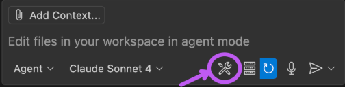
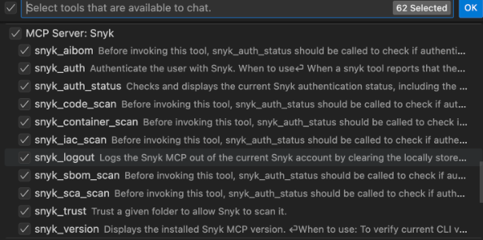

# GitHub Copilot guide

You can access Snyk Studio, including Snyk's MCP server, in VSCode to secure code generated with agentic workflows through Copilot. This can be achieved in several ways. For most users, we recommend accessing Snyk Studio using the Snyk Security plugin.

## Recommended: Access Snyk Studio using the Snyk Security Plugin

* Open the [Snyk Security plugin](cursor:extension/snyk-security.snyk-vulnerability-scanner).
* Click **Install.**

<figure><figcaption><p>The Snyk Security plugin in the extensions library.</p></figcaption></figure>

### Enable Secure At inception

After installation completes, a dialog appears asking you to opt in to **Secure at Inception** in Snyk Studio. Opting in automatically configures the rules needed to scan new AI-generated code. More configuration options are available on the plugin's **Settings** page.

Clicking **Yes** activates **Auto Configure Snyk MCP Server** and sets **Secure at Inception: Execution Frequency** to **On Code Generation**. These settings configure the Snyk MCP server and create the `snyk_rules.mdc` file in the directory.

#### Update Secure at Inception settings

If you installed the VS Code extension earlier and did not enable Secure at Inception in the dialog, you can enable it later in the extension settings. You can also update Secure at Inception settings there, or disable the feature by setting **Execution Frequency** to **Manual**.

### Authenticate

Selecting an **Execution Frequency** triggers an authentication request. You can authenticate at two points:

* Immediately after you install the plugin
* Before your first Snyk Code scan

The authentication flow asks you to sign up or log in on the Snyk website, and a browser window opens. New users select a sign-up method and agree to the terms on the next screen. After you authenticate, Snyk instructs you to return to your IDE.


To use Snyk Studio, specifically Snyk's SAST scanning capabilities, you'll need to enable [Snyk Code](https://app.gitbook.com/s/BJO0IZx7zB6bOkotxQP2/scan-with-snyk/snyk-code). To use Snyk Studio, specifically its SAST scanning, you must enable Snyk Code. Snyk Code analyzes your code for vulnerabilities and temporarily clones the repository or uploads your code. Snyk caches cloned or uploaded code according to the [Snyk data retention policy](https://app.gitbook.com/s/ELvljsaLKPkSpffOkmsQ/how-snyk-handles-your-data). On the Snyk Free plan, Snyk Code offers unlimited scans for open-source projects and limited tests for first-party code. To learn more, visit [Snyk plans](https://snyk.io/plans/).


Existing users select the login method associated with their account. If you do not have access to Snyk Code, you are prompted to enable it before your first scan. You can also enable it in **Settings**.

### Run Snyk Studio

After you authenticate, Snyk Studio runs whenever the LLM generates new code. If Snyk Studio does not run, restart your IDE and generate code again.


Free users have a limited number of scans. If you reach the limit, Snyk recommends [contacting sales](https://snyk.io/contact-us/) to unlock a higher threshold.


## Alternate: Install Snyk Studio Directly

### Prerequisites

* [Install the code assistant extension](github-copilot-guide.md#install-github-copilot)
* [Install the Snyk CLI](https://app.gitbook.com/s/IEEjSXQQu36y0vmFV8zf/snyk-cli/snyk-cli/install-the-snyk-cli)
* [Install the Snyk MCP](github-copilot-guide.md#install-the-snyk-mcp-server-in-github-copilot)

### Install GitHub Copilot

Add the GitHub Copilot extension to VS Code. For mode details, visit the official [Setup GitHub Copilot on VS Code guide](https://code.visualstudio.com/docs/copilot/setup).

### Install the Snyk MCP Server in GitHub Copilot

Install the Snyk MCP Server using the method that best suits your operating system and local environment.

#### Install using the Snyk extension (preferred)

Install the extension using one of the following methods:

* Open the Snyk Security extension in the [Visual Studio Marketplace](https://marketplace.visualstudio.com/items?itemName=snyk-security.snyk-vulnerability-scanner) and install it.
* Open the **Extensions: Install Extensions** pane, search for **Snyk Security**, and install it.

VS Code automatically detects the Snyk MCP Server, but you must enable it explicitly.

Enable the Snyk MCP Server using one of the following methods:

* Open the Command Palette (**Cmd + Shift + P** on MMacOS, **Ctrl + Shift + P** on Windows), select **MCP: List Servers**, then find **Snyk MCP server** in the list and enable all tools.
* In the GitHub Copilot chat, click the **Tools** icon.\
  
* You can see a list of all MCP Servers and their tool. Locate Snyk from the list and enable all of its tools:\
  

#### Install with Node.js and `npx`

Create or edit the MCP configuration file `.vscode/mcp.json` in the root directory of your Project.

If you have the Node.js `npx` executable installed in your environment, add the following JSON snippet to the file:

```json5
{
  "servers": {
    "Snyk": {
      "type": "stdio",
      "command": "npx",
      "args": ["-y", "snyk@latest", "mcp", "-t", "stdio"],
      "env": {}
    }
  }
}
```

#### Install with pre-installed Snyk CLI

Create or edit the MCP configuration file `.vscode/mcp.json` in the root directory of your Project.

If you have the Snyk CLI installed and accessible on your system path, include the following JSON snippet in the file. You might need to specify the full path to the Snyk executable CLI:

```json5
{
  "servers": {
    "Snyk": {
      "type": "stdio",
      "command": "/absolute/path/to/snyk",
      "args": ["mcp", "-t", "stdio"],
      "env": {}
    }
  }
}
```

If the `snyk` command is not available, add it by following the instructions on the [Installing or updating the Snyk CLI](https://app.gitbook.com/s/IEEjSXQQu36y0vmFV8zf/snyk-cli/snyk-cli/install-the-snyk-cli) page.

The following example shows a Snyk MCP Server that was successfully configured and started.

<figure><figcaption><p>Successful Snyk MCP Server configuration in VSCode.</p></figcaption></figure>


For additional MCP configuration options on VS Code and troubleshooting, visit the official [VS Code MCP server documentation](https://code.visualstudio.com/docs/copilot/chat/mcp-servers).


## Setting up the Snyk MCP Server

As a one-time setup, you might need to authenticate and trust the Project directory. The agentic workflow usually handles this automatically.

The model and the agentic code assistant run most of these workflows, and you approve them in a browser confirmation dialog. The process looks similar to this:

<figure><figcaption><p>Authentication prompt for the Snyk MCP Server.</p></figcaption></figure>

If you need to authenticate and trust the current directory, then proceed and complete the process.

<figure><figcaption><p>The agentic code assistant automatically running Snyk MCP server tools.</p></figcaption></figure>

## Examples

### Scanning for security vulnerabilities

In the chat, you can tag specific files or functions and ask Copilot to scan your code for safely deploying to production:


```
Scan this directory for code security & dependency vulnerabilities and security issues
```


Copilot indicates that this request is related to security vulnerability scanning and calls the Snyk MCP Server for various scans.

<figure><figcaption><p>Prompt responses from Copilot on the security scan results.</p></figcaption></figure>

Copilot then gathers all the security scan results, both code (SAST) and dependencies (SCA). Using the recommendations and context from the Snyk MCP server, Copilot suggests code changes that address some or all of the vulnerabilities found:

<figure><figcaption><p>Suggested changes and recommendations from Copilot.</p></figcaption></figure>

### Secure at inception rules

To practice [Secure at Inception](https://app.gitbook.com/s/L7HyJj9FsK1W4pNt8Gzl/glossary#secure-at-inception-directive), Snyk recommends adopting rules that align the LLM for secure code generation and workflows.

The following is a suggested instruction for [GitHub Copilot custom instructions](https://docs.github.com/en/copilot/how-tos/configure-custom-instructions/add-repository-instructions). Append the following contents to the rules file at `.github/copilot-instructions.md`:


```
---
alwaysApply: true
always_on: true
trigger: always_on
applyTo: "**"
description: Snyk Security At Inception
---

# Project security best practices

- Always run **snyk_code_scan** tool for new first party code that is generated in a Snyk-supported language.
- If any security issues are found based on newly introduced or modified code or dependencies, attempt to fix the issues using the results context from **Snyk**.
- Rescan the code after fixing the issues to ensure that the issues were fixed and that there are no newly introduced issues.
- Repeat this process until no new issues are found.
```


## Troubleshooting

### **Authentication loops, 401 errors, or timeouts**

&#x20;If you are behind a corporate proxy or experience scan timeouts (`MCP error -32001`), configure the proxy and timeout settings explicitly in your `mcp.json` file. The Snyk MCP server does not inherit OS or IDE proxy settings automatically.

1. Open your `mcp.json` file.
2. Add a `timeout` parameter, in milliseconds, to allow larger scans to complete. For example, set `600000` for 10 minutes.
3. Add the `HTTP_PROXY` and `HTTPS_PROXY` variables to the `env` block so the server can authenticate and route traffic.
4. Restart your IDE to apply the changes.

Example `mcp.json` with proxy and timeout configuration:

```json5
{
  "servers": {
    "Snyk": {
      "type": "stdio",
      "command": "/absolute/path/to/snyk",
      "timeout": 600000,
      "args": ["mcp", "-t", "stdio"],
      "env": {
        "HTTP_PROXY": "http://your-corporate-proxy:port",
        "HTTPS_PROXY": "http://your-corporate-proxy:port"
      }
    }
  }
}
```
