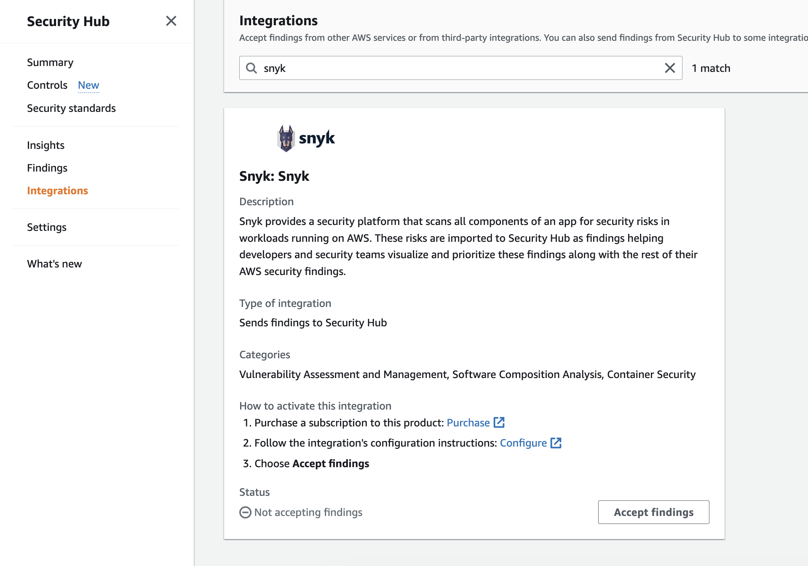
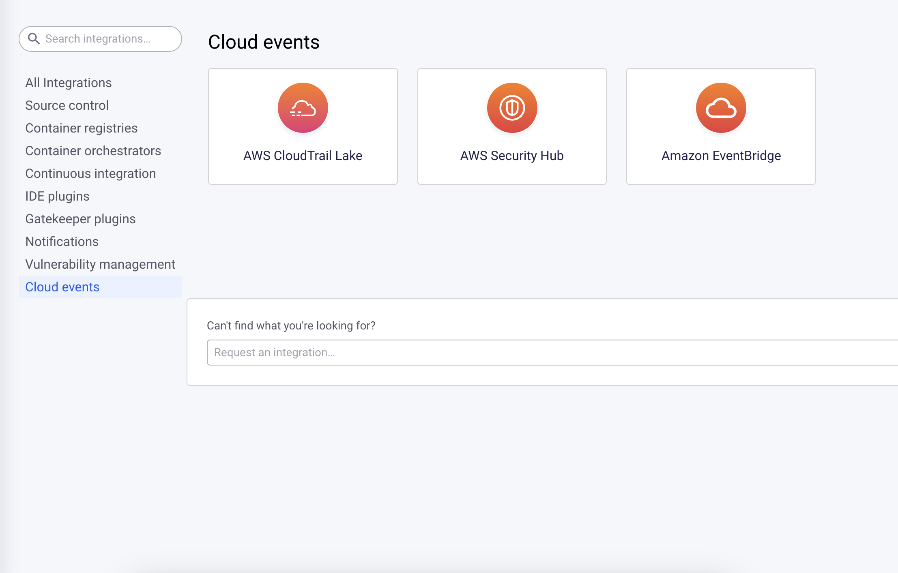
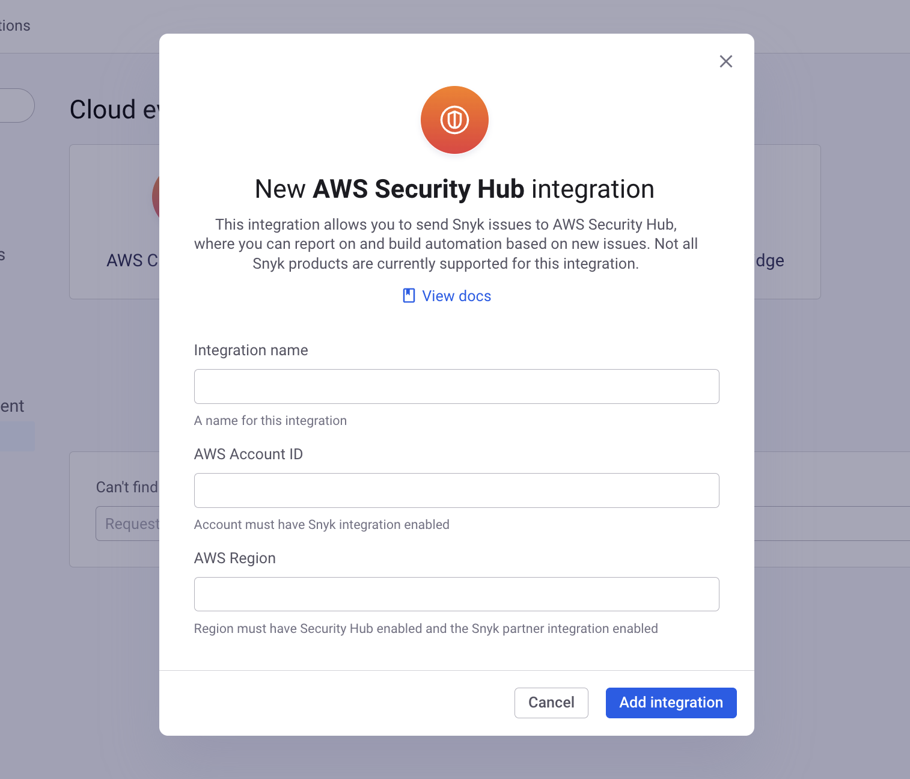
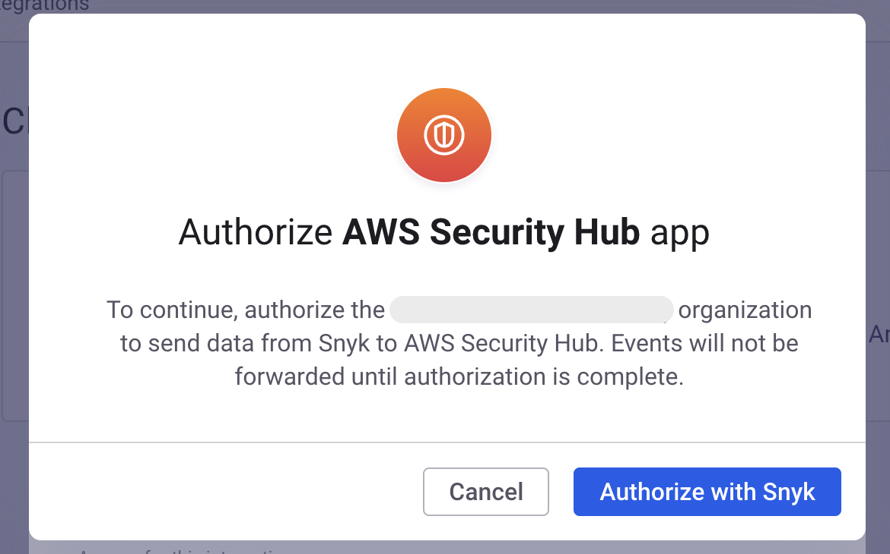
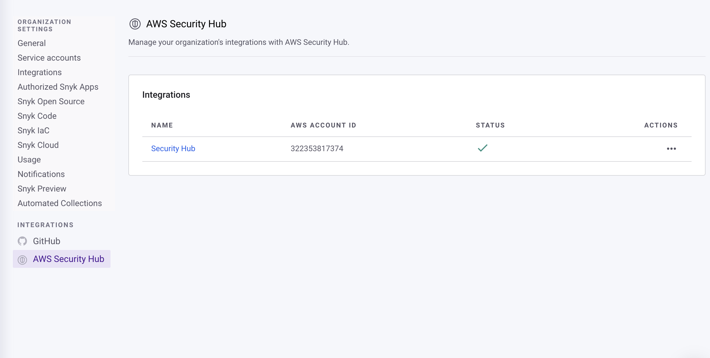
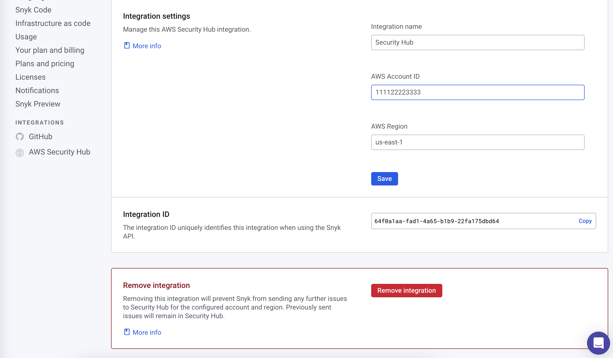

# AWS Security Hub

The [AWS Security Hub](https://aws.amazon.com/security-hub/) integration sends Snyk issues to Security Hub, so you can centralize your security reporting, build custom alerting, and trigger automation. After it is configured, the integration automatically uploads Snyk issues to Security Hub as security findings. When issues are updated or new remediations become available, the corresponding Security Hub findings are automatically updated.

There are two steps required to configure the integration:

1. Configure Security Hub to accept findings from Snyk in the Security Hub console.
2. Configure Snyk to send findings to Security Hub in the Snyk dashboard.

## Configuring Security Hub to accept Snyk findings

Go the the Security Hub console for the AWS account and region you want to receive Snyk findings. Navigate to the **Integrations** section and search for **Snyk**. On the **Snyk** integration tile, click **Accept findings** and follow the prompts.

<figure><figcaption>
Search for Snyk integration
</figcaption></figure>

After this step is done, you can continue setting up the integration in the Snyk dashboard.

## Configuring Snyk to send findings to Security Hub

Navigate to [the Snyk integrations page](https://app.snyk.io/integrations) and search for **Security Hub** or navigate to the **Cloud events** section. Click on the **Security Hub** tile to start creating a new integration.

<figure><figcaption>
Create new Security Hub integration
</figcaption></figure>

Enter a **name** for the integration, along with the **AWS Account ID** and **AWS Region** where you enabled the Snyk partner integration in step one.

<figure><figcaption>
Enter integration details
</figcaption></figure>

After this step is complete, Snyk begins sending new issue events to Security Hub.


Issues on existing Projects are not sent to Security Hub unless those issues are updated. To backfill issues from existing Projects, you can delete and re-import them.


## Snyk App authorization

If this is the first time you have set up an AWS Security Hub integration for your Organization, Snyk prompts you to complete the Snyk App authorization flow.

<figure><figcaption>
Snyk App authorization
</figcaption></figure>

After completing the authorization flow, Snyk redirects you to the settings page for the integration.&#x20;

## Managing and deleting a Security Hub integration

Navigate to the [Security Hub integration settings page](https://app.snyk.io/manage/integrations/aws-securityhub) in the Snyk dashboard and click on the name of the integration you want to manage.

<figure><figcaption>
Select integration to manage
</figcaption></figure>

Clicking on the name of an integration opens the settings page for that integration, where you can view and update configuration information for the integration.

To delete an integration, scroll to the bottom of the integration settings page and click **Remove integration**.

<figure><figcaption>
Remove integration
</figcaption></figure>

After the integration is deleted, Snyk no longer sends issues to Security Hub. Issues already sent to Security Hub remain there until they are archived.
