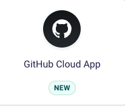
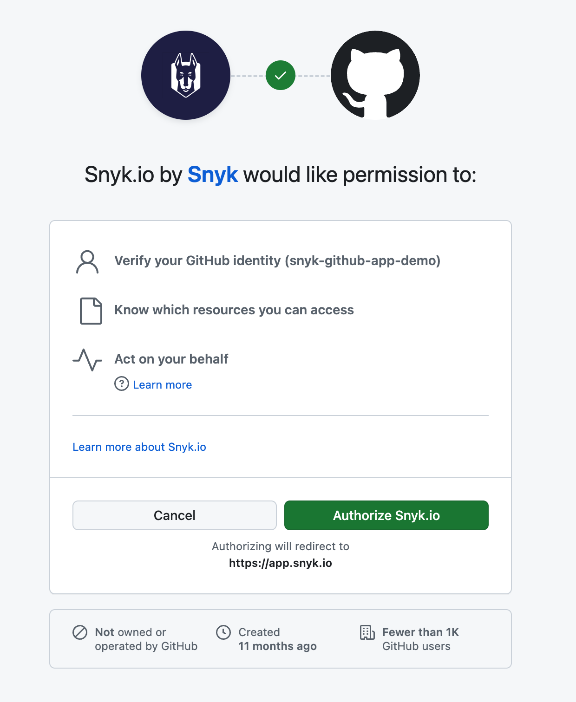
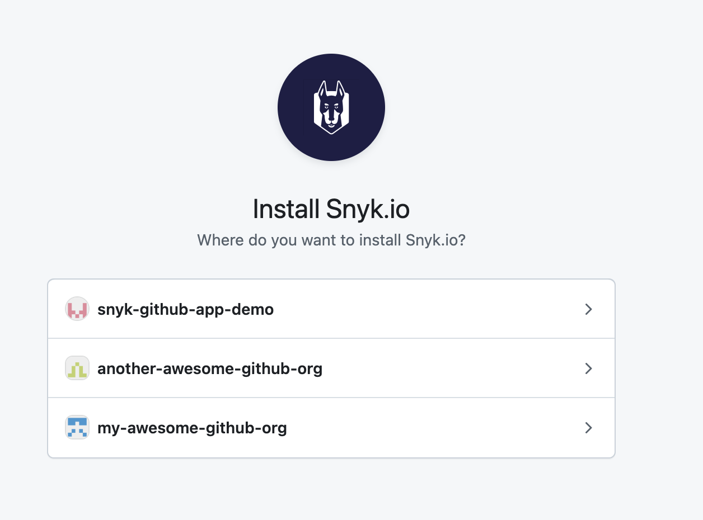
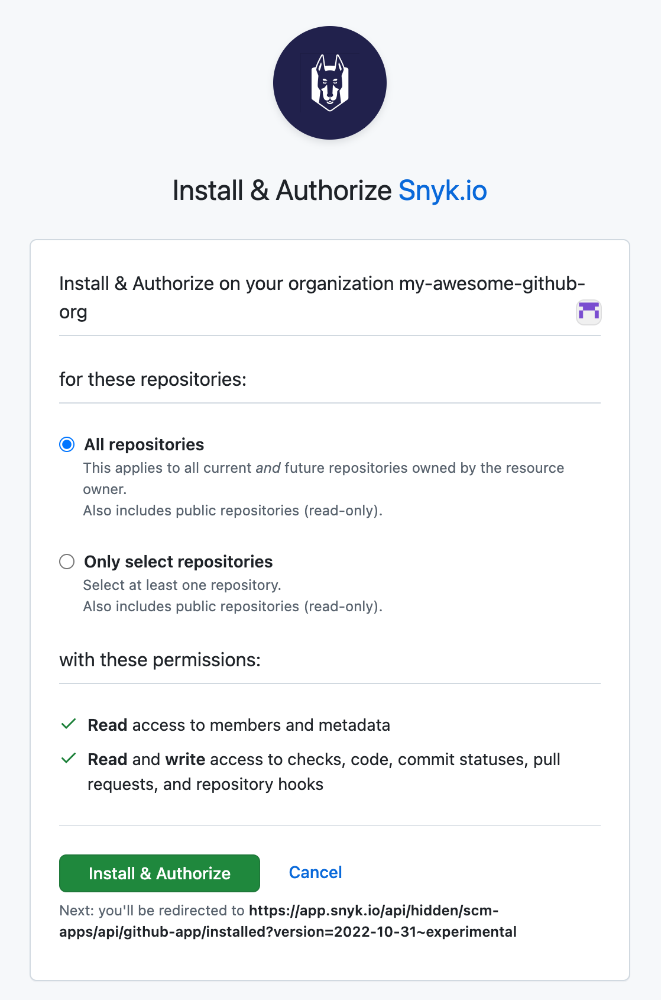

# GitHub Cloud App



## GitHub Cloud App


**Feature availability**

If you are using Broker, visit the [GitHub Cloud App for Universal Broker](../scm-integrations-and-snyk-broker.md#github-cloud-app-for-universal-broker) documentation.

If you want to use your own GitHub App, contact your Snyk account team.


### Prerequisites for GitHub Cloud App

* Snyk Organization Admin user role.
* GitHub Organization Admin user role.
* A public, internal, or private GitHub repository.
* The required app permissions. For more information, visit [GitHub Cloud App permission requirements](../user-permissions-and-access-scopes.md#github-cloud-app-permission-requirements).


Users can install the app on GitHub Organizations they are Repository Admins on through the GitHub UI.

The GitHub Cloud App integration is available at the Organization level within the Snyk Web UI.


### GitHub Cloud App benefits

The GitHub Cloud App improves on many features as compared to the current GitHub integration, including role-based, granular access control, increased API rate limits, and \
a foundation for an enhanced developer experience.

* Role-Based Access Control (RBAC) Compliance: The GitHub Cloud App decouples access control from user accounts, linking it to the app. This separation improves the management and enforcement of RBAC policies at the application level instead of individual accounts.
* Granular access control: The GitHub Cloud App allows fine-grained control over repository-level access permissions.
* The GitHub Cloud App provides a higher rate limit, enabling Snyk to make more requests and helping manage large-scale cases such as monorepos and organizations with many repositories.
* Enabler for an enhanced developer experience:
  * Pull request checks: The Checks tab in GitHub is only accessible through the Cloud App, providing an SCM-native experience for potential future PR check workflow improvements.
  * Fix and upgrade pull requests: The GitHub App performs Snyk-initiated pull requests directly rather than going through a service account.

### How to set up the GitHub Cloud App


When setting up the GitHub Cloud App, you can only implement one of the following scenarios:

* One GitHub organization connected to one Snyk Organization
* One GitHub organization connected to multiple Snyk Organizations


Log in to your Snyk account and navigate to the Integrations section in the Snyk Organization where you would like to set up the GitHub Cloud App.

Select the **GitHub Cloud App** tile.

<figure><figcaption>
GitHub Cloud App tile on the Integrations page
</figcaption></figure>

In the confirmation modal, click **Configure GitHub Cloud App**.

<figure><figcaption>
Configuration notice for the GitHub Cloud App
</figcaption></figure>

The app then asks you to authorize it to act on your behalf, so it can check which GitHub organizations you can install it in.

<figure><figcaption>
User authorization for the app
</figcaption></figure>

When the install screen in GitHub opens, you can select the GitHub organization where you wish to install the app.

<figure><figcaption>
Selection of the GitHub organization to install the app into
</figcaption></figure>

If the GitHub Cloud App is already installed in a GitHub organization, you can select that same GitHub organization during the integration process for a different Snyk Organization.

<figure><figcaption>
Connect another GitHub organization into a Snyk Organization
</figcaption></figure>

Specify whether to install the app in all repositories in the selected GitHub organization or in only some of them. Then click **Install & Authorize**.

<figure><figcaption>
Install and authorize settings for the GitHub organization  you are installing the GitHub Cloud App into
</figcaption></figure>


The GitHub Cloud App loses access to Snyk if you uninstall it from the GitHub organization or edit the repositories that the app instance can access.


## Configuring IP allowlists


The GitHub Cloud App has no pre-configured IP addresses. Contact your Snyk account team for the Snyk IP addresses to add manually.


If an IP allowlist protects access to your GitHub Cloud or Enterprise Cloud repositories, add the Snyk IP addresses to enable communication with your SCM tool. IP allowlists at the Enterprise level override those at the Organization level in GitHub Enterprise Cloud, so you must add the Snyk IP addresses to both levels.

### Configuring the allowlist at the Organization level


You must be a GitHub Organization admin to perform this.


Follow GitHub's instructions for [adding an allowed IP address](https://docs.github.com/en/enterprise-cloud@latest/organizations/keeping-your-organization-secure/managing-security-settings-for-your-organization/managing-allowed-ip-addresses-for-your-organization#adding-an-allowed-ip-address), and enter the Snyk IP addresses in the form fields.

### Configuring the allowlist at the Enterprise level


You must be a GitHub Enterprise admin to perform this.


Follow GitHub's instructions for [adding an allowed IP address](https://docs.github.com/en/enterprise-cloud@latest/organizations/keeping-your-organization-secure/managing-security-settings-for-your-organization/managing-allowed-ip-addresses-for-your-organization#adding-an-allowed-ip-address), and enter the Snyk IP addresses in the form fields.

## How to migrate to the GitHub Cloud App

If you are an Enterprise plan customer, you can migrate Snyk Targets to the GitHub Cloud App using the [snyk-migrate-to-github-app](https://github.com/snyk-labs/snyk-migrate-to-github-app) tool in the [tool repository](https://github.com/snyk-labs/snyk-migrate-to-github-app).
