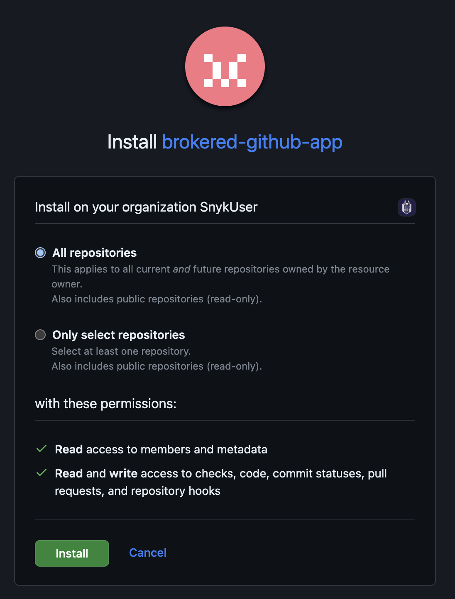

# SCM integrations and Snyk Broker

If your SCM instance is not publicly accessible, you need Snyk Broker. You can install and configure your Snyk Broker using Docker or Helm. For more information about Snyk Broker, see the [Snyk Broker](https://app.gitbook.com/s/IgtgtomLQ2TUgSKOMSAm/snyk-broker/snyk-broker) documentation, including [Using Snyk Essentials wtih Snyk Broker](https://app.gitbook.com/s/IgtgtomLQ2TUgSKOMSAm/snyk-broker/using-snyk-essentials-with-snyk-broker).


Enable the Snyk Essentials flag in your Snyk Broker deployment environment before running the commands.


You can find on [GitHub](https://github.com/snyk/broker/tree/565242baf003f06f445489dd96cc68c8386ede38/defaultFilters/apprisk) all the updated `.json` files that include the allowed list of accessible endpoints for the integrations.

## Integrated SCM tokens for classic Broker

An integrated SCM token is required for [Broker client setup](https://app.gitbook.com/s/IgtgtomLQ2TUgSKOMSAm/snyk-broker/classic-broker/prepare-snyk-broker-for-deployment). It is used in the `-e <SCM>_TOKEN` parameter, for example, `-e GITHUB_TOKEN=xxx…`, to enable access to the SCM. These meet certain permissions needed for the operation of Broker and Snyk Code.

An integrated SCM token can be generated for the following SCM integrations:

* [GitHub and GitHub Enterprise](scm-integrations-and-snyk-broker.md#github-and-github-enterprise-scm-token)
* [GitLab](scm-integrations-and-snyk-broker.md#gitlab-scm-token)
* [Azure Repositories (TFS)](scm-integrations-and-snyk-broker.md#azure-repositories-tfs-scm-token)
* [Bitbucket Server/Data Center](scm-integrations-and-snyk-broker.md#bitbucket-server-data-center-scm-token)

### GitHub and GitHub Enterprise SCM token

* Format: `GITHUB_TOKEN=` - a GitHub personal access token.
* Scopes: `repo, read:org` and `admin:repo_hook.`

### GitLab SCM token

* Format: `GITLAB_TOKEN=` - a GitLab personal access token.
* Scopes: `api`.

GitLab account with `Maintainer` permission.

### Azure Repositories (TFS) SCM token

* Format: `AZURE_REPOS_TOKEN=` - an Azure Repos personal access token.
* Scopes: `Custom defined`, `Code:` `Read & write`.

### Bitbucket Server/Data Center SCM token

* Format: `BITBUCKET_USERNAME=`, `BITBUCKET_PASSWORD=` – the Bitbucket Server username and password or a Bitbucket Server personal access token.
* Scope: `Repository admin`.

## GitHub Cloud App for Universal Broker

If your GitHub Cloud server is not publicly available, you can provide access to it through the Universal Broker, a proxy deployed in your internal network to facilitate outbound connections and communication with Snyk.

The setup process for Universal Broker involves:

1. [Creating a GitHub App](scm-integrations-and-snyk-broker.md#create-a-github-app-for-universal-broker)
2. [Creating the Universal Broker connection using the `snyk-broker-config` command](scm-integrations-and-snyk-broker.md#create-the-universal-broker-connection-for-your-github-cloud-app)

### Create a GitHub App for Universal Broker

To use the GitHub Cloud App with Universal Broker, you must create your own GitHub App on your GitHub Cloud instance.

1. Copy the following URL and paste it into a text editor.

```
https://github.com/settings/apps/new?name=Snyk&description=Snyk%20helps%20you%20develop%20fast%20while%20staying%20secure%20by%20finding%20and%20automatically%20fixing%20security%20issues%20in%20your%20code%2C%20open%20source%20dependencies%2C%20containers%2C%20and%20infrastructure%20as%20code%20-%20all%20powered%20by%20Snyk%E2%80%99s%20security%20intelligence.&url=https%3A%2F%2Fgithub.com%2Fapps%2Fsnyk-io&public=false&webhook_active=true&webhook_url={{SNYK-ENV}}%2Fapi%2Fhidden%2Fscm-apps%2Fapi%2Fgithub-app%2Fwebhook&checks=write&statuses=write&contents=write&metadata=read&repository_projects=write&pull_requests=write&repository_hooks=write&members=read&events[]=repository 
```

2. Replace `{{SNYK-ENV}}` in the URL with the region for your Snyk account. This value needs to be URL encoded; the most common are listed below:

* Snyk US-01: `https%3A%2F%2Fapp.snyk.io`
* Snyk US-02: `https%3A%2F%2Fapp.us.snyk.io`
* Snyk EU: `https%3A%2F%2Fapp.eu.snyk.io`
* Snyk AU: `https%3A%2F%2Fapp.au.snyk.io`

3. After the value is replaced, navigate to that URL in your browser.\
   This will take you to the app creation screen in your GitHub Cloud instance with all the required details pre-filled.
4. Scroll to the end of the page. Ensure that **Any account** is selected, and then click **Create GitHub App**.
5. Make a note of the `ClientId` and `AppId`. Store these safely and treat them as secrets. You must enter these credentials when you create the Universal Broker connection to your GitHub Cloud app.
6. Click the **generate a private key** link.\
   This initiates the download of a `.pem` file. Store this file safely and treat it as a secret. You must enter the path to this file when you create the Universal Broker connection to your GitHub Cloud app.\
   Your GitHub Cloud App is now ready to be installed in repositories in your Snyk Organization.
7. Scroll to the top of the page and click **Install App** on the navigation panel. Click the **Install** button for your app.
8. Choose where you want to install the app in your GitHub organization. It can be installed in specific repositories or all of them.


If you choose to install the app only in specific repositories, the app works only in those repositories. You can return to this screen and edit where the app is installed if you want to add it to additional repositories.


<figure><figcaption><p>Install the GitHub App in your selected repositories</p></figcaption></figure>

9. Copy the `InstallationID`. These are the numbers at the end of the page URL. You must enter it when you create the Universal Broker connection to your GitHub Cloud app.\
   For example, if the page URL is `https://github.com/settings/installations/12345678`, the `InstallationID` is `12345678`.

### Create the Universal Broker connection for your GitHub Cloud App

Before the GitHub Cloud App can be used with the Universal Broker, you must create a connection of the `github-cloud-app` type using the `snyk-broker-config` tool. For more details, see the [Universal Broker](https://app.gitbook.com/s/IgtgtomLQ2TUgSKOMSAm/snyk-broker/universal-broker) documentation. After the connection is created, it can be integrated with one or more Organizations of your choice.

#### Prerequisites

* Tenant Admin role
* Your Tenant ID
* The base API address for your Snyk region. Refer to the list of [API URLs](https://app.gitbook.com/s/ELvljsaLKPkSpffOkmsQ/regional-hosting-and-data-residency#api-urls) for Snyk regional hosting.
* A valid [Snyk API token](../snyk-api/authentication-for-api/#how-to-obtain-your-personal-token)
* `snyk-broker-config` tool installed
* The `ClientId,` `AppId`, `InstallationID` and `.pem` file for your app
* The Organization ID for the Organization you want to integrate the connection with

#### Create the connection and integrate it with your Organizations

1. Run the `snyk-broker-config workflows connections create` command. Choose the `github-cloud-app` option and provide the information you are prompted for in the workflow.
2. Run `snyk-broker-config workflows connections integrate` to integrate the newly created connection to the Organization of your choice. Enter the Organization ID when you are prompted.

Visit the integrations page in Snyk to verify that the integration has been configured.

See the [Universal Broker](https://app.gitbook.com/s/IgtgtomLQ2TUgSKOMSAm/snyk-broker/universal-broker) documentation for more details.

## GitHub Server App for Universal Broker

If your GitHub server is not publicly available, you can provide access to it through the Universal Broker, a proxy deployed in your internal network to facilitate outbound connections and communication with Snyk.

The setup process for Universal Broker involves:

1. [Creating a GitHub App on your GitHub Server instance](scm-integrations-and-snyk-broker.md#create-a-github-app-for-universal-broker)
2. [Creating the Universal Broker connection using the `snyk-broker-config` command](scm-integrations-and-snyk-broker.md#create-the-universal-broker-connection-for-your-github-server-app)

### Create a GitHub App for Universal Broker

To use the GitHub Server App with Universal Broker you must create your own GitHub App on your GitHub Server instance.

1. Copy the following URL and paste it into a text editor.

```
{{GITHUB-SERVER-URL}}/settings/apps/new?name=Snyk&description=Snyk%20helps%20you%20develop%20fast%20while%20staying%20secure%20by%20finding%20and%20automatically%20fixing%20security%20issues%20in%20your%20code%2C%20open%20source%20dependencies%2C%20containers%2C%20and%20infrastructure%20as%20code%20-%20all%20powered%20by%20Snyk%E2%80%99s%20security%20intelligence.&url=https%3A%2F%2Fgithub.com%2Fapps%2Fsnyk-io&public=false&webhook_active=true&webhook_url={{SNYK-ENV}}%2Fapi%2Fhidden%2Fscm-apps%2Fapi%2Fgithub-app%2Fwebhook&checks=write&statuses=write&contents=write&metadata=read&pull_requests=write&repository_hooks=write&members=read&events[]=repository 
```

2. Replace the following in the URL:

* `{{GITHUB-SERVER-URL}}`: Replace this with the base URL of your GitHub Server instance.
* `{{SNYK-ENV}}`: Replace this with the region for your Snyk account. This value needs to be URL encoded; the most common are listed below:
  * Snyk US-01: https%3A%2F%2Fapp.snyk.io
  * Snyk EU: https%3A%2F%2Fapp.eu.snyk.io
  * Snyk AU: https%3A%2F%2Fapp.au.snyk.io
  * Snyk US-02: https%3A%2F%2Fapp.us.snyk.io

3. After these values are replaced, navigate to that URL in your browser.\
   This will take you to the app creation screen in your GitHub Server instance with all the required details pre-filled.
4. Scroll to the end of the page. Ensure that **Any account** is selected, and then click **Create GitHub App**.
5. Make a note of the `ClientId` and `AppId`. Store these safely and treat them as secrets. You must enter these credentials when you create the Universal Broker connection to your GitHub Server app.
6. Click the **generate a private key** link.\
   This initiates the download of a `.pem` file. Store this file safely and treat it as a secret. You must enter the path to this file when you create the Universal Broker connection to your GitHub Server app.\
   Your GitHub Server App is now ready to be installed in repositories in your Snyk Organization.
7. Scroll to the top of the page and click **Install App** on the navigation panel. Click the **Install** button for your app.
8. Choose where you want to install the app in your GitHub organization. It can be installed in specific repositories or all of them.


If you choose to install the app only in specific repositories, the app works only in those repositories. You can return to this screen and edit where the app is installed if you want to add it to additional repositories.


<figure><figcaption><p>Install the GitHub App in your selected repositories</p></figcaption></figure>

9. Copy the `InstallationID`. These are the numbers at the end of the page URL. You must enter it when you create the Universal Broker connection to your GitHub Server app.\
   For example, if the page URL is `https://github.com/settings/installations/12345678`, the `InstallationID` is `12345678`.

### Create the Universal Broker connection for your GitHub Server App

Before the GitHub Server App can be used with the Universal Broker, you must create a connection of the `github-server-app` type using the `snyk-broker-config` tool. For more details, see the [Universal Broker](https://app.gitbook.com/s/IgtgtomLQ2TUgSKOMSAm/snyk-broker/universal-broker) documentation. After the connection is created, it can be integrated with one or more Organization(s) of your choice.

#### Prerequisites

* The base API address for your Snyk region; refer to the list of [API URLs](https://app.gitbook.com/s/ELvljsaLKPkSpffOkmsQ/regional-hosting-and-data-residency#api-urls) for Snyk regional hosting.
* A valid [Snyk API token](../snyk-api/authentication-for-api/#how-to-obtain-your-personal-token)
* `snyk-broker-config` tool installed
* Tenant Admin role
* The `ClientId,` `AppId`, `InstallationID` and `.pem` file for your app
* The Organization ID for the Organization you want to integrate the connection with

#### Create the connection and integrate it with your Organizations

1. Run the `snyk-broker-config workflows connections create` command. Choose the `github-server-app` option and provide the information you are prompted for in the workflow.
2. Run `snyk-broker-config workflows connections integrate` to integrate the newly created connection to the Organization of your choice. Enter the Organization ID when you are prompted.

Visit the integrations page in Snyk to see that the integration has been configured.

See the [Universal Broker](https://app.gitbook.com/s/IgtgtomLQ2TUgSKOMSAm/snyk-broker/universal-broker) documentation for more details.
