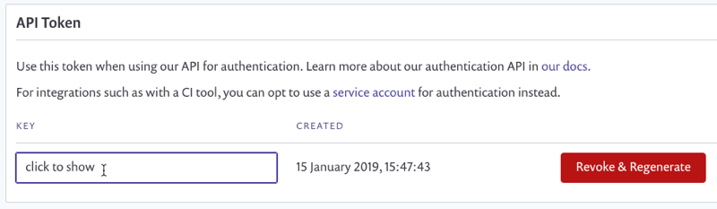

# Revoke and regenerate a Snyk API token


When you revoke an API token, all integrations using that key immediately stop working. Proceed with caution.


If you suspect an API token has been leaked, it is good practice to revoke that token and generate a new one to use in its place.

To revoke your Snyk user API token, navigate to your personal General Account Settings in the Snyk Web UI at [app.snyk.io/account](https://app.snyk.io/account).

Click **Revoke & Regenerate** to revoke your API token. Snyk generates a new one in its place. You can now copy the newly generated API token and update integrations that used the old token.
