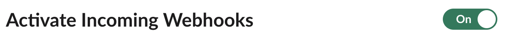

# Slack setup to connect Snyk with AWS Lambda



## Slack setup to connect Snyk with AWS Lambda

To enable Snyk to communicate with Slack, start by setting up incoming webhooks through Slack Apps. These are provided by Slack to enable developers to communicate with Slack.

To set up Slack Apps with a webhook, follow these steps:

1. Go to [https://api.slack.com/apps](https://api.slack.com/apps).
2. Select **Create New App**.
3. Select **From scratch**.
4. Give the app a name like "Snyk".
5. If you want to set the logo and an appropriate background you can download the Snyk logo [here](https://snyk.io/press-kit/) while using background color #1d1848.
6. Select your workspace.
7. With the Slack App created, click **Add features and functionality**.
8. Select **Incoming Webhooks**.
9. Activate incoming webhooks in that page.

    <figure><figcaption>
Incoming webhooks activation
</figcaption></figure>
10. Generate a webhook URL for the channel you want by clicking on **Add New Webhook to Workspace**.
11. Select the channel you want Snyk to post to. If you haven’t already done so, [create a channel](https://slack.com/intl/en-gb/help/articles/201402297-Create-a-channel).
12. When the webhook has been created, copy and save the webhook URL to use in the next step in AWS.
