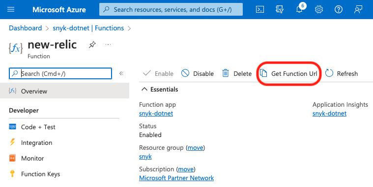

# Copy the Azure Function URL

Select the appropriate Azure Function and copy the Function URL. You need this URL in the next step, in order to [Create a Snyk Webhook](create-a-snyk-webhook.md).

An example follows for one user's New Relic Azure Function.

<figure><figcaption>
Azure Function URL
</figcaption></figure>
