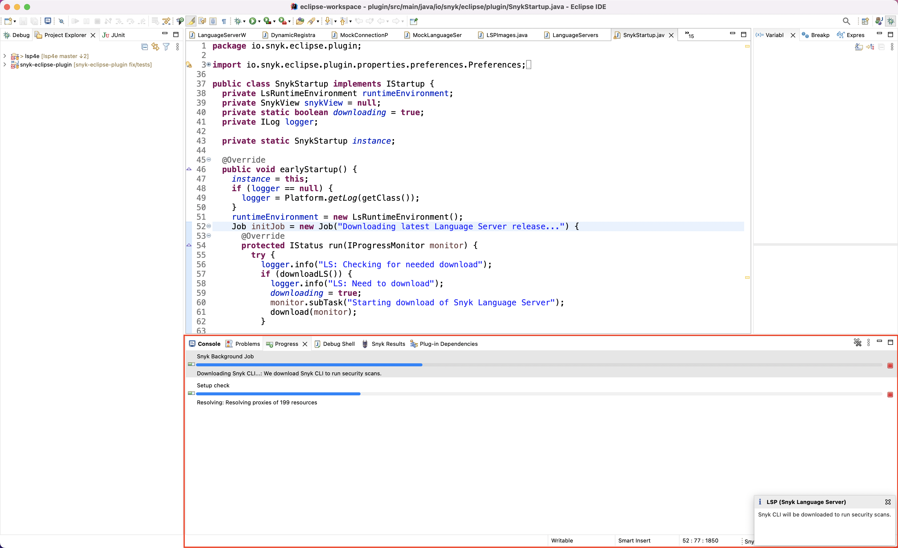

# Download the CLI with the Eclipse plugin

When you install the Eclipse plugin and open a file that Snyk supports, the [Snyk CLI](../../snyk-cli/) is downloaded automatically unless you have opted out. The [Language Server](../snyk-language-server/) is also downloaded. The Language Server works with the CLI to give you an optimal Eclipse experience.

<figure><figcaption>
Downloading the Snyk CLI
</figcaption></figure>

Continue with [Authentication for the Eclipse plugin](authentication-for-the-eclipse-plugin.md).
