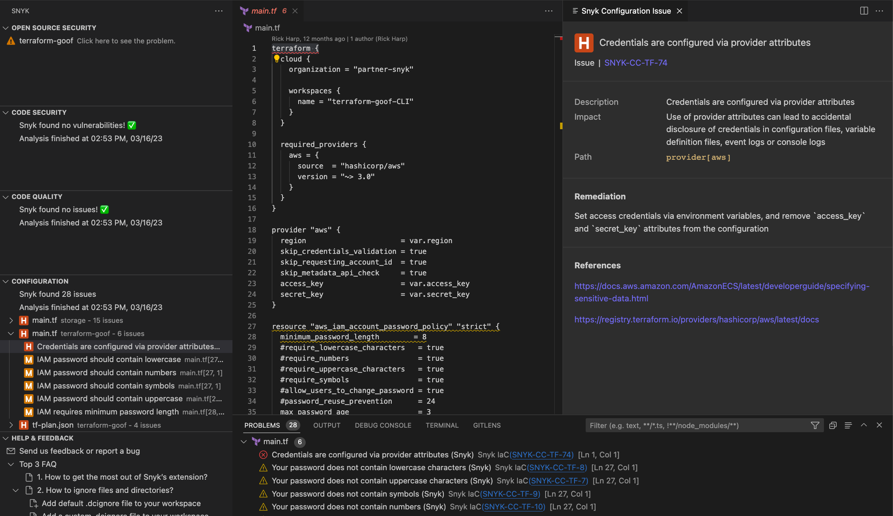
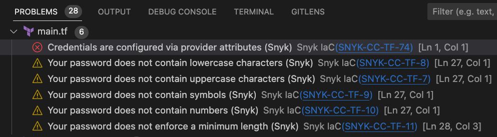
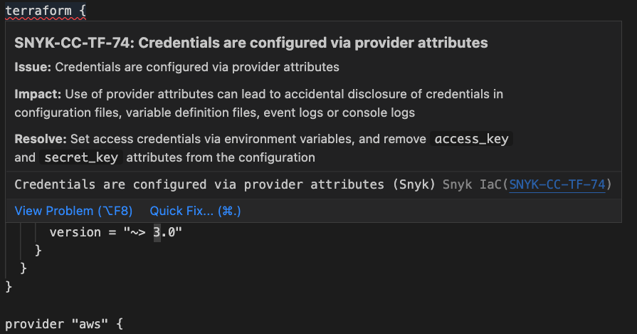
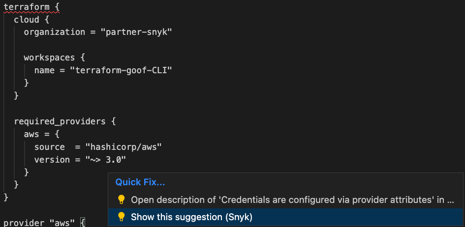
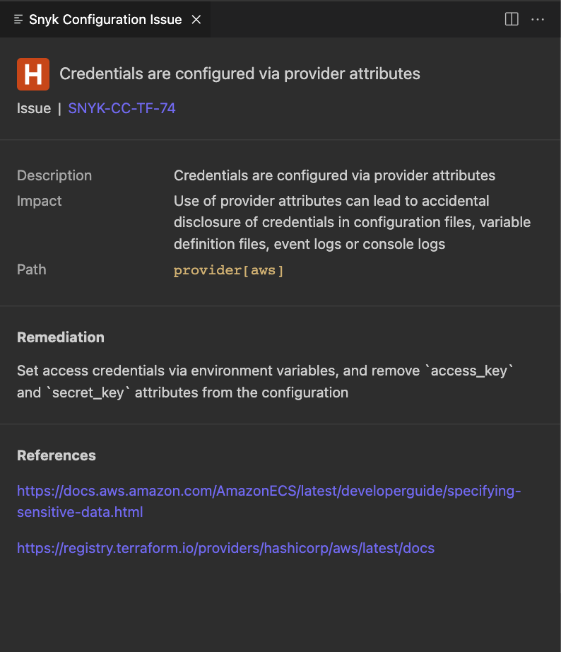

# Analysis results: Snyk IaC configuration

Snyk IaC configuration analysis shows issues in your Terraform, Kubernetes, AWS CloudFormation, and Azure Resource Manager (ARM) code with every scan. Based on the Snyk CLI, the scan is fast and friendly for local development. The scan runs in the background and is enabled by default.

## Snyk IaC configuration issues window

The configuration issues window shows information about issues. By clicking on an issue, you can learn more about it:

<figure><figcaption>
Snyk IaC configuration issues window
</figcaption></figure>

The following information is shown:

* Issue description
* Issue impact
* Issue path
* Remediation details
* Links to references

In the **Problems** tab of the Visual Studio Code configuration issues screen, you can see all configuration issues found in your Project.

<figure><figcaption>
Problems tab
</figcaption></figure>

## Snyk IaC configuration editor window

The issues are visible within the editor, with the detailed information available on hover.

<figure><figcaption>
Snyk IaC configuration issue
</figcaption></figure>

Choose **Quick Fix** to open the details panel for an issue using Code Action.

<figure><figcaption>
Quick Fix
</figcaption></figure>

The details panel shows the issue name with the **Description**, **Impact** statement, **Path** by which the issue was introduced, and suggested **Remediation**.

<figure><figcaption>
Details panel for a Snyk IaC configuration issue
</figcaption></figure>
