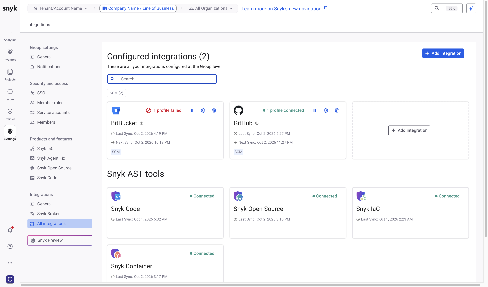
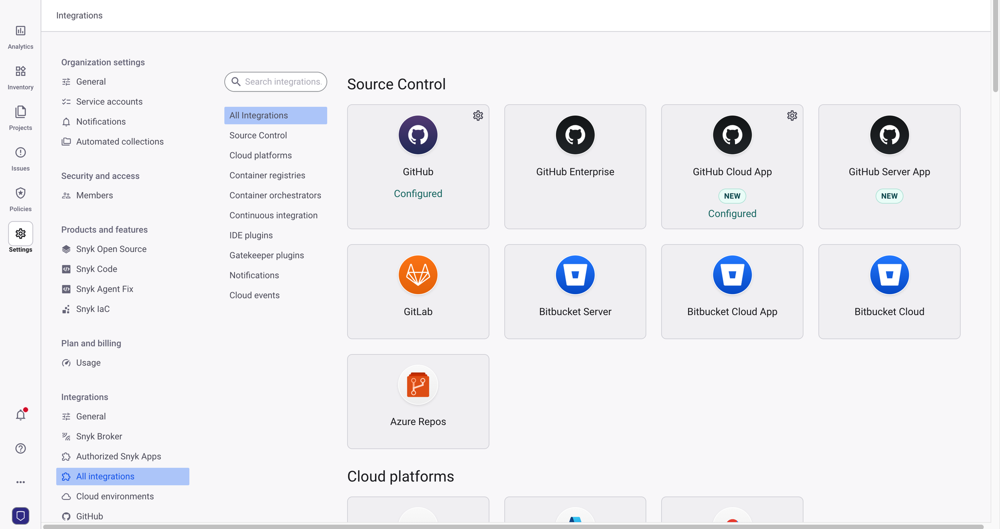

# GitHub



Configure the GitHub integration at both the Group level and the Organization level. For more details about setting up the GitHub integration, contact your Snyk account team.

## Generate a GitHub PAT

Generate a GitHub PAT with the following permissions:

* `repo`
* `read:org`
* `read:user`
* `user:email`
* `admin:repo_hook`


Save the PAT details. You need the PAT for both the Group-level integration and the Organization-level integration.


## Configure the Group-level integration

1. In the Snyk Web UI, use the scope selector at the top of the page to switch to your Group.
2. Navigate to **Settings** > **Integrations** > **All integrations**, then click **Add integration**.

<figure><figcaption></figcaption></figure>

3. Search for and select the GitHub integration.
4. Complete all mandatory fields, including the PAT details. For more details, visit [Integrate GitHub using Snyk Essentials](https://docs.snyk.io/developer-tools/integrations/scm-integrations/group-level-integrations/github-for-snyk-essentials#github-integrate-using-snyk-apprisk).


After you configure the integration, the Group-level integration shows a **Partially connected** status. During the next synchronization, the integration moves to the connected state, and Snyk fills the Inventory with data from GitHub.


## Configure the Organization-level integration

1. In the scope selector, open the **Organization** dropdown and select your Organization.
2. Navigate to **Settings** > **Integrations** > **All integrations**.
3. Search for and select the GitHub integration.
4. Complete all mandatory fields, including the PAT details. For more details, visit [GitHub integration settings](https://docs.snyk.io/developer-tools/integrations/scm-integrations/organization-level-integrations/github#github-integration-settings).

<figure><figcaption></figcaption></figure>

The Organization-level integration is available immediately, so you can import repositories and start scanning.
