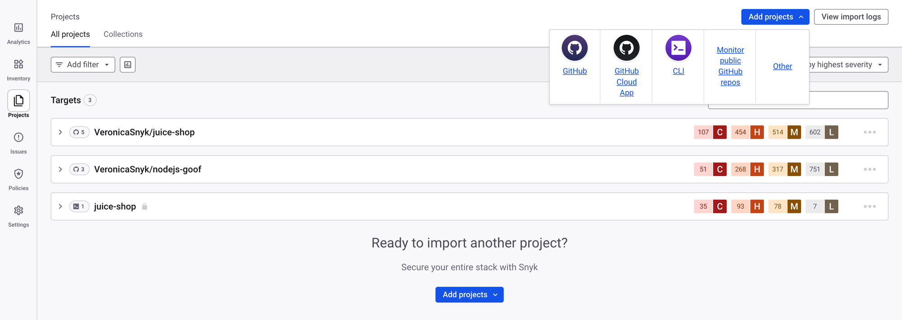
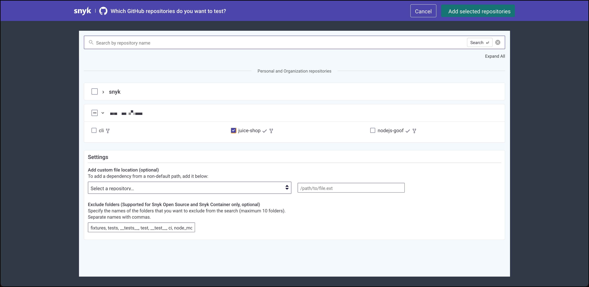

# Import repositories



After you set up your SCM integration, import repositories to Snyk.

1. In the Snyk Web UI, use the scope selector at the top of the page to select your Organization.
2. Select **Projects** in the side menu, then click **Add projects**.

<figure><figcaption></figcaption></figure>

3. Select the integration that you configured. Alternatively, navigate to **Settings** > **Integrations** > **All integrations** and select the integration from there.

<figure><figcaption></figcaption></figure>

4. Select the repositories that you want to import and click **Add selected repositories**.

<figure><figcaption></figcaption></figure>

The import starts immediately. To monitor progress, click **View import logs** on the **Projects** page.

<figure><figcaption></figcaption></figure>

All imported repositories appear on the **Projects** page.

<figure><figcaption></figcaption></figure>

Continue monitoring the import in the import logs, or select an imported repository to start reviewing its vulnerabilities.


Additional resources

* [Import Project repository](https://docs.snyk.io/scan-fix-and-prevent/scan-with-snyk/snyk-projects/import-project-repository)
* [API-driven imports](https://docs.snyk.io/developer-tools/snyk-apps/tool-snyk-api-import)

