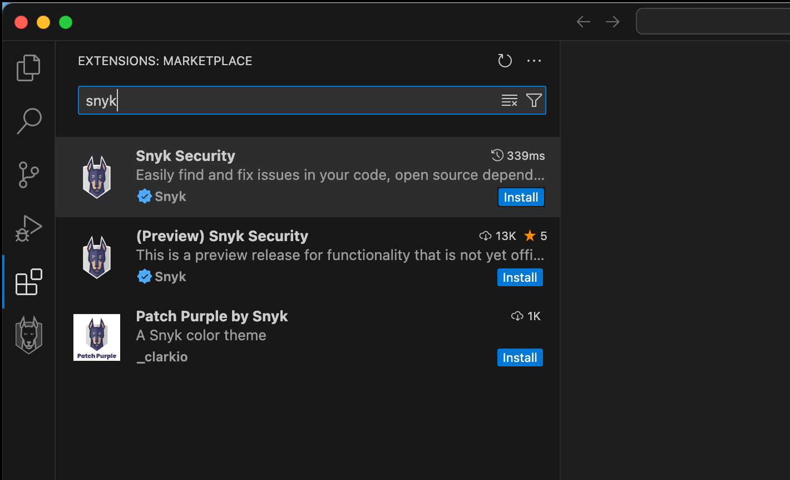



# Local scanning with the IDE



## Configure the Snyk IDE

To start scanning code in the IDE, navigate to your IDE plugin or extension marketplace and search for Snyk. This guide focuses on VS Code, but the [other supported IDEs](https://docs.snyk.io/developer-tools/integrations/snyk-ide-plugins-and-extensions) follow a very similar setup flow.

* Open VS Code, Extensions and search for Snyk.
* Install the Snyk extension.

<figure><figcaption></figcaption></figure>

* Select **Connect & Trust Workspace** to let Snyk scan your code.

* After being redirected to Snyk, you can click **Grant app access**. This authenticates your Snyk IDE extension.

* Return to your IDE, where you can start scanning immediately.

## Use the Snyk IDE

### Read the results

You can see the results are broken out by scan type. All the Open Source issues are grouped together, followed by Code, then Infrastructure as Code.

### Filter issues

Issues can be filtered in a number of ways to tune what gets presented to you while coding. Two of the most common settings to adjust are ‌**Severity** and **Total vs. new**.

To adjust which severity is shown, navigate to the **Severity** section in the extension settings.

You can also change from looking at the total set of issues in the codebase to just new issues. This method scans the main branch and the version that the developer is working on, then reports only the new vulnerabilities. This mode can be easily toggled at the top of the extension menu.

This option helps developers avoid introducing new vulnerabilities without getting overwhelmed by their backlog.

### Check the vulnerabilities

The results for each scan type and vulnerability type vary, but expect to see inline feedback as well as a more detailed window that can be accessed by clicking on the vulnerability.

For Snyk Code issues, you can see the Fix Analysis, Data Flow, and an Issue Overview. You can also click “Learn about this issue type” which brings you to a more detailed lesson in Snyk’s developer education platform, [Snyk Learn](https://learn.snyk.io/).

The next step in the guide covers fixing issues.


Additional Resources

* [Product Training: Snyk in the IDE](https://learn.snyk.io/lesson/snyk-in-an-ide)
* [Snyk Docs: Snyk IDE plugins and extensions](https://docs.snyk.io/developer-tools/integrations/snyk-ide-plugins-and-extensions)
* [Troubleshooting](https://docs.snyk.io/developer-tools/integrations/snyk-ide-plugins-and-extensions/troubleshooting-ides)

