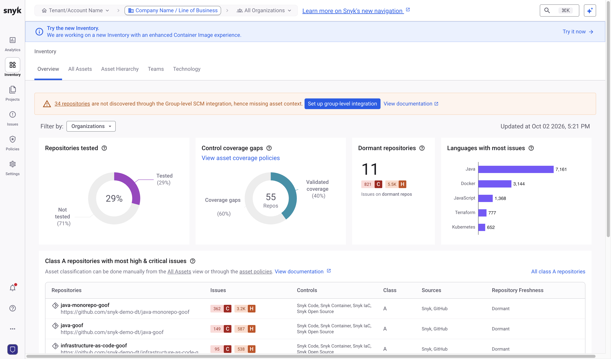

# Review scan coverage



## Check the Group-level SCM integration

Ensure that the Group-level SCM integration is configured.

1. In the Snyk Web UI, use the scope selector at the top of the page to switch to your Group.
2. Navigate to **Settings** > **Integrations** > **All integrations** and find your SCM.
3. Follow the instructions for your SCM.

<figure><figcaption></figcaption></figure>

## Review the Inventory

At Group scope, select **Inventory** in the side menu. The **Overview** tab shows your most important repositories and identifies coverage gaps: which repositories Snyk has tested and which it has not. For details, visit [Manage assets](https://docs.snyk.io/scan-fix-and-prevent/fix/manage-assets).

<figure><figcaption></figcaption></figure>

The **All Assets** tab lists every repository, with the number of issues, the Snyk tests that have run, tags ingested from the SCM, contributing developers, and repository freshness.

To view the repositories that a Snyk product has not tested, click the **Not tested** section of the first chart on the **Overview** tab, or use the coverage filters on the **All Assets** tab.

## Classifying Assets

The Class column is available for each repository. This class is meant to reflect the business criticality of the asset from A (most critical) to D (least critical). Try setting a few of your most important repos manually to Class A. This attribute can be used in reporting to help focus on issues from your company’s most important repositories.

\\

While you can set the class manually, you can also create a policy to automatically classify the repository. For example, Snyk ingests metadata like GitHub Topics and Custom Properties that can be used in a policy.

For example, a policy can filter on all repositories where there is a compliance tag, which in this case comes from the GitHub Custom Property, and set the asset class to ‘A’.

The asset class is a great way to filter on the most critical repositories in your organization, and help take a risk-based approach to prioritization by accounting for business impact. The asset class can be used when reviewing scan coverage and in all available Snyk reports.


Additional Resources

* [Manage assets](https://docs.snyk.io/scan-fix-and-prevent/fix/manage-assets)
* [Product Training: Snyk Essentials](https://learn.snyk.io/catalog/?type=product-training\&topics=Snyk+Essentials)

