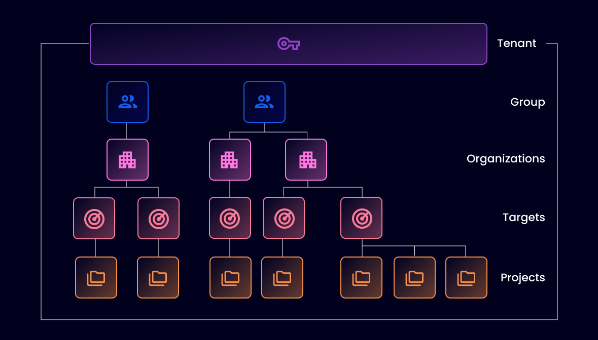

# Name your Organization

Organizations contain your scan, setup integrations, and view results.

The first step is to set the name of your Organization to be used by Snyk and others when referring to Snyk.

## Introduction to structure

<figure><figcaption>
Determine your Snyk account structure
</figcaption></figure>

Snyk uses a hierarchical approach to managing assets, access, and rollup reporting.

* **Snyk Tenant:** A Tenant encompasses the entire Snyk workspace of your company, team and individual users. It is typically named after your company.
* **Snyk Group:** This is the top entity used to group Organizations. Groups are typically named after your company or line of business.
* **Snyk Organizations**: below the Group level, typically representing:
  * Line of business
  * Git organization or team structure
  * Types of application
  * Development teams
* **Snyk Projects:** The targets you have tested/monitored with Snyk, such as a CLI scan, a container being monitored in registry, or open source files identified.

All customers have a Group and at least one Organization. On the Free and Team plans, you can create up to five Organizations in your Tenant. On the Enterprise plan, you can create an unlimited number of Organizations.

For more details, visit [Manage Groups and Organizations](../../../snyk-platform-administration/groups-and-organizations/).


If you have hundreds or thousands of repositories, consider the Snyk Enterprise plan for access to additional organizations to restrict access, separate reporting, and manageable lists to interact with.

