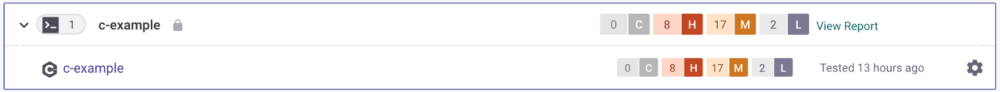

# C/C++


C/C++ is supported for Snyk Code and Snyk Open Source.


Available integrations:

* CLI and IDE: test or monitor your app

## Supported frameworks and libraries

For C/C++, the following frameworks and libraries are supported:



* argparse parser
* Asio Library
* Boost Library
* Botan LIbrary
* C Standard Library
* C++ Standard Library
* Curl library
* fstream framework
* grpc-cpp library
* HTTPlib framework
* JsonCpp library
* liboai framework
* libpq library
* libpqxx framework
* libsodium library
* LibTomCrypt framework
* libxml2 framework



* MySQL framework
* OpenSSL framework
* POSIX LIbrary
* pugixml library
* SQLite library
* WinHTTP framework
* Xerces libraries



## Supported package managers

For Conan, Snyk supports [conan.io](https://conan.io/center) as a package registry.

## C/C++ for Snyk Code

For C/C++ for Snyk Code, the embedded operating system is Linux. Support for Windows is limited.

### Supported file formats

For C/C++ with Snyk Code, Snyk supports the following file formats: `.c`, `.cc`, `.cpp`, `.cxx`, `.h`, `.hpp`, `.hxx`.

### Available features

* SCM import
* Support for interfile analysis

If you use macros, it is possible that your results include false positives and false negatives.

For C/C++ Projects:

* Snyk does not require compilation or a build to perform analysis.
* Snyk Code analyzes the source code directly.
* If you have precompile components, ensure the source code is available during the scan.

When using the IDE, you do not need additional options. The Snyk plugin displays results in the IDE views.

## C/C++ for Snyk Open Source

### Available features

* License scanning
* Reports
* Test your app's SBOM and packages using `pkg:generic` or `pkg:conan` PURLs through [SBOM test](https://app.gitbook.com/s/IEEjSXQQu36y0vmFV8zf/snyk-cli/snyk-cli/commands/sbom-test) CLI command.


The **Snyk FixPR** feature is not available for C/C++. This means that you will not be notified if the PR checks fail when the following conditions are met:

* The **PR checks** feature is enabled and configured to **Only fail when the issues found have a fix available.**
* "**Fixed in" available** is set to **Yes.**


### Dependency management and license compliance

To check compliance for open source licenses, visit [Snyk License Compliance Management.](https://app.gitbook.com/s/BJO0IZx7zB6bOkotxQP2/scan-with-snyk/snyk-open-source/scan-open-source-libraries-and-licenses/snyk-license-compliance-management)

For information about managing dependencies and licenses from your developer workflows through policy, visit the following resources:

* [Defining a secure open source policy](https://snyk.io/series/open-source-security/open-source-policy/)
* [Use Snyk security policies to prioritize fixes more efficiently](https://snyk.io/blog/snyk-security-policies/)

To scan for C/C++ Open Source dependencies using the IDE, add the `--unmanaged` option to your IDE settings:

1. Navigate to **Additional Parameters** in the IDE settings.
2. Enter `--unmanaged`.
3. Click **Scan for dependencies**.

### Troubleshooting

Your Snyk Open Source code is not sent to Snyk severs. Snyk converts the files to a list of hashes before sending them for scanning.

Snyk matches your code against a database of official open-source releases. If a scan returns no results, check these common causes:

* **Unpacked source code:** The source code of the scanned dependencies must be unpacked in the scanned directory. If you use a package manager like Conan, the Conan cache often contains the source code along with dependencies from other Snyk Projects. Snyk recommends scanning package manager dependencies in a clean environment, for example, during a build.
* **Unofficial releases:** The dependency source code is not from an official release of the open-source software (OSS) component. Snyk does not store unofficial releases in the database.
* **Extensive modifications:** If you modify the OSS source code extensively, Snyk cannot detect it. If you modify most files in a small component, Snyk cannot match them to the Snyk database. Common modifications include whitespace formatting and adding license or copyright headers.
* **Incomplete source code:** If you include only a small percentage of the component files, Snyk cannot match them to the Snyk database.
* **Symlink issues:** Snyk does not follow symlinks when collecting files for hashing. If you unzip a Linux source package in Windows, Windows replaces in-package symlinks with copies of linked files. This makes the Windows representation different from the original source. If the difference is too large, Snyk cannot detect the component.
* **New components:** The OSS component source code is too new. Snyk refreshes the database twice a month, but processing the latest releases takes time.

If none of the above apply, contact Snyk Support.

## CLI support for C/C++

To explore C/C++ vulnerabilities, you can search the [Snyk Vulnerability Database](https://app.gitbook.com/s/BJO0IZx7zB6bOkotxQP2/scan-with-snyk/snyk-open-source/manage-vulnerabilities/snyk-vulnerability-database). Snyk tests your code against this database. Snyk updates the database periodically with the latest source code from online sources.

For codebase scanning, Snyk analyzes your source code without requiring a build. To test your code, open the source code directory in the terminal and run the following command:

```bash
snyk code test
```

Use the `snyk-to-html` plugin to generate reports. To access results programmatically, export them to JSON or SARIF using the `--json` or `--sarif` options. For more information, visit [Exporting the test results to a JSON or SARIF file](https://app.gitbook.com/s/IEEjSXQQu36y0vmFV8zf/snyk-cli/snyk-cli/scan-and-maintain-projects-using-the-cli/snyk-cli-for-snyk-code/view-snyk-code-cli-results#export-test-results).

For advanced filtering options, see[ snyk-filter](https://app.gitbook.com/s/IEEjSXQQu36y0vmFV8zf/snyk-cli/snyk-cli/scan-and-maintain-projects-using-the-cli/cli-tools/snyk-filter).

To scan an Open Source Project, Snyk requires the dependencies to be available as source code in the scanned directory. If the dependencies reside in a different location, you must scan that location.

For Open Source Projects, use the `--unmanaged` option to analyze for license compliance and known security issues:

```bash
snyk test --unmanaged
```

When you run the `snyk test --unmanaged` command, Snyk performs the following steps:

1. Converts all files from your current directory into a list of hashes.
2. Sends hashes to the Snyk scan server to compute the dependencies list.
3. Queries the database to find a list of potentially matching dependencies.
4. Links the dependencies to known vulnerabilities.
5. Displays the results.

To monitor and share reports, run the following command:

```bash
snyk monitor --unmanaged --org=*org-id*
```

Find your org-id under **Organization settings** in the Snyk web UI. Although the Organization ID is optional, Snyk recommends using it. You can use the `snyk-to-html` plugin to generate reports.

For individual scans, use the CLI or IDE and run `snyk monitor --unmanaged` to upload results. This displays license and policy information.

To prevent noise from individual scans, Snyk recommends that you:

* Send results to your personal folder.
* Disable scheduled scanning in **Project settings**.

For automated scans in a CI/CD pipeline, run `snyk monitor --unmanaged` and send results to your chosen Organization. This displays license and policy information.

### Scanning license policies

You can create a license policy for open-source applications to specify unapproved licenses. When Snyk detects an unapproved license, it sends an alert containing the license name and the license policy text.

Administrators associate license policy text with the license issue. This text provides custom instructions on how to resolve the issue or explains why the license violates the policy.

### Display dependencies

To display dependencies in your codebase and their origin, use the `--print-deps` option.

In C/C++, this flag also identifies the confidence level of a match. A confidence level below 90% indicates the file is likely modified and not the original source. Investigate these files to confirm their origin.

```bash
$ snyk test --unmanaged --print-deps

Testing /Users/user/src/foo...


Dependencies:

  https://curl.se|curl@7.29.0
  purl: pkg:generic/curl@7.29.0?download_url=https:%2F%2Fcurl.se%2Fdownload%2Farcheology%2Fcurl-7.29.0.tar.gz
  confidence: 1.000

  https://github.com|nih-at/libzip@1.8.0
  purl: pkg:generic/libzip@1.8.0?download_url=https:%2F%2Fgithub.com%2Fnih-at%2Flibzip%2Farchive%2Fv1.8.0.tar.gz
  confidence: 1.000

  https://github.com|madler/zlib@1.2.11
  purl: pkg:generic/zlib@1.2.11?download_url=https:%2F%2Fzlib.net%2Ffossils%2Fzlib-1.2.11.tar.gz
  confidence: 1.000
```

Use the `--print-dep-paths` option to see which files contribute to each dependency.

```bash
$ snyk test --unmanaged --print-dep-paths

Testing /Users/user/src/foo...


Dependencies:

  https://curl.se|curl@7.29.0
  purl: pkg:generic/curl@7.29.0?download_url=https:%2F%2Fcurl.se%2Fdownload%2Farcheology%2Fcurl-7.29.0.tar.gz
  confidence: 1.000
  matching files:
    - curl-7.29.0/Android.mk
    - curl-7.29.0/CHANGES
    - curl-7.29.0/CMake/CMakeConfigurableFile.in
    ... and 1766 more files

  https://github.com|nih-at/libzip@1.8.0
  purl: pkg:generic/libzip@1.8.0?download_url=https:%2F%2Fgithub.com%2Fnih-at%2Flibzip%2Farchive%2Fv1.8.0.tar.gz
  confidence: 1.000
  matching files:
    - libzip-1.8.0/API-CHANGES.md
    - libzip-1.8.0/AUTHORS
    - libzip-1.8.0/CMakeLists.txt
    ... and 780 more files

  https://github.com|madler/zlib@1.2.11
  purl: pkg:generic/zlib@1.2.11?download_url=https:%2F%2Fzlib.net%2Ffossils%2Fzlib-1.2.11.tar.gz
  confidence: 1.000
  matching files:
    - zlib-1.2.11/CMakeLists.txt
    - zlib-1.2.11/ChangeLog
    - zlib-1.2.11/FAQ
    ... and 249 more files
```

The output shows the confidence level for the identified dependency and its version. Use the `--print-deps` or `--print-dep-paths` option to view this information.

### Confidence level

The confidence level indicates how accurately Snyk identifies a dependency. This value ranges from 0 to 1. A higher number indicates greater accuracy. A confidence level of 1 means all files in the source tree fully match the expected files in the Snyk database.

```
curl|https://github.com/curl/curl/releases/download/curl-7_58_0/curl-7.58.0.tar.xz@7.58.0 confidence: 0.993
```

Snyk uses file signatures to find the closest match to an open-source library. If you modify the source code of a dependency, the identification accuracy decreases.

### Source code dependency location

The CLI requires the full dependency source code in the scanned directory to find dependencies.

Keep a large percentage of files in their original, unchanged form to ensure Snyk accurately identifies dependencies and reports the correct vulnerabilities. Modifying the source code reduces the confidence of the scanning engine and produces less accurate results. Modified source code causes Snyk to miss dependencies or identify them incorrectly as a different version or package.

The following example shows a typical package with listed dependencies:

```
c-example
├── deps
│   ├── curl-7.58.0
│   │   ├── include
│   │   │   ├── Makefile.am
│   │   │   ├── Makefile.in
│   │   │   ├── README
│   │   │   └── curl
│   │   ├── install-sh
│   │   ├── lib
│   │   │   ├── asyn.h
│   │   │   ├── base64.c
│   │   │   ├── checksrc.pl
│   │   │   ├── config-amigaos.h
│   │   │   ├── conncache.c
│   │   │   ├── conncache.h
│   │   ├── src
│   │   │   ├── tool_binmode.c
│   │   │   ├── tool_binmode.h
│   │   │   ├── tool_bname.c
│   │   │   ├── tool_xattr.c
...
```

### Scanning archives

By default, Snyk does not scan archives. However, the CLI can recursively extract archives to analyze the internal source code.

To enable archive extraction, specify the extraction depth using the `--max-depth` option.

Snyk supports the following archive formats:

* Zip-like archives
* Tar archives
* Tar with gzip compression algorithm

### Support for releases

Snyk tracks only official releases. Snyk does not identify commits, including commits to the default branch, unless they are part of an official release or tag.

For Projects with a package manager, this means a release to the package manager. For Go and unmanaged scans (C/C++), this requires an official release or tag on the GitHub repository.

### Data collection during a scan

When you scan C++ Projects, Snyk collects and stores the following data for troubleshooting:

* Hashes of the scanned files: Snyk converts all files to a list of irreversible hashes.
* Relative paths to scanned files: Snyk includes the paths to files relative to the scanned directory for better identification and matching.

Example:

```
./project-name/vendor/bzip2-1.0.6/blocksort.c
```

### JSON output

To generate machine-readable JSON output, use the `--json` option:

```
$ snyk test --unmanaged --json
[
  {
    "issues": [
      {
        "pkgName": "curl|https://github.com/curl/curl/releases/download/curl-7_58_0/curl-7.58.0.tar.xz",
        "pkgVersion": "7.58.0",
        "issueId": "CVE-2019-5481",
        "fixInfo": {
          "isPatchable": false,
          "isPinnable": false
        }
      }
    ],
    "issuesData": {
      "CVE-2019-5481": {
        "severity": "high",
        "CVSSv3": "",
        "originalSeverity": "high",
        "severityWithCritical": "high",
        "type": "vuln",
        "alternativeIds": [
          ""
        ],
        "creationTime": "2019-09-16T19:15:00.000Z",
        "disclosureTime": "2019-09-16T19:15:00.000Z",
        "modificationTime": "2020-10-20T22:15:00.000Z",
        "publicationTime": "2019-09-16T19:15:00.000Z",
        "credit": [
          ""
        ],
        "id": "CVE-2019-5481",
        "packageManager": "cpp",
        "packageName": "curl|https://github.com/curl/curl/releases/download/curl-7_58_0/curl-7.58.0.tar.xz",
        "language": "cpp",
        "fixedIn": [
          ""
        ],
        "patches": [],
        "exploit": "No Data",
        "functions": [
          ""
        ],
        "semver": {
          "vulnerable": [
            "7.58.0"
          ],
          "vulnerableHashes": [
            ""
          ],
          "vulnerableByDistro": {}
        },
        "references": [
          {
            "title": "https://curl.haxx.se/docs/CVE-2019-5481.html",
            "url": "https://curl.haxx.se/docs/CVE-2019-5481.html"
          },
        ],
        "internal": {},
        "identifiers": {
          "CVE": [
            "CVE-2019-5481"
          ],
          "CWE": [],
          "ALTERNATIVE": [
            ""
          ]
        },
        "title": "CVE-2019-5481",
        "description": "",
        "license": "",
        "proprietary": true,
        "nearestFixedInVersion": ""
      }
    },
    "fileSignaturesDetails": {
      "https://curl.se|curl@7.58.0": {
        "artifact": "curl",
        "version": "7.58.0",
        "author": "curl",
        "path": "curl-7.58.0",
        "id": "59d80da8ba341aaff828662700000000",
        "url": "https://curl.se/download/curl-7.58.0.tar.gz",
        "purl": "pkg:generic/curl@7.58.0?download_url=https:%2F%2Fcurl.se%2Fdownload%2Fcurl-7.58.0.tar.gz",
        "score": 1,
        "confidence": 1,
        "filePaths": [
          "deps/curl-7.58.0/CHANGES",
          "c-example/deps/curl-7.58.0/CMake/CMakeConfigurableFile.in",
          "c-example/deps/curl-7.58.0/CMake/CurlSymbolHiding.cmake"
        ],
        "confidence": 1
      }
    }
  }
]
```

### CLI options

You can use the following command-line options with the `snyk test --unmanaged` and `snyk monitor --unmanaged` commands:

* `--org=ORG_ID`
* `--json`
* `--json-file-output=OUTPUT_FILE_PATH` (`snyk test` only)
* `--remote-repo-url=URL`
* `--severity-threshold=low|medium|high|critical>` (`snyk test` only)
* `--max-depth`
* `--print-dep-paths`
* `--target-reference=TARGET_REFERENCE` (`snyk monitor` only)
* `--project-name=c-project` (`snyk monitor` only)

For more information about command-line options, visit [Options for scanning with `snyk test --unmanaged`](https://app.gitbook.com/s/IEEjSXQQu36y0vmFV8zf/snyk-cli/snyk-cli/commands/test#unmanaged) or [`snyk monitor --unmanaged`](https://app.gitbook.com/s/IEEjSXQQu36y0vmFV8zf/snyk-cli/snyk-cli/commands/monitor#unmanaged).

To import the test results (issues and dependencies) in the Snyk CLI, run the `snyk monitor --unmanaged` command:

```
$ snyk monitor --unmanaged
Monitoring /c-example (c-example)...

Explore this snapshot at https://app.snyk.io/org/example-org/project/8ac0e233-d0f9-403e-b422-5970e7a37443/history/5de4616d-3967-485f-bf21-bbbe91068029

Notifications about newly disclosed issues related to these dependencies will be emailed to you.
```

Snyk creates a snapshot of dependencies and vulnerabilities and imports them into the Snyk web UI. You can review the issues and view them in your reports.

Importing a Snyk Project with unmanaged dependencies creates a new Snyk Project on the **Projects** page:

<figure><figcaption><p>Project with unmanaged dependencies</p></figcaption></figure>

Use Snyk test APIs if you develop advanced dependency management strategies instead of using standard package managers.

For C++, if you know the open-source packages and versions included in the application but lack the source code, use the [List issues for a package](https://app.gitbook.com/s/IEEjSXQQu36y0vmFV8zf/snyk-api/reference/issues#orgs-org_id-packages-purl-issues) endpoint to analyze the application.
