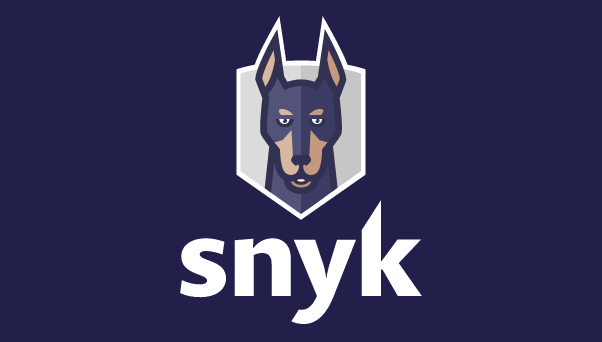

# Snyk User Documentation

Snyk is like having your dog doing your homework for you. We call ours Patch.

### A developer's best friend

[Our online app](https://snyk.io/login?cta=sign-up\&loc=nav\&page=support_docs_page) let’s you see all your Snyk projects in stunning visual displays while our CLI and API make it simple to run scans and monitor your code where ever you have it stashed. Working with an SCM like GitHub, Gitlab, or Azure Repos? That’s great because we are too, well, Patch is, really.

You’re probably familiar with different things scanning your code like lint checkers, Jenkins, and all the testing fun that comes with writing software, right?

Everyone at Snyk knows about it, too. Except these brilliant people found a simple way to just “make it happen”.

### Snyk is like having another developer on your team

So what’s in it for you? Simple, [create a new account](https://snyk.io/login?cta=sign-up\&loc=nav\&page=support_docs_page), hook up your repo, install the CLI locally (all of which can be found right here in the docs), and scan your code. Patch will tell you what packages have updates and what those updates contain so you can determine how important each is to your specific situation.

Right, doing your homework for you—Snyk can set up automatic PRs. After a scan occurs, Patch creates a PR on your behalf. Then it’s simply a question of reviewing the PR and merging. And now you know why over 2.2 million developers have already started using Snyk.

[Introducing Snyk](introducing-snyk/): read an [introduction to Snyk](introducing-snyk/introduction-to-snyk/) and explore [Snyk's core concepts](introducing-snyk/snyks-core-concepts/)

* [Getting started](getting-started/): learn how to [get started with a Snyk account](getting-started/getting-started-snyk-products/) and select a Snyk product.
* Snyk product docs: access information for:
  * [Snyk Open Source](products/snyk-open-source/)
  * [Snyk Code](products/snyk-code/)
  * [Snyk Container](products/snyk-container/)
  * [Snyk Infrastructure as Code](products/snyk-infrastructure-as-code/)
* [Snyk CLI](features/snyk-cli/): learn about the Snyk Command-Line interface 
* [Integrations](features/integrations/): information to integrate Snyk into your application development cycle


For details of Snyk data handling, see [How Snyk handles customer data](https://snyk.io/wp-content/uploads/Snyk-dataflows-How-Snyk-handles-customer-data.pdf).

