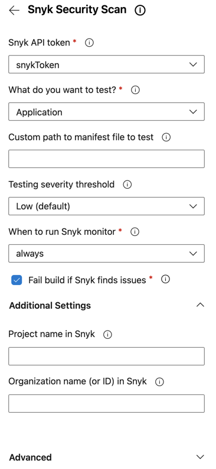
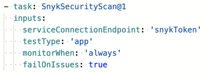

# Example of a Snyk task to test a node.js (npm)-based application

The following shows examples of Snyk Security Scan task configurations and parameters for testing a Node.js (npm) application using software component analysis (SCA) to review open-source packages in use by your application.

The configuration panel appears as follows:

<figure><figcaption>
Snyk Security Scan configuration panel
</figcaption></figure>

Click **add** and the task is added to your pipeline as follows:

