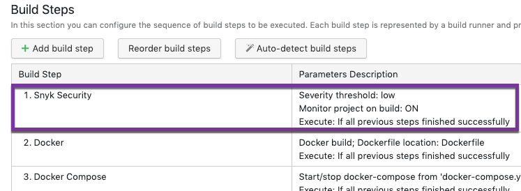
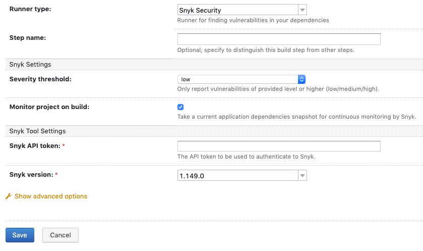
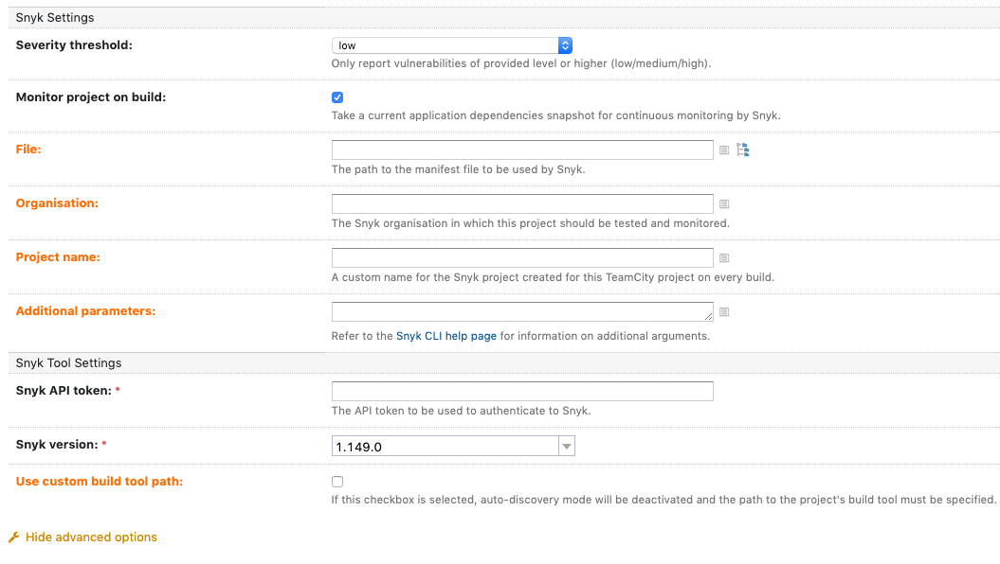
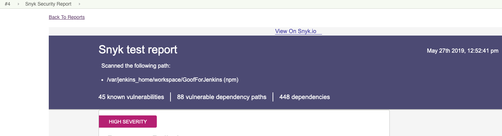

# TeamCity integration: use Snyk in your build

For any Project, you can add Snyk to your build to scan the code while you build and to fail the build for vulnerabilities, based on your configurations.

Snyk recommends running a build with the Snyk Security step before deployment, to ensure an excellent security posture.

For additional information about TeamCity and its features, refer to the [TeamCity documentation](https://www.jetbrains.com/help/teamcity/teamcity-documentation.html).

The following explains **how to configure your build with a Snyk step**.

* Add the Snyk step to a new or existing Project:
  * For new Projects, after configuring the Git repo from which to create the build, activate the auto-detect feature to automatically identify relevant steps for your Project build.
  * For existing Projects, navigate to **edit the project build steps**.\
    \
    When the Snyk step has been added, **Snyk Security** appears in the list of suggested steps, and the current test policy appears in the **Parameters Description** column:

* Navigate to configure the Snyk Security step as follows:
  * Click anywhere on the **Snyk Security** row to open the configuration screen, or
  * For existing Projects, click **Add build step** to open the configuration screen.

* Configure the TeamCity fields (**Runner type**, **Step name**, and **Execute Step** (an advanced option)).
* Optionally, click **Show advanced options** to display additional fields and Snyk parameters:

* Configure **Snyk Settings** and **Snyk Tool Settings**. For more information, see [TeamCity configuration parameters](teamcity-configuration-parameters.md).
* When the configuration is complete, run the build. When the Snyk Security step ends successfully, you can navigate to the **Snyk Security Report** tab to view results within TeamCity and to navigate to the Snyk UI for further action:

* From the top of the report, click **View on Snyk.io** to view the snapshot and vulnerability information directly from the Snyk Web UI.
