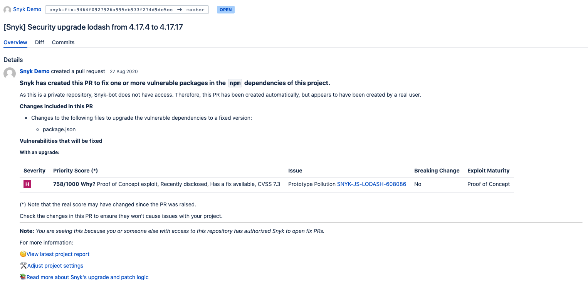
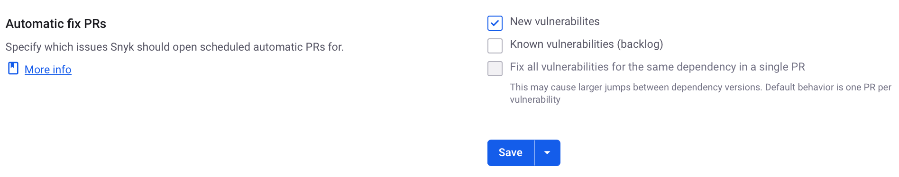
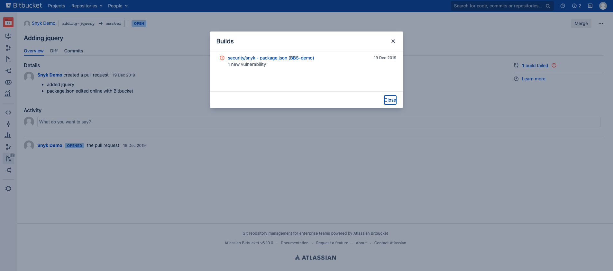

# Bitbucket Data Center/Server

The Bitbucket Data Center/Server integration allows you to continuously perform security scanning across all the integrated repositories, detect vulnerabilities in your open-source components, and use automated fixing. This integration supports Bitbucket Data Center/Server versions 4.0 and above.

For a quick reference, see the [Snyk and Bitbucket best practices cheat sheet](https://snyk.io/blog/snyk-bitbucket-best-practices-cheat-sheet/) on the Snyk blog.

### How to set up a Bitbucket DC/Server Integration

1. To give Snyk access to your Bitbucket DC/Server account, set up a dedicated service account in Bitbucket DC/Server with admin permissions.\
   Visit [Bitbucket Server documentation ](https://confluence.atlassian.com/bitbucketserver/users-and-groups-776640439.html#Usersandgroups-Creatingauser)to learn more about creating users.\
   Ensure the newly-created user has **Admin** permissions to all the repositories you need to monitor with Snyk.
2. In Snyk, navigate to the **Integrations** page and click on the **Bitbucket Server** card.
3. Enter your Bitbucket DC/Server URL and the username and password for the service account you created. Alternatively, you can create a [personal access token](https://confluence.atlassian.com/bitbucketserver075/personal-access-tokens-1018784848.html) and use it instead of a password.
   1. If your Bitbucket DC/Server instance has Basic Auth disabled, you must use a personal access token.
   2. Specify `x-access-token` for the username, and provide the personal access token instead of a password.
4. **Save** your changes.\
   Snyk connects to your Bitbucket DC/Server instance.\
   When the connection succeeds, a confirmation message appears on your integrations screen.

### How to import Bitbucket Server repositories

To select the repositories for Snyk to monitor:

1. Click **Add your Bitbucket Server repositories to Snyk** to start importing repositories to Snyk.
2. When prompted, select the repositories to import to Snyk and click **Add selected repositories**.

After they are added, Snyk scans the selected repositories for dependency files in the entire directory tree, (that is, `package.json`, `pom.xml`, and so on) and imports them to Snyk as projects.\
\
The imported Projects appear on your Snyk **Projects** page and are continuously checked for vulnerabilities.

### Bitbucket DC/Server Integration Features

After the integration is in place, you can use capabilities such as:

* [Project-level security reports](bitbucket-data-center-server.md#project-level-security-reports)
* [Project monitoring and automatic fix pull requests](bitbucket-data-center-server.md#project-monitoring-and-automatic-fix-pull-requests)
* [Pull request testing](bitbucket-data-center-server.md#pull-request-tests)

#### Project-level security reports

Snyk produces advanced [security reports](/broken/pages/-MhEHe4_cik3nchhmNWZ) that let you explore the vulnerabilities found in your repositories and fix them immediately by opening a fix pull request directly to your repository with the required upgrades or patches.

The example that follows shows a Project-level security report.

<figure><figcaption>
Project-level security report
</figcaption></figure>

#### Project monitoring and automatic fix pull requests

Snyk scans your Projects on either a daily or a weekly basis. When new vulnerabilities are found, Snyk notifies you by email and by opening automated Snyk pull requests with fixes for your repositories.

The example that follows shows a fix pull request opened by Snyk.

<figure><figcaption>
Pull request opened by Snyk
</figcaption></figure>

To review and adjust the automatic fix pull request settings:

1. In Snyk, navigate to **Organization settings** > **Integrations** > **Source control** > **Bitbucket Server**, and click **Edit Settings**.
2. Scroll to the **Automatic fix PRs** section and configure the relevant options.

<figure><figcaption>
Automatic fix PR settings
</figcaption></figure>


Snyk pull requests are automatically assigned to the default reviewer set in your Bitbucket Server/Data Center account.

Unlike manual pull requests opened from the Bitbucket interface, for the Snyk Bitbucket Cloud integration, Snyk pull requests are _not_ automatically assigned to the default reviewer set in your Bitbucket Cloud account.

For more information, see [Automated pull request creation for new fixes](../../../scan-with-snyk/pull-requests/snyk-pull-or-merge-requests/create-automatic-prs-for-new-fixes-fix-prs.md).


#### Pull request tests


Snyk Code PR Checks are only available for Bitbucket DC/Server versions 7.0 and above.


Snyk tests any newly created pull request in your repositories for security vulnerabilities and sends a build check to Bitbucket DC/Server. You can see directly from Bitbucket DC/Server whether or not the pull request introduces new security issues.

The example that follows shows a Snyk pull request build check on the Bitbucket DC/Server **Pull Request** page.

To review and adjust the pull request tests settings:

1. In Snyk, navigate to **Organization settings** > **Integrations** > **Source control** > **Bitbucket Server** and click **Edit Settings**.
2. Scroll to **Default Snyk test for pull requests** > **Open Source Security & Licenses**, and configure the relevant options.

<figure><figcaption>
Configure PR Checks for your integration
</figcaption></figure>

#### Required Builds

The Snyk integration for Bitbucket Data Center/Server now supports the[ Required Builds](https://confluence.atlassian.com/bitbucketserver/checks-for-merging-pull-requests-776640039.html) feature for granular control over pull requests.

You can select which Snyk security checks must pass before a merge can occur. Snyk reports distinct build statuses for different scan types (security vulnerabilities, license compliance, and code analysis), so you can configure your Bitbucket Data Center/Server repository to enforce specific security gates.

To configure, open a pull request for the imported repository to make the build statuses available, then add them in the **Required builds** settings by navigating.

To configure:

1. Open a pull request from the imported repository to make the build statuses available in the settings list within Bitbucket.
2. In the Bitbucket **Repository settings**, navigate to **Required builds** then **Add builds**.\
   You can select the protected targets branch by name, pattern, or model, and specify any source branches which do not have to pass before merging to the target branch.

### Required permission scopes for the Bitbucket DC/Server integration

Snyk performs all the Bitbucket DC/Server operations on behalf of the integrated service account.

For Snyk to perform the required operations on monitored repositories, such as reading manifest files on a frequent basis and opening fix or upgrade PRs, the integrated Bitbucket DC/Server service account needs **Admin** permissions on the imported repositories.

**Admin** permissions are also needed to set secure webhooks. Snyk relies on webhooks to perform a variety of tasks, from PR checks, to commit tests upon merge events, and upcoming auto imports. To ensure the events come from your system and your system only, with no tampering or spoofing, we secure the webhooks using the recommended method shared by the systems we are connecting to. For Bitbucket Server, please see [this link](https://urldefense.proofpoint.com/v2/url?u=https-3A__confluence.atlassian.com_bitbucketserver_manage-2Dwebhooks-2D938025878.html-23Managewebhooks-2DwebhooksecretsSecuringyourwebhook\&d=DwMGaQ\&c=wwDYKmuffy0jxUGHACmjfA\&r=Ck2O4F9WHPBs7KXjKQbW8v6LYdkZzI7TbBwtHf0DvoQ\&m=aKqZjXlWOErUgMQ_jsYYcqqKiHpEYfZS1BT-ru1umJEnIorIvvNt1QshbHugekFP\&s=khA_g0Unp0YP0qTeBtQyma-KHpa1vgWwT0kzcA5tQr0\&e=).\
To do this, a secret token is generated for each secure webhook we create. Snyk setting the webhooks resolves scalability constraints, eliminates token leakage, and reduces the integration workload for you.

For detailed information on the permission scopes required, see [Bitbucket permission requirements](../user-permissions-and-access-scopes.md#bitbucket-cloud-and-bitbucket-data-center-server-scopes).

### **How to disconnect the Bitbucket Data Center/Server integration**


When you disconnect Snyk from your Bitbucket repository projects, your credentials are removed from Snyk, and any integration-specific projects that Snyk is monitoring are deactivated in Snyk.\
To re-enable this integration later, you must re-enter your credentials and activate your Projects.


To disable this integration, in **Organization settings** > **Integrations**, follow these steps:

1. In your list of integrations, select the Bitbucket integration you want to deactivate and click **Edit settings** to open a page with the current status of your integration.\
   \
   The page includes sections specific to each integration, where you can manage your credentials, API key, Service Principal, or connection details.
2. Scroll to the relevant section and click **Remove Bitbucket Server.**

### Migration from Bitbucket Server to Bitbucket Data Center

Usually, migrating from Bitbucket Server to Bitbucket Data Center requires no further action. The Snyk integration should keep working as Bitbucket Server and Bitbucket Data Center APIs are identical.

Action is required only when the new Bitbucket Data Center instance URL differs from the Bitbucket Server instance URL. In this case, you must reconnect the integration from the Bitbucket Server-Bitbucket Data Center integration page in Snyk.io. To reconnect, follow the steps in [How to set up a Bitbucket DC/Server Integration](bitbucket-data-center-server.md#how-to-set-up-a-bitbucket-dc-server-integration).
