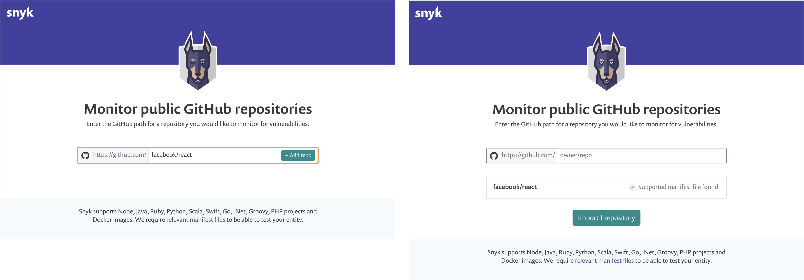

# GitHub Read-only Projects

### How GitHub Read-only Projects work

Snyk offers GitHub Read-only Projects, providing the ability to monitor a public GitHub repository that is not owned by your Organization.

Adding a read-only Project lets you track the vulnerabilities in a Project you are considering using as a dependency, a Project you are already using as a stand-alone independent tool within your business, or any other public repository where you do not need to actively prevent or fix issues using Snyk.

The repository is tested daily using your Organization's GitHub credentials. These automated tests are not counted as part of the test limits of your Snyk plan.

Unlike Projects imported through the Snyk GitHub integration, Projects that are imported or monitored with the read-only status cannot do the following:

* Use automatic retesting when a pull request is merged.
* Commit tests on any PR raised to detect and optionally block new vulnerabilities from being introduced.
* Use [automated fix PRs](../../../scan-with-snyk/pull-requests/snyk-pull-or-merge-requests/create-automatic-prs-for-new-fixes-fix-prs.md) to recommend minimal changes to fix vulnerabilities.
* Use [automated dependency upgrade PRs](../../../scan-with-snyk/pull-requests/snyk-pull-or-merge-requests/upgrade-dependencies-with-automatic-prs-upgrade-prs/) to keep dependencies up to date, avoid new vulnerabilities, and simplify fixing those that are found.
* Use manual Fix PRs generated through Snyk to address specific issues chosen by the user.

### How to monitor a public GitHub repository

Import a read-only Project using the **Add project** > **Monitor public GitHub repos** menu in the **Dashboard** and **Projects** tabs, or by going to [Monitor public GitHub repositories](https://app.snyk.io/add/github-readonly).

1. Enter a public repository to monitor, following the format `owner/repository.`
2. When you have entered a valid repository name, click **+ Add repo**.\
   The repository is quickly tested for a supported manifest file.
3. Enter the public repositories you want to monitor and select **Import N repository/ies**.

<figure><figcaption>
Add repo and Import repository or repositories
</figcaption></figure>
