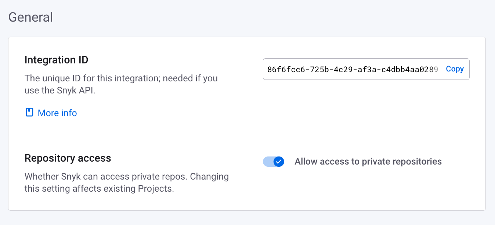
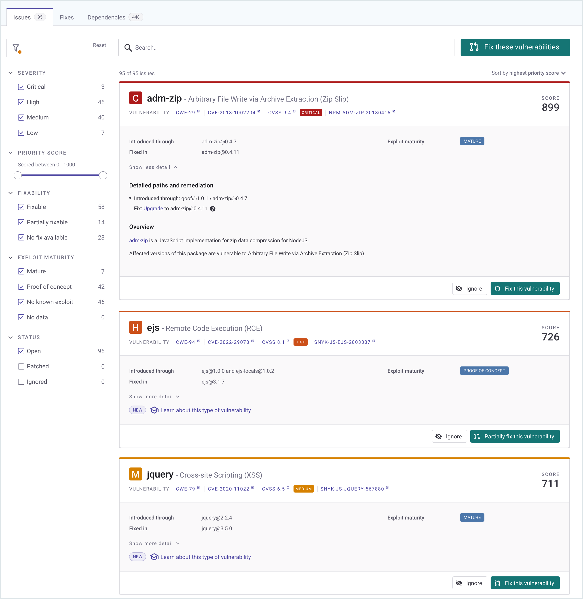
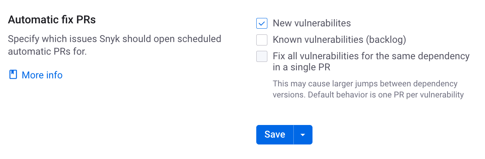
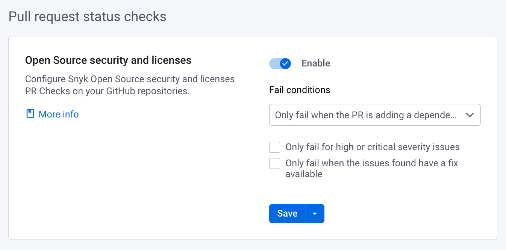
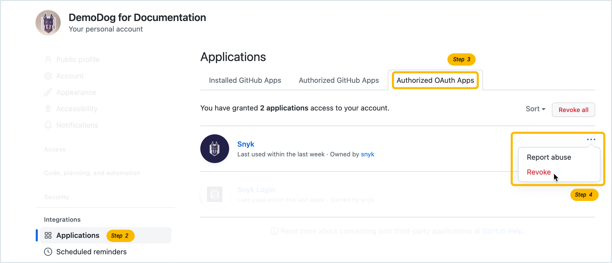

# GitHub

### Prerequisites for GitHub integration

* Internet-accessible repositories.\
  If your repositories are not internet-accessible, you must use [Snyk Broker](../../../implementation-and-setup/enterprise-setup/snyk-broker/).
* A public or private GitHub project.
* The required PAT and GitHub repository access scope permissions. For more information, see [GitHub and GitHub Enterprise permissions requirements](../user-permissions-and-access-scopes.md#github-and-github-enterprise-permissions-requirements).

### Known limitations of the GitHub integration

You cannot use the GitHub integration with a Snyk [Service Account](../../../implementation-and-setup/enterprise-setup/service-accounts/), as the GitHub integration is associated with your user account, not with the Snyk Organization.

Use the [GitHub Enterprise integration](github-enterprise.md) to import public and private Projects using the API with a Snyk Service Account.

### GitHub integration features

The GitHub integration allows you to:

* Continuously perform security scanning across all the integrated repositories
* Detect vulnerabilities in your open-source components
* Provide automated fixes and upgrades

### Per user, not per Organization

The GitHub integration is set up for your user account, not for a Snyk Organization. GitHub integration settings apply to all Organizations associated with your user account but do not automatically apply to other user accounts in an Organization.

When you import a Snyk Project using your GitHub integration with the Snyk PR functionality enabled, Snyk PRs are created for that Project. However, if another user imports Projects with their GitHub integration after disabling the Snyk PR functionality, Snyk PRs are not created for the Projects they import.

### How to set up the GitHub integration

To connect your GitHub repositories to Snyk for scanning, you need to set up the integration and then import Projects. For details, see [Getting started](../../../discover-snyk/getting-started/).

### GitHub integration settings

To see all settings for your GitHub integration, go to the GitHub Integration settings page, then navigate to Organization **Settings**, and select **GitHub** in the **Integrations** section:

You can then scroll down to the section required, and set the options accordingly:

* [General settings](github.md#general-github-integration-settings)
* Pull requests:
  * [Opening fix and upgrade pull requests from a fixed GitHub account](../../../scan-with-snyk/pull-requests/snyk-pull-or-merge-requests/opening-fix-and-upgrade-pull-requests-from-a-fixed-github-account.md)
  * [Automatic fix PRs](github.md#project-monitoring-and-automatic-fix-pull-requests)
  * [Automatic dependency upgrade PRs](../../../scan-with-snyk/pull-requests/snyk-pull-or-merge-requests/upgrade-dependencies-with-automatic-prs-upgrade-prs/)
  * [Pull request assignees](github.md#pr-assignment)
  * [Snyk vulnerability patches](../../../scan-with-snyk/snyk-open-source/manage-vulnerabilities/snyk-patches-to-fix-vulnerabilities.md)
* Pull request status checks ([PR Checks](../../../scan-with-snyk/pull-requests/pull-request-checks/))
  * [Open Source security and licenses](../../../scan-with-snyk/pull-requests/pull-request-checks/configure-pull-request-checks.md#configure-pr-checks-at-the-integration-level)
  * [Code analysis](../../../scan-with-snyk/pull-requests/pull-request-checks/configure-pull-request-checks.md#configure-pr-checks-at-the-integration-level)
* Dockerfiles
  * [Scan your Dockerfile](../../../scan-with-snyk/snyk-container/scan-your-dockerfile/)
  * [Fix vulnerable base images in your Dockerfile](../../../scan-with-snyk/snyk-container/scan-your-dockerfile/fix-vulnerable-base-images-in-your-dockerfile.md)

### General GitHub integration settings

Select **General** to view general settings:

<figure><figcaption>
GitHub integration general settings
</figcaption></figure>

* **Integration ID**: The unique ID for this integration, needed if you use the [Snyk API](../../../snyk-api/snyk-api.md).
* **Repository access**: Whether Snyk can access private repos (in addition to public repos). Changing this setting affects existing Projects.

### GitHub integration features

After you have connected GitHub to Snyk, you can use:

* [Project-level security reports](github.md#project-level-security-reports)
* [Project monitoring and automatic fix pull requests](github.md#project-monitoring-and-automatic-fix-pull-requests)
* [Commit signing](github.md#commit-signing)
* [Pull request testing](github.md#pull-request-status-checks)

#### Project-level security reports


**Feature availability**

Reports are available only with Enterprise plans. For more information, see [plans and pricing](https://snyk.io/plans/).


Snyk produces advanced [security reports](/broken/pages/-MhEHe4_cik3nchhmNWZ) that let you explore the vulnerabilities found in your repositories and fix them right away by opening a fix pull request directly in your repository, with the required upgrades or patches.

This example shows a Project-level security report.

<figure><figcaption>
Project-level security report
</figcaption></figure>

#### Project monitoring and automatic fix pull requests

Snyk scans your Projects on either a daily or a weekly basis. When new vulnerabilities are found, Snyk notifies you via email and opens automated pull requests with fixes for your repositories.

The example that follows shows a fix pull request opened by Snyk.

<figure><figcaption>
Fix pull request opened by Snyk
</figcaption></figure>

To review and adjust the automatic fix pull request settings in the Snyk GitHub Integration settings page, navigate to Organization **Settings** > **Integrations** > **Source control** > **GitHub**.

Scroll down to the **Automatic fix PRs** section and set the options. For definitions, see [Configure automatic fix PRs at the integration level](../../../scan-with-snyk/pull-requests/snyk-pull-or-merge-requests/create-automatic-prs-for-backlog-issues-and-known-vulnerabilities-backlog-prs.md#configure-automatic-fix-prs-at-the-integration-level).

<figure><figcaption>
Automatic fix pull request settings
</figcaption></figure>

#### Commit signing


**Feature availability**

For availability with Snyk Broker, see the [Commit signing](../../../implementation-and-setup/enterprise-setup/snyk-broker/snyk-broker-commit-signing.md) page in the Broker docs.


All the commits in Snyk's pull requests are done by `snyk-bot@snyk.io` (a verified user on GitHub), and signed with a PGP key. All Snyk pull requests appear as verified on GitHub, thus providing your developers with the confidence that the fix and upgrade pull requests are generated by a trusted source.

#### Pull request status checks

The Snyk [PR Checks](../../../scan-with-snyk/pull-requests/pull-request-checks/) feature allows Snyk to test any new PR in your repositories for security vulnerabilities and sends a status check to GitHub. This lets you see, directly in GitHub, whether or not the pull request introduces new security issues.

This example shows how Snyk PR checks appear on the GitHub pull request page.

<figure><figcaption>
Snyk pull request checks on GitHub pull request page
</figcaption></figure>

You can review and adjust the pull request test settings using the Snyk GitHub Integration settings page in Organization **Settings** > **Integrations** > **Source control** > **GitHub**.

<figure><figcaption>
Pull request status checks settings
</figcaption></figure>

### GitHub user permissions and actions

In non-brokered GitHub integrations, operations that are triggered through the Snyk Web UI, for example, opening a Fix PR or re-testing a Project, are performed on behalf of the acting user.

Therefore, a user who wants to perform this operation on GitHub through the Snyk UI must connect their GitHub account to Snyk with the required permission scope for the repositories where they want to perform these operations. See [GitHub and GitHub Enterprise permissions requirements](../user-permissions-and-access-scopes.md#github-and-github-enterprise-permissions-requirements) for details.

Operations that are not triggered through the Snyk Web UI, such as daily and weekly tests and automatic PRs (fix and upgrade), are performed on behalf of random Snyk Organization members who have connected their GitHub accounts to Snyk and have the required permission scope for the repository.

For public repositories that are non-brokered, some operations, such as creating the PR, may occasionally be performed by `snyk-bot@snyk.io`.


A Snyk Organization administrator can [designate a specific GitHub account to use for opening fix and upgrade PRs](../../../scan-with-snyk/pull-requests/snyk-pull-or-merge-requests/opening-fix-and-upgrade-pull-requests-from-a-fixed-github-account.md).

Note that Snyk will continue to use a random Snyk Organization member's GitHub account to perform all the other operations. Therefore using this feature does not eliminate the need to connect users' GitHub accounts to Snyk.


### **How to set up a GitHub account to open Snyk PRs** and enable the Pull Request Experience

You can designate a specific GitHub account to open fix and upgrade pull requests, and enable the [Pull Request Experience](../../../scan-with-snyk/pull-requests/pull-request-checks/pull-request-experience.md).


The configured account is only used for opening PRs and posting issue summary and inline comments. All other operations are still performed on behalf of a randomly selected Snyk Organization member who has connected their GitHub accounts to Snyk.


To use this feature, follow these steps:

1. Navigate to the GitHub Integrations settings page in the Snyk Web UI using Organization **Settings** **> Integrations** > **Source control** > **GitHub.**
2. In the **Open Snyk automatic PRs from a fixed GitHub account** section, enter your GitHub personal access token.\
   You can [generate this from your GitHub account](https://docs.github.com/en/authentication/keeping-your-account-and-data-secure/creating-a-personal-access-token).
3. Click **Save** to enable this feature.

<figure><figcaption>
Set an account to open Snyk PRs and to enable the Pull Request Experience
</figcaption></figure>


Ensure that the GitHub account that you designate to open Snyk PRs has write-level permissions or higher for the repos you want to monitor with Snyk.

See [GitHub and GitHub Enterprise permissions requirements](../user-permissions-and-access-scopes.md#github-and-github-enterprise-permissions-requirements) for more information.


### **How to assign pull requests to users** 


**Feature availability**

The Auto-assign PRs feature is supported only for private repositories.


Snyk can automatically assign the pull requests it creates to ensure that they are handled by the right team members.

Auto-assign for PRs can be enabled for the GitHub and GitHub Enterprise integration and all Projects imported via GitHub, or on a per-Project basis.

Users can either be manually specified, and all will be assigned, or automatically selected based on the last commit user account.

#### **Enable Auto-assign for all Projects in the GitHub integration**

To configure the Auto-assign settings for all the Projects from an imported private repository, go to the Github integration settings using Organization **Settings >** **Integrations** > **Source control** > **GitHub** and select **Enable pull request assignees**.&#x20;

You can then choose to assign PRs to the last user to change the manifest file or specified contributors.

<figure><figcaption>
Auto-assign PRs in private repos
</figcaption></figure>


For pull request assignees, the option **The last user to change the manifest file** is based on blame data, not Git commits.


#### **Enable Auto-assign for a single Project**

To configure the Auto-assign settings for a specific Project from an imported private repository, follow these steps:

1. In the **Projects** tab for your Organization, select and expand the relevant private repository, select a Target, and click the **Settings** cog. This opens the Project page.
2. On the Project page, apply unique settings for that specific Project.\
   Select the **Settings** tab in the upper right and the **Github integration** \_\_ option in the left sidebar.
3. Go to the **Pull request assignees for private repos** section at the bottom of the page and choose to **Inherit from integration settings** or **Customize only for this Project**.
4. Ensure **Auto-assign PRs for this private Project** is enabled.
5. Choose to assign PRs to the last user to change the manifest file or named contributors.

<figure><figcaption>
Auto-assign PRs for this private Project
</figcaption></figure>

### How to disable the GitHub integration

The GitHub SCM integration leverages the OAuth app integration. If you integrated GitHub without using Snyk Broker, you can disconnect it by following these steps:

1. In GitHub, log in to the GitHub account that you used to create the integration.
2. Go to your GitHub account settings and select the **Applications** option in the left sidebar.
3. Select the **Authorized OAuth Apps** tab.\
   You can also reach the [Authorized OAuth Apps tab directly](https://github.com/settings/applications).
4. Find the **Snyk** entry, click the three (3) dots on the right, and select **Revoke**.

<figure><figcaption>
Revoke OAuth authorization
</figcaption></figure>

Revoking this access effectively disconnects Snyk’s access to that GitHub account.

* Existing imported snapshots will persist in Snyk and continue to be re-scanned based on the existing snapshots until deleted.
* Snyk will no longer be able to import new Projects from the GitHub integration and will no longer re-scan on new code merges.

In addition, you must confirm that Snyk is not enabled on any existing **Branch protection rules.**


Note that branch protection is active only after a PR has been raised.


1. From the main page of your GitHub repository, go to **Settings** > **Branches** > **Branch protection rules.**
2. Ensure there are no **Status checks found in the last week for this repository.**


A disconnected GitHub integration will still appear as configured in the Integrations menu of the Snyk UI. However, clicking on the integration settings will show that it is not connected. In this case, the "configured" integration can safely be ignored.


### Migrate to the GitHub Enterprise integration


Before deleting Snyk Projects imported using the GitHub integration, consider the impact on reporting. If you decide to delete Projects, and none remain for a Target, delete the Target too. For details, contact your Snyk account team or Snyk support.


Before you configure and Import Projects using the [GitHub Enterprise integration](github-enterprise.md), Snyk recommends removing all Projects imported using the GitHub integration. This avoids having duplicate Snyk Projects.

You can remove Projects imported using the GitHub integration manually by removing the Projects from Snyk. However, depending on how many Projects you have already imported using the GitHub integration, it may be easier for you to create a new Snyk Organization.

If you have already created multiple Snyk Organizations and Projects have been imported from GitHub to each Organization, it may be easier to re-create the Snyk Organizations to use the Snyk GitHub Enterprise integration than to update each one manually. If you choose to do this, you can copy integration settings from an existing Organization to avoid having to re-configure other integrations.

#### Migration steps

If you already have multiple Snyk Organizations with Projects imported using the GitHub integration, follow these steps to migrate from GitHub integration to GitHub Enterprise integration.

1. Create a new Snyk Organization that will be used as the template for all others. You can copy integration settings from an existing Organization if required.
2. In this new template Organization, set up the Snyk GitHub Enterprise integration using the steps on the page [GitHub Enterprise integration](github-enterprise.md#how-to-set-up-the-github-enterprise-integration). The dedicated GitHub service account in those steps is a separate user account that you will use as the connection between Snyk and GitHub.
3. When the Snyk GitHub Enterprise integration is configured, you can import a Project to your template Organization to test that the integration is working as expected.
4. You can now create new Organizations that will replace the existing Organizations that were configured using the GitHub integration. As you create each new Organization, ensure that you copy the integration settings from this template Organization so that the GitHub Enterprise integration is available.
5. Now that your new Organizations are created, you can import your Projects, choosing the GitHub Enterprise integration when you select the source.
6. You can now remove the previous Organizations that were configured using the GitHub integration.

You may want to [disconnect your GitHub integration](github-enterprise.md#how-to-disconnect-the-github-enterprise-integration) to avoid unintentionally importing Projects using the GitHub integration in the future. Because the GitHub integration is configured per user account, rather than per Organization, each user who has set up the GitHub integration must complete this disconnection process individually.
