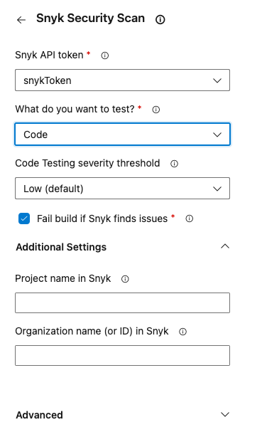
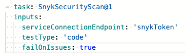

# Example of a Snyk task to test application code

The following shows an example of Snyk Security Scan task configuration and parameters for testing application code.

The configuration panel appears as follows:

<figure><figcaption>
Snyk Security Scan configuration panel
</figcaption></figure>

The following shows the same configuration once you have added it to your pipeline.

<figure><figcaption></figcaption></figure>
