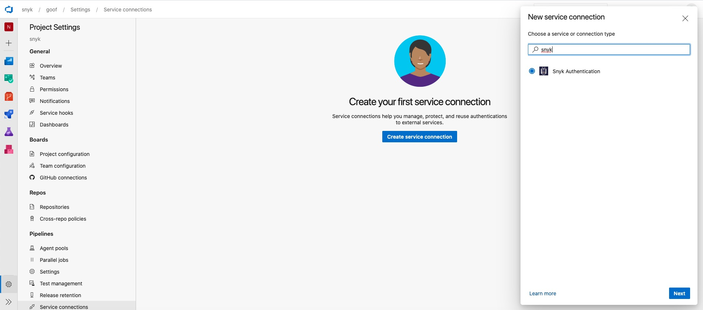
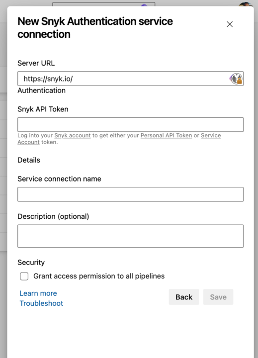

# Install the Snyk extension for your Azure pipelines

To start using the Snyk task as part of your pipeline build, from the [Visual Studio Marketplace](https://marketplace.visualstudio.com/items?itemName=Snyk.snyk-security-scan), install the extension into your Azure DevOps instance for your Organization.

## **Prerequisites for installing Snyk extension for Azure pipelines**

* Create a Snyk account at [https://snyk.io/](https://snyk.io).
* Ensure you are an owner or administrator of this account.

## **Step for installing the Snyk extension for Azure pipelines**

1. Log in to your Snyk account.
2. Token:
   1. For **free plans**, navigate to your **General Account Settings** and find, copy, and save your personal API token.
   2. For **paid plans**, navigate to the Organization where you want to integrate; then navigate to **Settings** to create a new service account token. Copy and save the new service account token.
3. Access your Azure DevOps account and navigate to the **Extensions  > Browse marketplace.**
4. Search for the **Snyk Security Scan** extension and click **Get it free**.
5. Create a new **Service Connection** in your Project using **Project Settings** > **Pipelines** > **Service Connections**.
6. Select the **Snyk Authentication** service connection:
   1. In the Snyk Authentication service connection form, enter the **Snyk API Token or Snyk PAT**.
   2. Click **Save**, ensuring the new service connection appears in your list of service connections.

<figure><figcaption>
Create your first service connection
</figcaption></figure>

<figure><figcaption>
New Snyk authentication service connection
</figcaption></figure>


If you are hosted in a region other than `SNYK-US-01`, see the section [Regional API endpoints](regional-api-endpoints.md).

