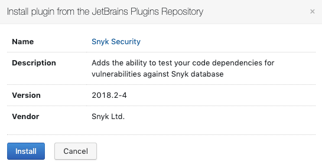

# TeamCity integration: install the Snyk plugin

Follow these steps to install or upgrade the Snyk Security plugin. When the installation is complete, you can add a Snyk step to your Projects.

Before you begin, sign up for a Snyk account.

1. Log in to your TeamCity instance to install the Snyk Security plugin.
2. Configure the **Plugins list** to **Periodically check for plugin updates**, to ensure regular automatic upgrades in the background.
3. Navigate to the [JetBrains Plugins Repository](https://plugins.jetbrains.com/plugin/12227-snyk-security), search for Snyk, and, from the **Get** dropdown list, select the plugin for your TeamCity installation.
4. In response to the prompt, click **Install**.
5. When the installation ends, and the **Administration Plugins List** loads with a notification that the plugin has been uploaded, ensure the plugin is enabled.

To configure the integration, see [TeamCity configuration parameters](teamcity-configuration-parameters.md). For information on how to configure your build with a Snyk step, see [Team City integration: use Snyk in your build](teamcity-integration-use-snyk-in-your-build.md).
