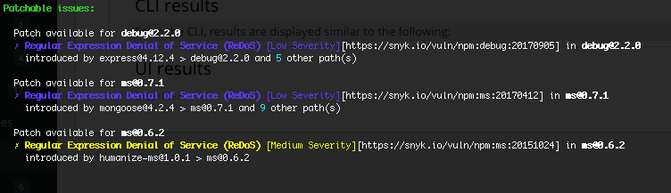

# Fix vulnerabilities using the Snyk CLI

The Snyk CLI provides support for fixing vulnerabilities found by using the `snyk test` command. For information about fixes in the Web UI, see [Fix your vulnerabilities](../../../scan-with-snyk/snyk-open-source/manage-vulnerabilities/fix-your-vulnerabilities.md). For general information about patches, see [Snyk patches to fix vulnerabilities](../../../scan-with-snyk/snyk-open-source/manage-vulnerabilities/snyk-patches-to-fix-vulnerabilities.md).

If you are using `snyk container test`, see [Understanding Snyk Container CLI results](snyk-cli-for-snyk-container/understand-snyk-container-cli-results.md) for information about resolving vulnerabilities found in a scan. If you are using `snyk code test`, see [View Snyk Code CLI results](snyk-cli-for-snyk-code/view-snyk-code-cli-results.md). If you are using `snyk iac test`, see [Understanding the IaC CLI test results](snyk-cli-for-iac/understand-the-iac-cli-test-results/).

## Upgrade and patch results from the CLI

From the CLI, for each list (upgrade and patch), results are displayed in groups based on the packages Snyk recommends that you fix. The results include the following:

* details for all vulnerabilities introduced per package; to view all dependency paths affected, use `--show-vulnerable-paths=all` when running `snyk test` or `snyk monitor`
* links to full descriptions of each vulnerability

Upgrade and patch results appear similar to the following:

<figure><figcaption>
Upgrade results in the CLI
</figcaption></figure>

Patch recommendations appear similar to the following:

<figure><figcaption>
Patch results in the CLI
</figcaption></figure>

## Snyk patches to fix vulnerabilities using the CLI

The `protect` command was replaced by `@snyk/protect`: [https://github.com/snyk/snyk/tree/master/packages/snyk-protect](https://github.com/snyk/snyk/tree/master/packages/snyk-protect); [npm package for `snyk-protect` command](https://www.npmjs.com/package/@snyk/protect). These pages have instructions for using the package and migrating from `snyk protect`.
