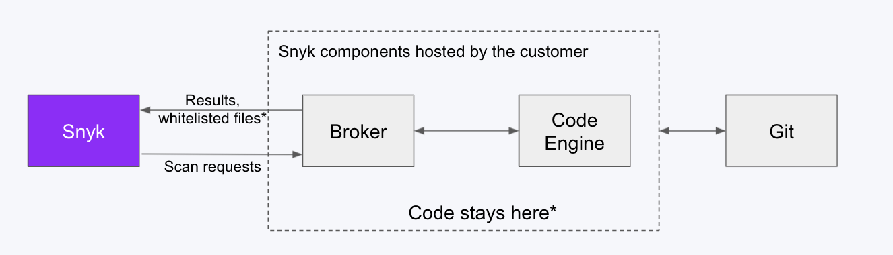

# Scan all unmanaged JAR files

The Snyk CLI can scan unmanaged JAR files in [Java applications](../../../supported-languages-package-managers-and-frameworks/java-and-kotlin/) to identify which open-source package they contain.

The CLI identifies the package name, version, and vulnerabilities only if the package is available in Maven Central, and the JAR file hash matches the hash in Maven Central.

**Prerequisite:** You must install a [supported version](../../../supported-languages-package-managers-and-frameworks/java-and-kotlin/#supported-package-managers-and-package-registries) of Maven to scan unmanaged JAR files.

## Scanning all JAR files in a single folder and scanning each JAR file individually

To scan each JAR file individually, use the following command:

`snyk test --scan-unmanaged --file=/path/to/file`

When you test each JAR file individually, the name of the JAR file that was scanned appears on the Snyk web UI.

**WAR file support**: You can scan individual WAR files that are published in Maven Central. To scan open-source dependency JARs directly, you must extract (unzip) all other WAR files or JAR files containing other JARs.

## Recursively scanning all subfolders


**The method described here is deprecated.**

Beginning with Snyk CLI 1.1176.0, by default you can scan all subfolders using the `--scan-all-unmanaged`option. When you scan using --`scan-all-unmanaged`, the package name appears rather than the file name.


Java apps often have JAR files in a number of different folders within an application.

The following is a Linux/Mac Bash script used with CLI versions before Snyk CLI 1.1176.0 that recurses through all subfolders starting with the current folder and tests each JAR file found.

Setting a value for the `REMOTE_REPO_URL` variable is important; it is used to combine all scan results under a single Snyk Project in the UI using the `--remote-repo-url` parameter.

```
#!/bin/bash

SNYK_CLI_BINARY_NAME=snyk-cli
SNYK_CLI_BINARY_LOCATION=https://github.com/snyk/cli/releases/latest/download/
REMOTE_REPO_URL= #Insert desired project name in Snyk UI here

detected_jars=""
undetected_jars=""
detected_count=0
undetected_count=0

[[ -z "$REMOTE_REPO_URL" ]] && { echo "REMOTE_REPO_URL is empty. Please enter REMOTE_REPO_URL (line 6) and re-run script." ; exit 1; }

#Download Snyk binary specific to OS (MacOS or Linux)
case "$(uname -s)" in
   Darwin)
     curl -L -O $SNYK_CLI_BINARY_LOCATION/snyk-macos
     mv snyk-macos snyk-cli
     ;;
   Linux)
     curl -L -O $SNYK_CLI_BINARY_LOCATION/snyk-linux
     mv snyk-linux snyk-cli
     ;;
esac

chmod +x $SNYK_CLI_BINARY_NAME

#Loop through folders recursively to find all .jar files
#NOTE: will ERROR on files with whitespace in name or contained in directories with whitespace in name
for file in $(find . -type f -name '*.jar' | uniq)
do
echo ""
echo "=-=-=-=-=-=-=-=-=-=-=-=-=-=-=-=-=-=-=-=-=-="    
echo $file
echo "=-=-=-=-=-=-=-=-=-=-=-=-=-=-=-=-=-=-=-=-=-=" 

#Execute Snyk monitor for each .jar
if (./$SNYK_CLI_BINARY_NAME monitor --scan-unmanaged --file=$file --project-name=$file --remote-repo-url=$REMOTE_REPO_URL) then
  detected_jars+=$file'\n'
  let detected_count++
else
  undetected_jars+=$file'\n'
  let undetected_count++
fi

done

#Output metrics to the console
echo ""
echo ""
echo ""
echo "=-=-=-=-=-=-=-=-=-=-=-=-=-=-=-=-=-=-=-=-=-=" 
echo "Detected jars ($detected_count) - does not include transitive dependencies:"
echo ""
if [ ${detected_count} -gt 0 ]; then
   printf "${detected_jars}"
fi
echo ""
echo ""
echo ""
echo "=-=-=-=-=-=-=-=-=-=-=-=-=-=-=-=-=-=-=-=-=-=" 
echo "Undetected jars ($undetected_count) - not found on Maven Central:"
echo ""
if [ ${undetected_count} -gt 0 ]; then
   printf "${undetected_jars}"
fi
```

The following is a Windows batch script for scanning JARs in all subfolders, run from a `scanjar.bat` file.

To use this script, you must have installed the Snyk CLI.

```batch
REM Usage:    
REM For example: scanjar.bat "C:\workspace\app" "myapp" 
SET WORKSPACE=%1 
SET REMOTE_REPO_URL=%2 
for /R %WORKSPACE% %%f in (*.jar) do cmd /c snyk monitor --scan-unmanaged --remote-repo-url=%REMOTE_REPO_URL% --file=%%f --project-name=%%f
```

An example follows of the result shown in the Snyk UI after you use these scripts with `REMOTE_REPO_URL` set to "econnect".

<figure><figcaption><p>Result of scanning unmanaged JAR files</p></figcaption></figure>
