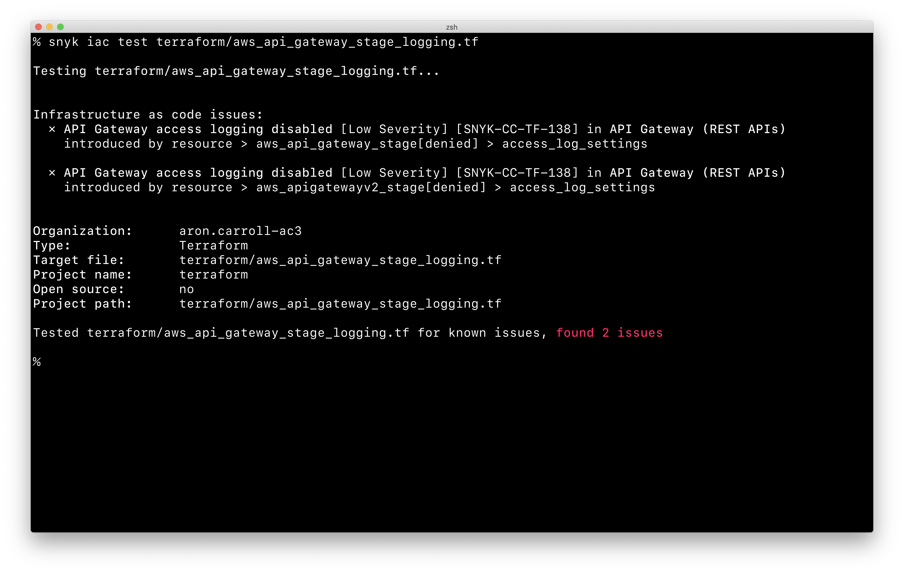
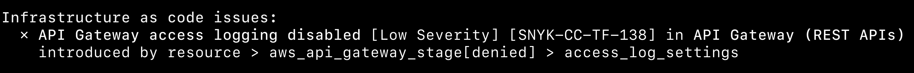

# Snyk IaC CLI test results (v. 1.938.0 and earlier)


The instructions in this section apply to any file format supported by Snyk Infrastructure as Code, including Terraform, Kubernetes, CloudFormation, and ARM.


Snyk analyzes your configuration file for issues and provides additional information on the issues discovered that can help you resolve them.

For example, when scanning a Terraform file, run the following command:

```
snyk iac test aws_api_gateway_stage_logging.tf
```

The results from running this command follow:

<figure><figcaption><p>snyk iac test output</p></figcaption></figure>

The results include a list of issues sorted by severity, where each issue reported includes the following details:&#x20;

* **Heading** - the issue that was detected, the severity of that issue, and the Snyk Policy ID for that particular issue.
* **Location** - the property path within the configuration file where the issue was identified. See the example that follows for more details.

<figure><figcaption><p>Example of property path</p></figcaption></figure>

The path of this issue is specified as follows:

```
resource > aws_api_gateway_stage[denied] > access_log_settings
```

The following example represents the content of the `aws_api_gateway_stage` block, called "**denied**", which lacks the `access_log_settings` field.


```
resource "aws_api_gateway_stage" "denied" {
  xray_tracing_enabled = true
}
```

