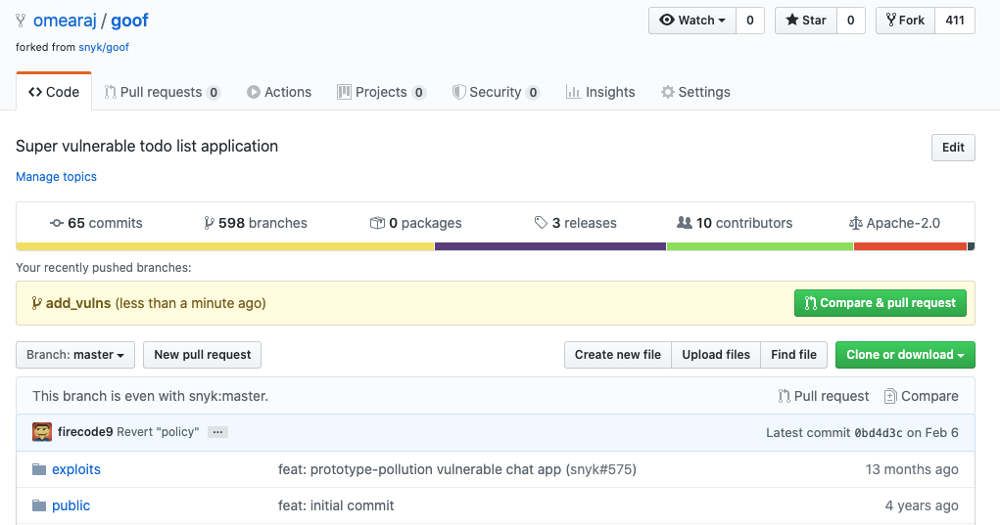

# Integrate Snyk into your workflow using the CLI

This page provides an example of integrating Snyk into your GitHub workflow using the [Snyk CLI](../../).

### Step 1: Set up the environment

1.  Open the [Snyk CLI](../../), and run a git clone command on the **goof** repository.

    ```
       git clone https://github.com/snyk/goof.git
    ```
2.  Create a new branch, add vulnerabilities on this branch, then merge changes back to GitHub as a Pull Request:

    ```
       git branch add_vulns
       git checkout add_vulns
    ```

### Step 2: Add an open-source dependency

Review the **package.json** manifest file in your cloned goof application, to see multiple direct dependencies listed:

<figure><figcaption><p>List of dependencies in the package.json file</p></figcaption></figure>


These direct dependencies can also have additional transitive dependencies; libraries that they depend on.


To add the dependency:

* Add the **tinymce 4.1.0** library at the bottom of the dependencies list:

```
   {
   "name": "goof",
   ...
   }
   "dependencies" {
    ...
   "typeorm": "^0.2.24",
   "tinymce": "4.1.0"
   },
   ...
```


Tip: remember to place a comma after the previous dependency.


*   Create a [lock file](https://docs.npmjs.com/files/package-lock.json) for the Node application:

    ```
    npm install --package-lock
    ```


Tip: if this file already exists, run rm package-lock.json to remove it.


### Step 3: Commit and review changes

* Commit your change locally, checking the status of the change in the local git repository, then adding the change to the local git, and then committing it:

```
   git status
   git add package*
   git commit -m "adding tinymce v4.1.0"
```

* Commit your local code change to GitHub, transferring the files and history to your upstream git repository on GitHub:

```
   git push --set-upstream origin add_vulns
```

```
GitHub has received your changes on your **add\_vulns** branch.
```

* In GitHub, click **Compare & pull request** to compare the **add\_vulns** branch with the **master** branch and generate a pull request:

<figure><figcaption><p>Pull request information in GItHub</p></figcaption></figure>

### Step 4: Use Snyk PR Checks

Snyk can auto-scan your pull request (PR) for vulnerabilities and license issues in the merge process:

<figure><figcaption><p>Snyk pull request checks in GitHub</p></figcaption></figure>

As the PR workflow is completed, Snyk validates the vulnerability and license policy set for the Project. Based on the policy, the checks either passed or failed; this is shown in GitHub.

This allows you to establish a security gate and prevent pull requests from adding new vulnerabilities, or new open-source libraries that do not meet your license policy, to the source code baseline.
