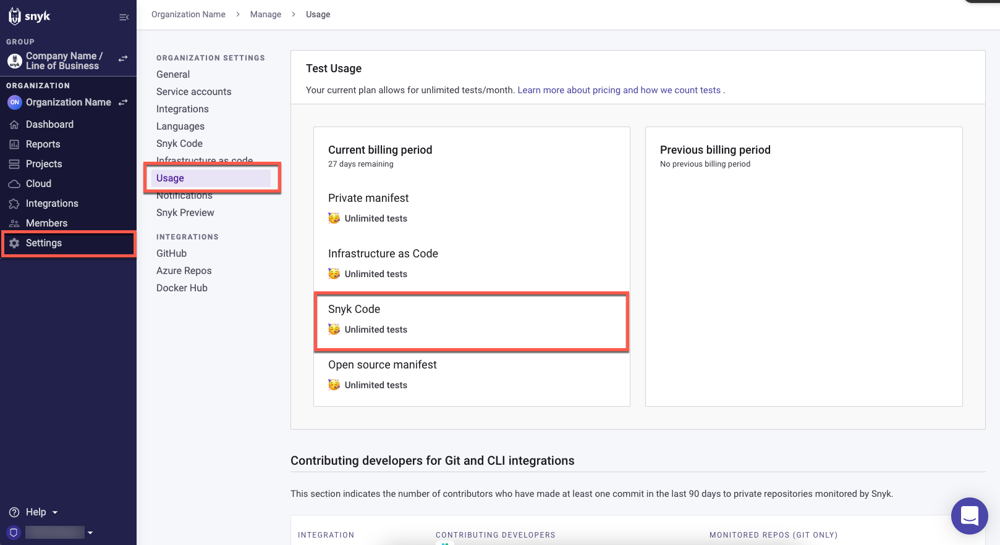
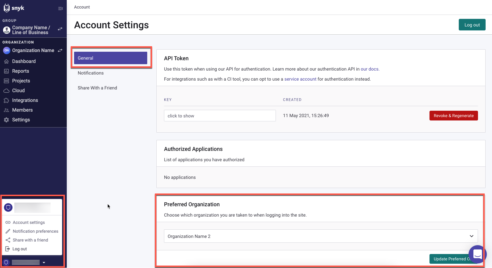
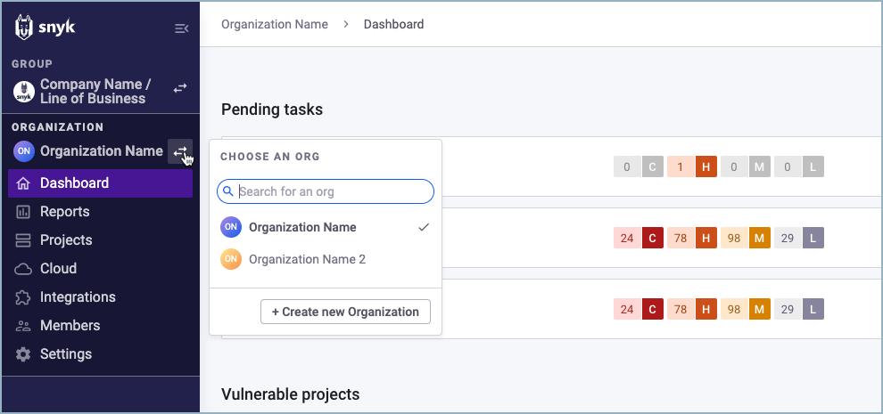
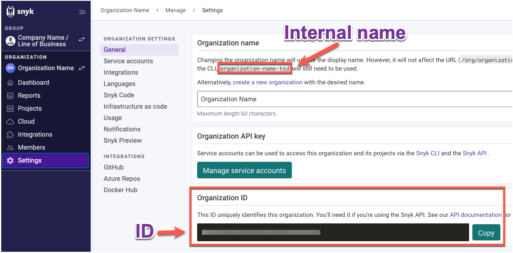

# Set the Snyk Organization for CLI tests

If you have several Organizations in your Snyk account, before you test your code using the CLI, specify which Snyk Organization will be used for the test count.

You can find your available CLI test count on the Organization **Settings** page -> **Usage** tab -> **Test Usage** section -> **Snyk Code** field:

<figure><figcaption><p>Snyk Code allowed test usage</p></figcaption></figure>

By default, the CLI runs tests under your **Preferred Organization**, as defined in your **Account settings:**

<figure><figcaption><p>Preferred Organization in Snyk Account settings</p></figcaption></figure>

You can [change your **Preferred Organization**](../../../../snyk-platform-administration/groups-and-organizations/organizations/create-and-delete-organizations.md) or set another Organization for the CLI tests via the CLI.

When setting an Organization for the CLI tests, you have two options:

* [Set the default Organization globally for CLI tests](set-the-snyk-organization-for-the-cli-tests.md#set-the-default-organization-globally-for-cli-tests)
* [Set an Organization locally for a specific CLI test](set-the-snyk-organization-for-the-cli-tests.md#set-an-organization-locally-for-a-specific-cli-test)

## Find Snyk ID and internal name of an Organization

When setting an Organization for the CLI tests, you can use either the Organization ID or the Organization internal name. These Organization identification details are generated automatically by Snyk for each Organization when it is created. The value you select to enter in the command will be shown as the **Organization** name in the test results. You can find the Snyk ID and internal name on the **Settings** page of the Organization on the Web UI.

Follow these steps to find an Organization ID and internal name:

1\. On the Snyk Web UI, open the Organization whose details you want to find:

<figure><figcaption><p>Open an Organization to find its details</p></figcaption></figure>

2\. Once the selected Organization is open, click the **Org Settings.**

3\. On the **Settings** page of the Organization, select the **General** tab to find the following:

* **Internal name:** stated in the **Organization name** section.
  * You can change the display name of an Organization, but not the internal name.
  * The internal name also appears in the URL of the Organization.
  * When using the internal name for setting the Organization for the CLI tests, copy the name from the **Settings** page. The internal name is always written in lowercase letters.
* **ID:** appears in the **Organization ID** section. You can use the **Copy** button to copy the ID to the CLI.

<figure><figcaption><p>Organization name and ID</p></figcaption></figure>

## Set the default Organization globally for CLI tests&#x20;

You can set a default Organization globally for all CLI tests via the CLI. This default Organization will override the Organization set as the [preferred Organization](../../../../snyk-platform-administration/groups-and-organizations/organizations/create-and-delete-organizations.md). When entering this command, you can use either the [ID or internal name](set-the-snyk-organization-for-the-cli-tests.md#find-snyk-id-and-internal-name-of-an-organization) of the new default Organization.

Regardless of the Organization you set as a global default, you can [run specific CLI tests under a different Organization](set-the-snyk-organization-for-the-cli-tests.md#set-an-organization-locally-for-a-specific-cli-test).

To set a default Organization for all CLI tests, In the terminal, enter

```
snyk config set org=<ORG_ID_or_ORG_INTERNAL_NAME>
```

You receive the following confirmation:

```
org updated
```

From now on, all your CLI tests will run under the specified Organization.

For example, to set the Snyk Demo Org as the default Organization for the CLI tests, use the Organization ID and enter:

```
snyk config set org=a7708807-3881-xxxx-xxxx-xxxxxxxxxxxx
```

<figure><figcaption><p>Command to set Organization and confirmation</p></figcaption></figure>

From now on, all the CLI tests will run by default under the Snyk Demo Org Organization, and the Snyk Demo Org ID will appear in the test results:

<figure><figcaption><p>Snyk Demo Org ID in test results</p></figcaption></figure>

## Set an Organization locally for a specific CLI test

You can run a specific CLI test under a different Organization from the default. When using this option, the specified Organization will override the default Organization in a specific CLI test. You can use either the [ID or internal name of the Organization](set-the-snyk-organization-for-the-cli-tests.md#find-snyk-id-and-internal-name-of-an-organization) to run a command.

To set an Organization for a specific CLI test in the terminal, after the `test` command enter:

```
--org=<ORG_ID_or_ORG_INTERNAL_NAME>
```

For example, to set the Snyk Test Org as the Organization for a specific CLI test, we use the Organization internal name and enter:

```
snyk code test --org=snyk-xxxx-xxx 
```

The internal name of the Snyk Test Org Organization appears in the results of this test:


