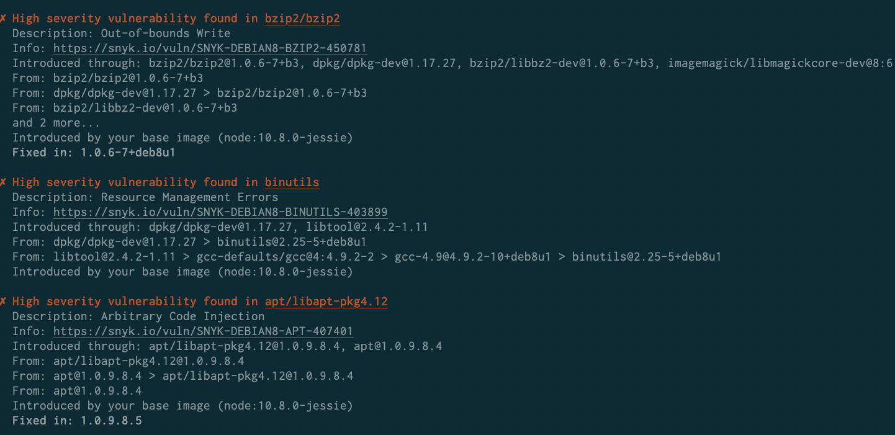
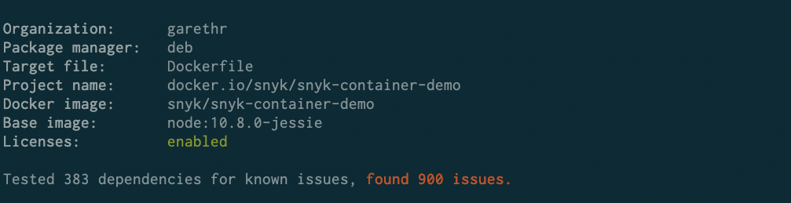
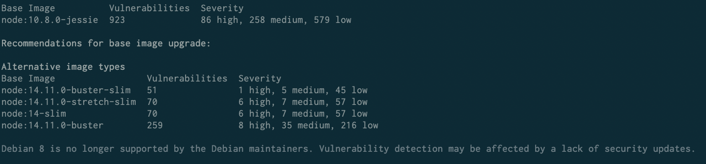

# Understand Snyk Container CLI results

## **Vulnerability information**

When Snyk Container detects vulnerabilities, they are presented in the output:

<figure><figcaption>
Vulnerabilities detected with Snyk Container
</figcaption></figure>

Each vulnerability contains the following information:

| **Field**              | **Description**                                                                                                                                                                                                                                       |
| ---------------------- | ----------------------------------------------------------------------------------------------------------------------------------------------------------------------------------------------------------------------------------------------------- |
| **Severity**           | The importance of the specific vulnerability. For more information, see [Severity levels of detected Linux vulnerabilities](../../../../scan-with-snyk/snyk-container/how-snyk-container-works/severity-levels-of-detected-linux-vulnerabilities.md). |
| **A clear heading**    | A summary of the vulnerability and the package it affects.                                                                                                                                                                                            |
| **Description**        | A brief description of the type of issue or Common Vulnerabilities and Exposure (CVE) reference, if a CVE exists.                                                                                                                                     |
| **Info**               | A link to vulnerability details, including links to upstream sources and global vulnerabilities databases.                                                                                                                                            |
| **Introduced through** | The top-level package names that the vulnerability affects.                                                                                                                                                                                           |
| **From**               | How the affected packages came to be in the image.                                                                                                                                                                                                    |
| **Introduced by**      | Whether the vulnerability is in the base image or which line in the Dockerfile introduced the vulnerability.                                                                                                                                          |
| **Fixed in**           | If available, the version of the package that has a fix for the vulnerability.                                                                                                                                                                        |

Vulnerabilities appear in reverse order of severity so that you can see the most important issues first, with limited scrolling required.

Snyk also reports the total dependencies scanned for known vulnerabilities and the total number of vulnerabilities.

<figure><figcaption>
Example of total dependencies scanned and the issues found
</figcaption></figure>


Snyk groups together vulnerabilities that are found in multiple packages. This helps you focus on the number of vulnerabilities rather than the instances only.


## Base image recommendations

Snyk SCM scanning supports a subset of Docker Hub images. Other registries are not supported.

If Snyk identifies the base image, and the image uses an [Official Docker image](https://docs.docker.com/docker-hub/official_images/), the output includes recommendations for upgrades, in order to fix some of the discovered vulnerabilities.

<figure><figcaption>
Example of recommendations to upgrade the base image
</figcaption></figure>

This provides a level of situational awareness, showing the vulnerability counts in minor and major upgrades or in alternative base images, which might have fewer vulnerabilities.
