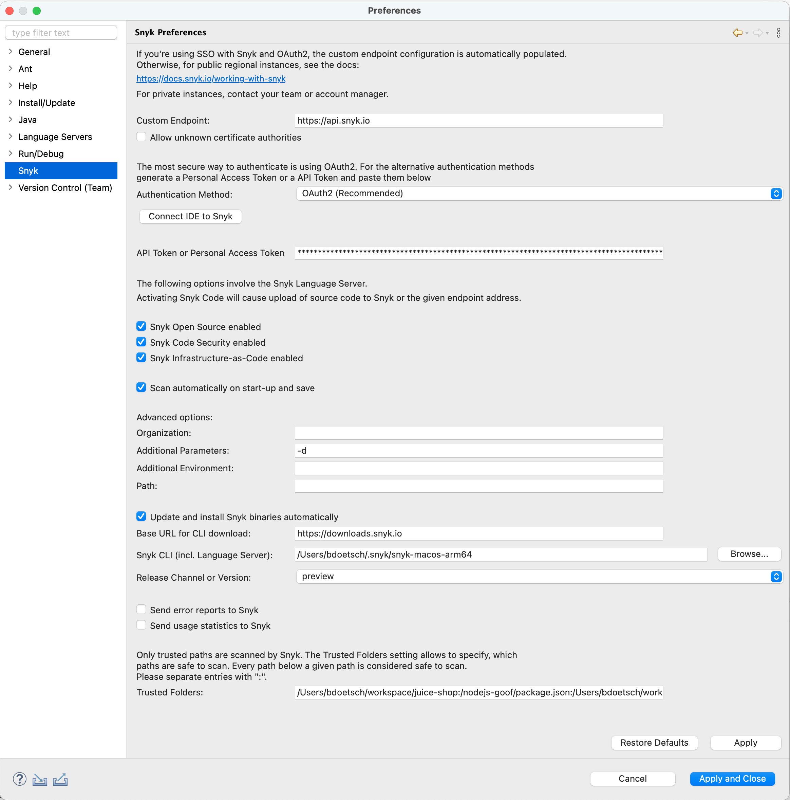

# Configuration of the Eclipse plugin

You can configure both [Global settings](configuration-of-the-eclipse-plugin.md#global-settings) and [Project-specific properties](configuration-of-the-eclipse-plugin.md#project-specific-properties).

## Global settings

You can set the following global configuration settings in the Snyk preferences.

<figure><figcaption>
Snyk preferences
</figcaption></figure>

* **Custom Endpoint**: Specify the Snyk API endpoint for a custom multi-tenant or single-tenant setup. If you are using `https://api.snyk.io`, no configuration is required. For details, see the list of [IDEs URLs](../../../snyk-data-and-governance/regional-hosting-and-data-residency.md#ides-urls).\
  Multi-tenant users who do not belong to the `SNYK-US-01` region will be automatically redirected to the correct domain for the email with which the user authenticated. The redirect will not occur for cases where the users are expected to use a custom URL, such as companies with single-tenant setups.
* **Allow unknown certificate authorities**: Disable certificate checks for SSL connections.
* **Authentication Method**: Select to override the default OAuth2 authentication in order to use a Snyk API token. Snyk recommends keeping this setting off because the default OAuth2 authentication is more secure.
* **Connect to Snyk:** Launch the web-browser to authenticate. In case of Personal Access Tokens, it will redirect to the correct website where the token can be generated and copied from.
* **API Token or Personal Access Token**: Set the authentication token for Snyk.
* **Snyk Open Source enabled**: Enable or disable Snyk Open Source Dependency Scans through the Language Server. Default: `Enabled`.
* **Snyk Code Security enabled**: Enable or disable Snyk Code Security Issues through the Language Server. Default: `Disabled`.
* **Snyk Infrastructure-as-Code enabled**: Enable or disable Snyk IaC scans through the Language Server. Default: `Enabled`.
* **Scan automatically on start-up and save**: Scan automatically or not when you start the extension.
* **Organization**: Specify the Snyk Organization to use for scanning. Snyk recommends using the `ORG_ID`. The `ORG_ID`  is a UUID. If you specify an Organization slug name, the value must match the URL slug (`[orgslugname]`) as displayed in the URL of your Organization in the Snyk UI: `https://app.snyk.io/org/[orgslugname]`. If this is not specified or incorrect, the preferred Organization, as defined in your [web account settings](https://app.snyk.io/account), is used to run tests.
* **Additional Parameters**: Specify additional parameters to pass to the CLI, for example, `--file=pom.xml` or `--debug.` \
  Note: When you enable `debug`, your code may be logged in the IDE log files, for example, the `idea.log` file.
* **Additional Environment**: Add environment variables to the Language Server; multiple variables can be separated by `;`. Example: `JAVA_HOME=/Library/JDK/bin;GOPATH=/usr/local/bin`&#x20;
* **Path**: Specify your additions to the path to find needed third-party tools such as Gradle or Maven.
* **Update and install Snyk binaries automatically**: If **disabled**, the CLI binary is not downloaded automatically, and updates must be performed manually. Snyk recommends always using the most recent stable version of the CLI with the most recent stable Eclipse plugin version to maintain compatibility between CLI and plugin. Ensure that the location for the CLI points to an existing current binary.
* **Base URL for CLI download**: Specify an alternative download host for the CLI, for example, `https://downloads.snyk.io/fips`. This must provide the CLI and necessary files as the default `https://downloads.snyk.io` does, that is, the following files. See also GitHub[ releases](https://github.com/snyk/cli/releases).
  * %Base URL%/cli/v%VERSION%/%CLI-BINARY-NAME%
  * %Base URL%/cli/v%VERSION%/%CLI-BINARY-NAME%.sha256
  * %Base URL%/cli/v%VERSION%/sha256sums.txt.asc
  * %Base URL%/cli/v%VERSION%/release.json
  * %Base URL%/cli/stable/version
  * %Base URL%/cli/stable/%CLI-BINARY-NAME%
  * %Base URL%/cli/stable/%CLI-BINARY-NAME%.sha256
  * %Base URL%/cli/stable/ls-protocol-version-%PROTOCOL\_VERSION%
  * %Base URL%/cli/stable/release.json
  * %Base URL%/cli/stable/sha256sums.txt.asc
* **Snyk CLI (incl. Language Server)**: Specify the location of the Snyk CLI, where it is searched for, and where it is downloaded to. Downloads occur only if automatic management of Snyk binaries is enabled.
* **Release Channel or Version**: Choose `preview`, `release candidate`, or `stable`. This is relevant only if automatic downloads are enabled.
* **Send error reports to Snyk**: Send errors from the Language Server to Snyk to enable quick bug fixing. Default: `Enabled`.
* **Send usage statistics to Snyk**: Allow Snyk to get usage data to improve workflows. Default: `Enabled`.
* **Trusted Folders**: Specify which directories should be considered safe, for example, the parent directory of all your Projects.

## Project-specific properties

You can specify Project-specific scan settings on the **Snyk** page in the **Project Properties**. To open the **Project Properties** page, right-click the root folder of your Project in either the **Package Explorer** or **Project Explorer** view, then select **Properties** from the context menu.

<figure><figcaption>
Snyk Project-specific properties page, allowing entry of scan parameters for the Project
</figcaption></figure>

