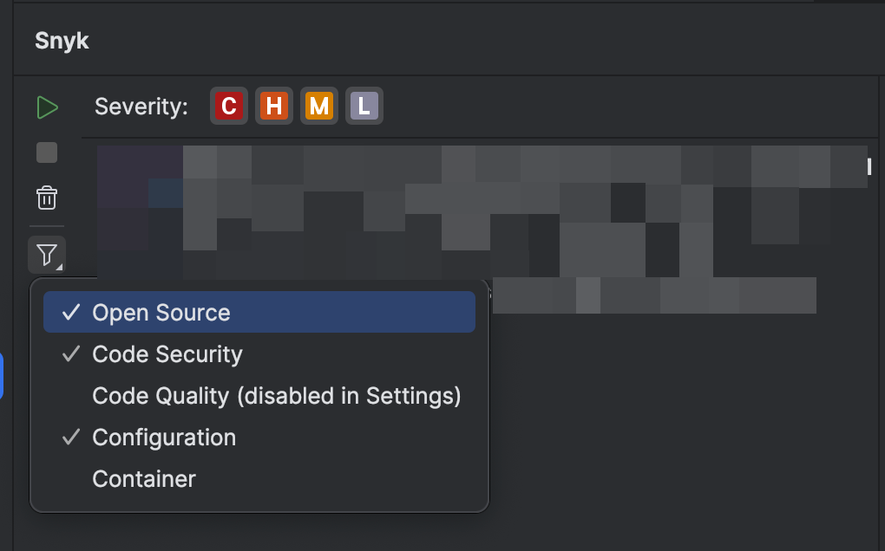
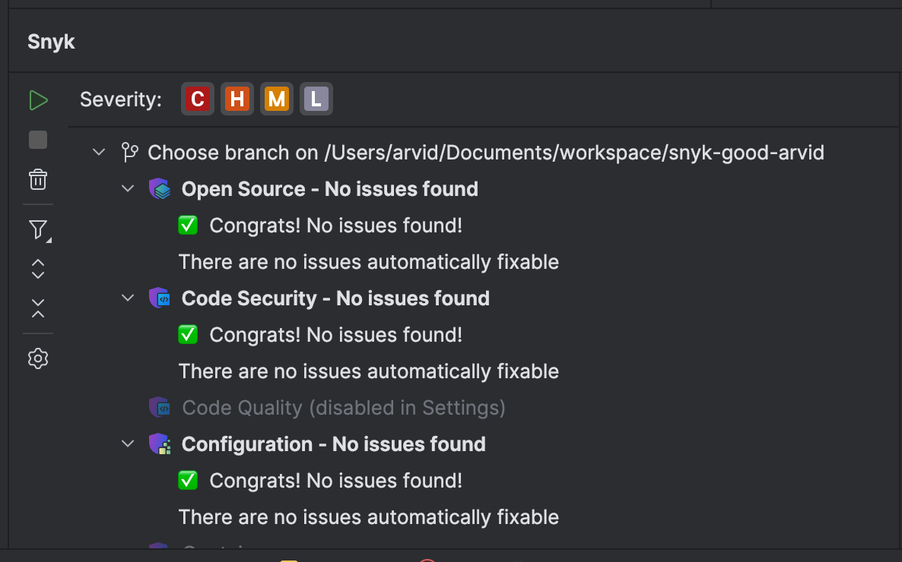
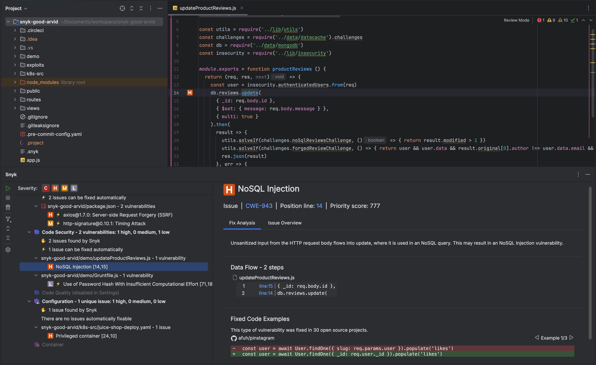
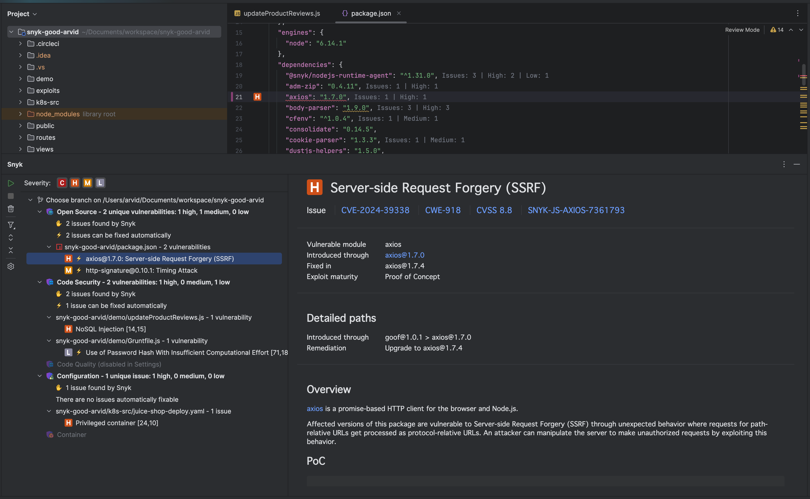
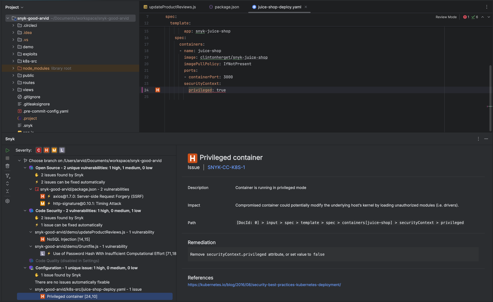

# Run an analysis with the JetBrains plugin


Ensure the Snyk extension is configured, authenticated, and trusted for your current Project, as described in the configuration and authentication pages.


You can trigger `snyk test` using one of these methods:

* automatic (default)
* manual

A Snyk scan is triggered automatically when you open your Project and when you save any supported files. This behavior can be turned off in [user experience configuration](configuration-for-the-snyk-jetbrains-plugin-and-ide-proxy.md#user-experience).


Ensure your files are saved before manually running an analysis.


To manually trigger `snyk test` , as illustrated in the following screen image:

1. Click the **Snyk icon** in the sidebar to open the Snyk panel.
2. Click the **Run (play)** button at the top of the plugin sidebar.
3. If the play button is grayed out, there is a scan in progress. Wait for it to complete before starting another scan.

<figure><figcaption>
Manually triggering a Snyk analysis
</figcaption></figure>

## Scan configuration

You may customize your scan behavior to reflect the security policy of your company or to focus on certain areas.

### Severity filter

Snyk reports critical, high, medium, and low severities. There are two ways to control severity:

* Use the plugin settings for the [Scan configuration](configuration-for-the-snyk-jetbrains-plugin-and-ide-proxy.md#scan-configuration).
* Use the small buttons with the severity icons at the top of the issues in the Snyk panel.

By default, all levels are selected. You must select at least one.

Snyk severity icons have the following meaning:

|  (1).png>) Critical severity                                                                                                                                                             | May allow attackers to access sensitive data and run code on your application.                                                               |
| -------------------------------------------------------------------------------------------------------------------------------------------------------------------------------------------------------------------------------- | -------------------------------------------------------------------------------------------------------------------------------------------- |
|  (1) (1) (2) (1) (1) (1) (1) (1) (1) (1) (1) (1) (1) (1) (1) (1) (1) (1) (1) (1) (1) (1) (1) (1) (1) (1) (1) (1) (1) (1) (1) (1) (1) (1) (1) (1) (1) (1) (1) (1) (5).png>) High severity | May allow attackers to access sensitive data on your application.                                                                            |
|  (1) (2).png>) Medium severity                                                                                                                                                          | May allow attackers under some conditions to access sensitive data on your application.                                                      |
|  (1) (1) (1) (1) (1).png>) Low severity                                                                                                                                                  | The application may expose some data allowing vulnerability mapping, which can be used with other vulnerabilities to attack the application. |

### Filter by issue type

Snyk reports the following types of issues:

* **Open Source** issues: found in open source dependencies. For details, see the section [Snyk Open Source issues](run-an-analysis-with-the-jetbrains-plugin.md#snyk-open-source-issues).
* **Code Security** issues: found in your application’s source code. For details, see the section [Snyk Code security vulnerabilities and quality issues](run-an-analysis-with-the-jetbrains-plugin.md#snyk-code-security-vulnerabilities-and-quality-issues).
* **Code Quality** issues: found in your application source code. For details, see the section [Snyk Code security vulnerabilities and quality issues](run-an-analysis-with-the-jetbrains-plugin.md#snyk-code-security-vulnerabilities-and-quality-issues).
* **Infrastructure as Code** issues: found in infrastructure as code files. For details, see the section [Snyk Infrastructure as Code issues](run-an-analysis-with-the-jetbrains-plugin.md#snyk-infrastructure-as-code-issues).
* **Container** issues: found in images sourced from Kubernetes workload files. For details, see the section [Snyk Container issues](run-an-analysis-with-the-jetbrains-plugin.md#snyk-container-issues).


The exact capabilities and available scanners depend on your plan. Be sure your Organization's admin has enabled all Snyk products prior to configuring any of them in the IDE plugin.


There are two ways to show or hide specific issue types:

* Use the plugin settings for the [Scan configuration](configuration-for-the-snyk-jetbrains-plugin-and-ide-proxy.md#scan-configuration).
* Use the filter button in the panel's sidebar, as illustrated in the screen image that follows

By default, all issue types shown are selected.

<figure><figcaption>
Filter to show or hide specific issue types
</figcaption></figure>

### Net new issues versus all issues

Beginning with plugin version [2.10.0](https://plugins.jetbrains.com/plugin/10972-snyk-security/versions/stable/623034), it is possible to see only newly introduced issues.

This functionality reduces noise and allows you to focus only on current changes. This will prevent issues early, thus unblocking your CI/CD pipeline and speeding up your deliveries.

The logic uses your local Git repository or any folder to compare the current findings with those in a base branch or reference folder. Net new issues scanning (delta scanning) shows you the difference between the two branches or folders, highlighting only the new issues.

In plugin version 2.12.0 and later, you can choose any folder as your base for scanning.

To apply the filter and see only the new issues, use the toggle in the summary panel.

<figure><figcaption>
Summary panel toggle showing the the total number of issues and the number of issues in the checked out branch or current folder or new issues only
</figcaption></figure>

You can also enable the net new issues feature in the [scan configuration](run-an-analysis-with-the-jetbrains-plugin.md#scan-configuration) settings.\
\
For newly created feature branches, there will be no reported issues. That is an intended state that developers would aim for, as illustrated in the screen image that follows:

<figure><figcaption>
Successful state, no net new issues found
</figcaption></figure>

### Changing the base branch

The base branch is usually automatically determined for each Git repository.

You can change the base branch or base folder by following these steps, as illustrated in the screen image that follows:

1. Click on the top-level node in the issues tree.
2. Use the dropdown selection.
3. Choose any branch.
4. Click OK to save the selection.

<figure><figcaption>
Choosing the base branch or folder
</figcaption></figure>

## Available Snyk issue types

### Snyk Code security vulnerabilities and quality issues

Snyk Code analysis shows a list of security vulnerabilities and code quality issues found in your application code.


Effective beginning on June 24, 2025, Snyk Code Quality issues will no longer be provided.


For more details and examples of fixes others used to fix the issue, select the security vulnerability or the code security issue.

<figure><figcaption>
Snyk Code issue details
</figcaption></figure>

### Snyk Open Source issues

Snyk Open Source analysis shows a list of vulnerabilities and license issues found in all manifest files. To see more detailed information, select a vulnerability or license issue.

<figure><figcaption>
Snyk Open Source issue details
</figcaption></figure>

### Snyk Infrastructure as Code issues

With every scan, Snyk IaC analysis shows issues in your Terraform, Kubernetes, AWS CloudFormation, and Azure Resource Manager (ARM) code. The scan is based on the Snyk CLI and is fast and friendly for local development. To see more detailed information, select an issue.

<figure><figcaption>
Snyk IaC issue details
</figcaption></figure>

### Snyk Container issues


The Snyk JetBrains IDE plugin will no longer detect container images specified in Kubernetes YAML files in versions released after June 24, 2025.


The JetBrains plugin scans Kubernetes configuration files and searches for container images. Vulnerabilities are found quickly using the extracted container images and comparative analysis against the latest information from the [Snyk Vulnerability Database](https://security.snyk.io).

Snyk Container analysis shows each of the security vulnerabilities that might affect your image. To see more detailed information, select a vulnerability.

A comparison table shows the severity levels, such as critical or high. This shows the difference in vulnerabilities between the current image and the image recommended by Snyk, with the same characteristics sorted by severity. This helps you decide if you want to upgrade your image to the recommended one and increase the level of confidence in the image you are running in production.
