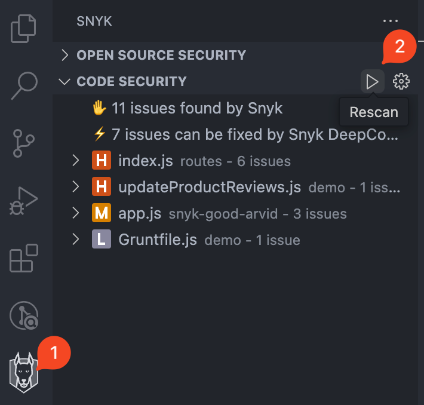

# Run an analysis with Visual Studio Code extension


Ensure the Snyk extension is [configured](visual-studio-code-extension-configuration-environment-variables-and-proxy.md), [authenticated](view-analysis-results-from-visual-studio-code-extension/), and [trusted](visual-studio-code-workspace-trust.md) for your Project.


You can trigger `snyk test` by using one of these methods:

* automatic (default)
* manual

Snyk Code and IaC configuration scans are triggered automatically when you open your Project and when you save any supported files. This behavior can be turned off in [user experience configuration](visual-studio-code-extension-configuration-environment-variables-and-proxy.md#user-experience).

Snyk Open Source, by default, does not automatically run on save, but you can enable auto-scan in the configuration settings.

When the scan happens automatically, observe that the extension picks up the files and uploads them for analysis as soon as you open your Project or save any supported files.

Snyk Open Source requires the Snyk CLI, so it is downloaded in the background.

Snyk Code analysis runs quickly without the CLI, so results may be available quickly. If there is a delay, you see in-progress messages for each type of scan while Snyk scans your workspace for vulnerabilities and issues:

<figure><figcaption>
Snyk scan in progress
</figcaption></figure>


Ensure your files are saved before manually running an analysis.


To trigger `snyk test` manually:

1. Click the **Snyk icon** in the sidebar to open the Snyk panel.
2. Click the **Rescan** (play) button at the top of the extension panel.

<figure><figcaption>
Manually trigger a Snyk analysis
</figcaption></figure>
