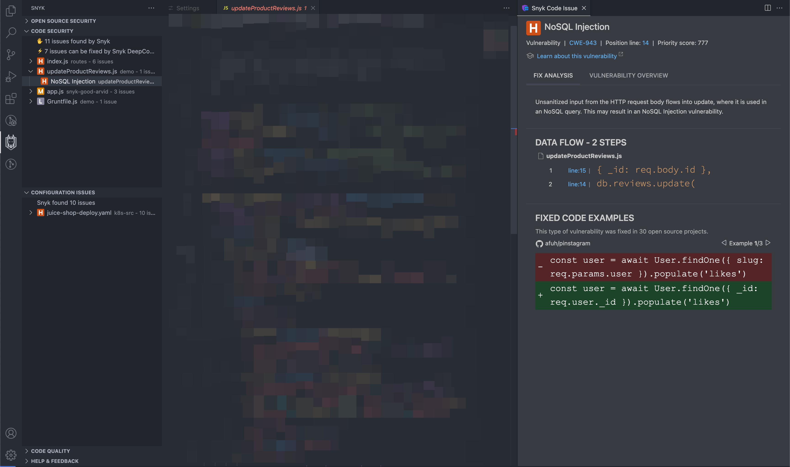
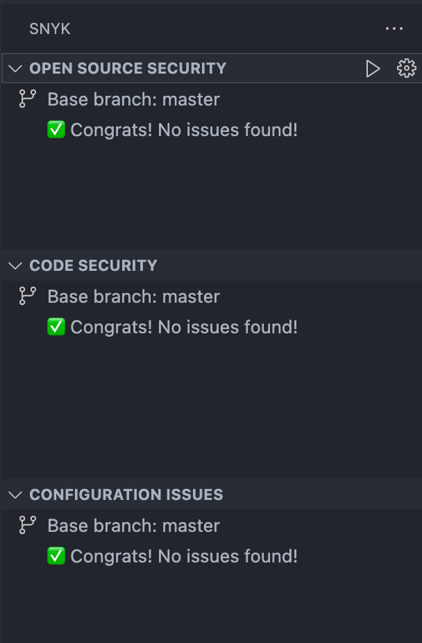

# View analysis results from Visual Studio Code extension

## Overview of results

Snyk analysis shows a list of security vulnerabilities and code issues in the application code. Select a security vulnerability or a code security issue to view more details and examples of how others fixed the issue. The **Issue details panel** appears in a tab on the right side of the screen, as shown in following screen image.

The **Snyk analysis panel** on the left shows the time the analysis took and a list of issues with the suggestions found for those issues.

<figure><figcaption>
Snyk Security extension with Snyk Code issue
</figcaption></figure>

Each issue contains a severity icon that has the following meaning:

| .png>) Critical severity                                                                                                                                                                 | May allow attackers access to sensitive data and to run code on your application.                                                            |
| ----------------------------------------------------------------------------------------------------------------------------------------------------------------------------------------------------------------------------------- | -------------------------------------------------------------------------------------------------------------------------------------------- |
|  (1) (1) (2) (1) (1) (1) (1) (1) (1) (1) (1) (1) (1) (1) (1) (1) (1) (1) (1) (1) (1) (1) (1) (1) (1) (1) (1) (1) (1) (1) (1) (1) (1) (1) (1) (1) (1) (1) (1) (1) (5).png>) High severity | May allow attackers access to sensitive data on your application.                                                                            |
|  (1) (2).png>) Medium severity                                                                                                                                                          | May allow attackers under some conditions to have access to sensitive data on your application.                                              |
|  (1) (1) (1) (1) (1).png>) Low severity                                                                                                                                                  | The application may expose some data allowing vulnerability mapping, which can be used with other vulnerabilities to attack the application. |

## Scan configuration

You can customize your scan behavior to reflect your company's security policy or to focus on certain areas.&#x20;

### Severity filter

Snyk reports critical, high, medium, and low severities. This can be adjusted in the [scan configuration settings](../visual-studio-code-extension-configuration-environment-variables-and-proxy.md).

By default, all levels are selected. You must select at least one.

### Filter by issue type

Snyk reports the following types of issues:

* Open Source issues: Found in open-source dependencies; for more details, see [Analysis results: Snyk Open Source](analysis-results-snyk-open-source.md).
* Code Security issues: Found in your application’s source code; for more details, see [Analysis results: Snyk Code](analysis-results-snyk-code.md).
* Infrastructure as Code issues: Found in infrastructure as code files; For more details, see [Snyk IaC Analysis results: Snyk IaC Configuration](analysis-results-snyk-iac-configuration.md).


The exact capabilities and available scanners depend on your Snyk plan. Be sure your Organization's admin enabled all Snyk products prior to configuring any of them in the IDE plugin.


You can set the issue types to be shown in the Scan configuration settings. By default, all issue types shown are selected.

### Net new issues versus all issues

Starting with Visual Studio Code extension version 2.19.0, it is possible to see only newly introduced issues.

This functionality reduces noise and allows you to focus only on current changes. This helps prevent issues early, thus unblocking your CI/CD pipeline and speeding up your deliveries.

The logic uses your local Git repository or any folder to compare the current findings with those in a base branch or reference folder. Net new issues scanning (delta scanning) shows you the difference between the two branches or folders, highlighting only the new issues.

In Visual Studio Code version 2.21.0 and later, you can choose any folder as your base for scanning.&#x20;

To apply the filter and see only the new issues, use the **total** or **new** toggle in the summary panel.

<figure><figcaption>
Summary panel with a toggle that shows the total number of issues, and the number of issues in the checked out branch or current folder
</figcaption></figure>

<figure><figcaption>
Net new issues filter enabled after the user clicks on the total/new issues toggle
</figcaption></figure>

You can also enable the net new issues feature in the [scan configuration](./#scan-configuration) settings for the extension.

For newly created feature branches, there will be no reported issues. That is an intended state that developers would aim for, as shown in the screen image that follows:

<figure><figcaption>
Successful state. No net new issues found.
</figcaption></figure>

### Changing the base branch

The base branch is usually determined automatically for each Git repository.&#x20;

You can change the base branch or base folder by following these steps, as illustrated in the screen image that follows:&#x20;

1. Select the Snyk plugin.
2. Toggle the `total/new` filter in the summary panel.
3. Click on the top-level node in the issues tree to change the branch or directory.
4. Use text input to specify any branch name or reference directory.

<figure><figcaption>
Changing the reference branch or reference directory for calculation of net new issues
</figcaption></figure>

