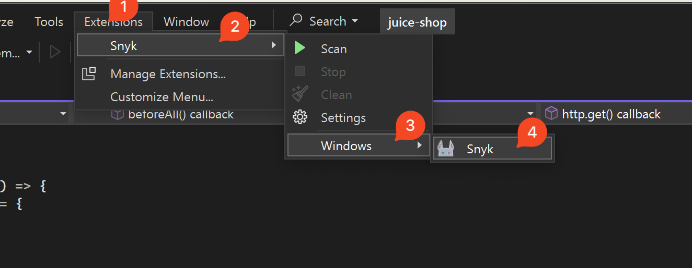
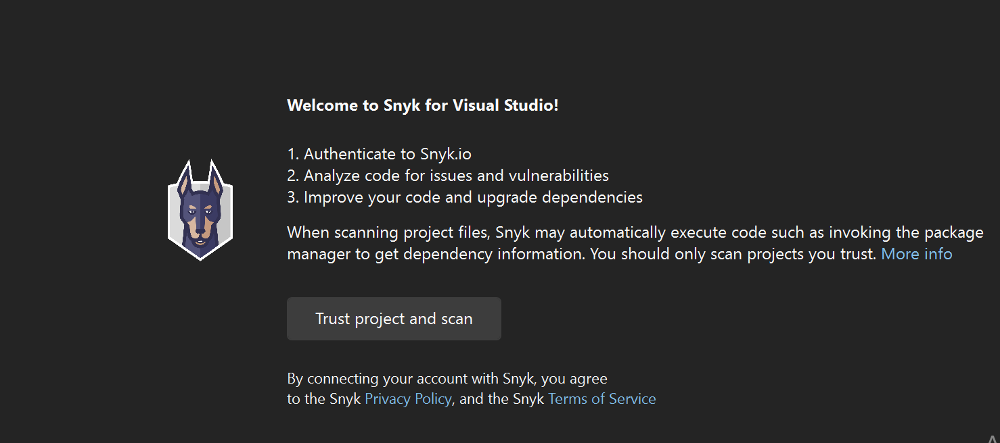
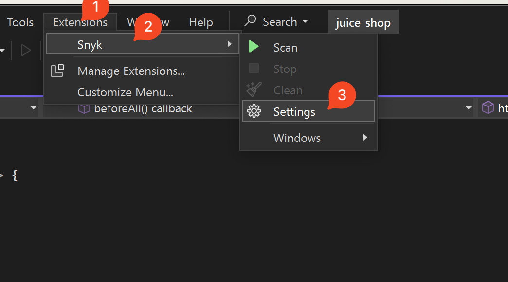

# Authentication for Visual Studio extension

To scan your Projects, you must authenticate with Snyk.

Snyk supports the following protocols for authentication:

* OAuth 2.0 (Recommended)
* Personal Access Token
* API token (Legacy)



<figure><figcaption>
Authentication methods available in the Snyk extension in Visual Studio
</figcaption></figure>

## Steps to authenticate using the OAuth 2.0 protocol

Follow the next steps to authenticate:

1. After the extension is installed, navigate to **Extensions** > **Snyk** > **Windows**, and then **Snyk** to open the Snyk panel.

<figure><figcaption>
Snyk extension navigation
</figcaption></figure>

2. On the welcome screen, click **Trust project and scan.**

<figure><figcaption>
Trust project and scan
</figcaption></figure>

3. A new browser window opens, requiring you to log in to your Snyk account.
4. In the next prompt, the Snyk IDE extension requests access to act on your behalf. Click **Grant app access**.
5. When you have authenticated successfully, a confirmation message appears. Close the browser window and return to the IDE.

The analysis starts automatically. The IDE reads and saves the authentication on your local machine.


OAuth 2.0 tokens are not static and cannot be copied from the Snyk account page.


If you have problems, see [OAuth 2.0 authentication does not work](../troubleshooting-ides/how-to-set-environment-variables-by-operating-system-os-for-ides-and-cli-1.md).

## Steps to authenticate using your Personal Access Token




The Personal Access Token (PAT) authentication is progressively rolled out to all Enterprise customers. To check if this feature is available for your Organization at this time, please reach out to your Snyk account team.


To authenticate using the Personal Access token, follow these steps:

1. Navigate to **Preferences** > **Snyk**.
2.  Set the flag to **Use Personal Access Token.**

    <figure><figcaption></figcaption></figure>
3. Click the **Connect IDE to Snyk** button.
4. Create your **Personal Access** **Token**. For details, see the [Authentication for API](../../../snyk-api/authentication-for-api/) page.
5. Paste or enter the token in the **Token** field.
6. Click **Apply and Close.**

## Steps to authenticate using your Snyk API token



Follow these steps to authenticate:

1. After the extension is installed, navigate to **Extensions > Snyk** > **Settings**:

<figure><figcaption>
Snyk Settings navigation
</figcaption></figure>

2.  Find the **Authentication Method** and change it to **API Token** authentication.

    <figure><figcaption></figcaption></figure>
3. Click the **Connect IDE to Snyk** button.
4.  Click **Authenticate** in the web browser window that opens.

    <figure><figcaption></figcaption></figure>
5. The API token is automatically updated in the **API Token field**.
6. Click **Apply and Close.**

The analysis starts automatically.


Alternatively, copy the personal API token from your Snyk Web UI instance (default is [https://app.snyk.io](https://app.snyk.io/)). Paste the token in the **API Token** field. For details, see [Obtain and use your Snyk API token](../../../discover-snyk/getting-started/#obtain-and-use-your-snyk-api-token).


## How to switch accounts

To re-authenticate with a different account, follow these steps:

1. Navigate to **Extensions > Snyk > Settings.**
2. Clear the value of the **Token** field.
3. Click **OK**.
4. When you have logged out, start authentication again from the beginning.
