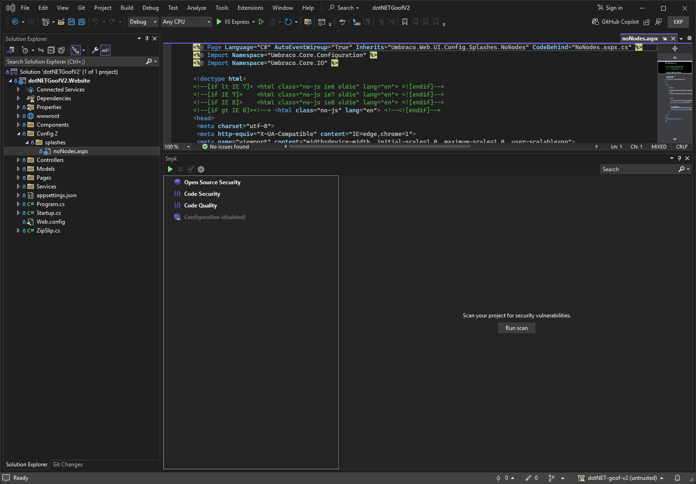
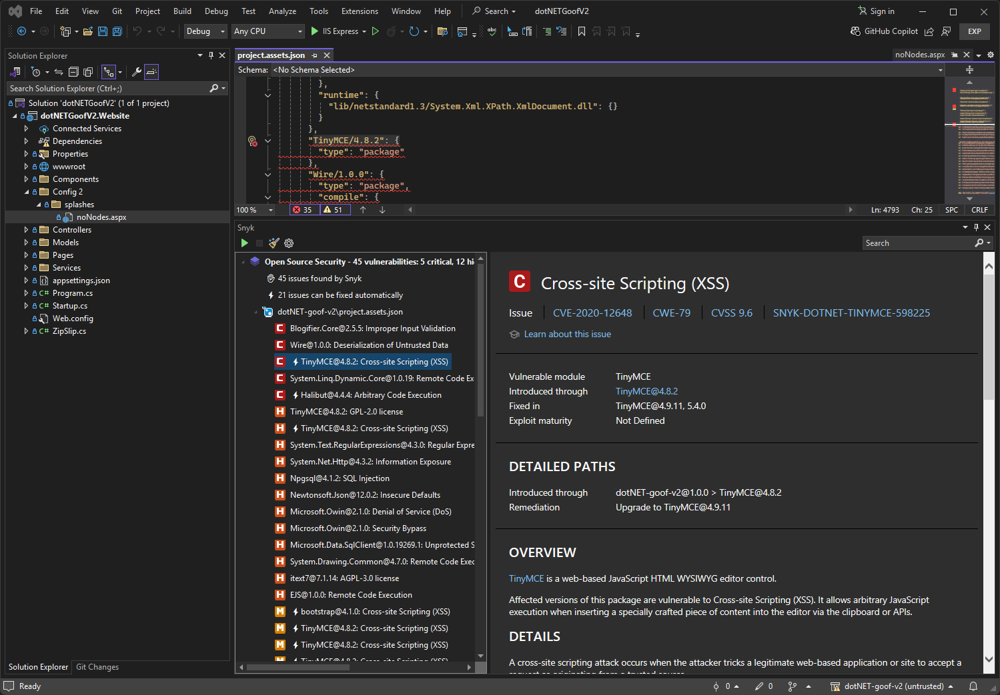
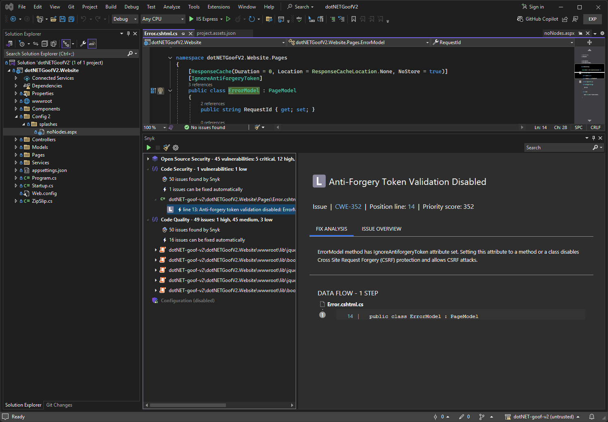

# Run an analysis with Visual Studio extension

Open your solution and click **Run scan**. Depending on the size of your solution and the time needed to build a dependency graph, it takes less than one or two minutes to get the vulnerabilities.

<figure><figcaption>
Run a scan
</figcaption></figure>

The extension provides two kinds of results:

* Open Source vulnerabilities
* Snyk Code issues

## Open Source vulnerabilities

Note that your solution must be built successfully in order to allow the CLI to pick up the dependencies and find the vulnerabilities.

If you see only npm vulnerabilities or vulnerabilities that are not related to your C#/.NET Projects, your Project may not have been built successfully and thus not detected by the CLI. If you have difficulty or questions, submit a request to [Snyk Support](https://support.snyk.io).

<figure><figcaption>
Open Source vulnerabilities
</figcaption></figure>

## Snyk Code issues

Snyk Code analysis shows a list of security vulnerabilities and code issues found in the application code. For more details and examples of how others fixed the issue, select a security vulnerability or a code security issue and examine the suggestions that Snyk provides.

<figure><figcaption>
Snyk suggestion panel
</figcaption></figure>

The suggestions from Snyk include the recommendation of the Snyk engine using, for example, variable names in your code and the line numbers in red. You can also see:

* Links to external resources that explain the bug pattern in more detail.
* Tags that were assigned by Snyk, such as Security (the issue found is a security issue), Database (the issue is related to database interaction), or In Test (the issue is within the test code).
* Code from open-source repositories that can be of help to see how others have fixed the issue.

