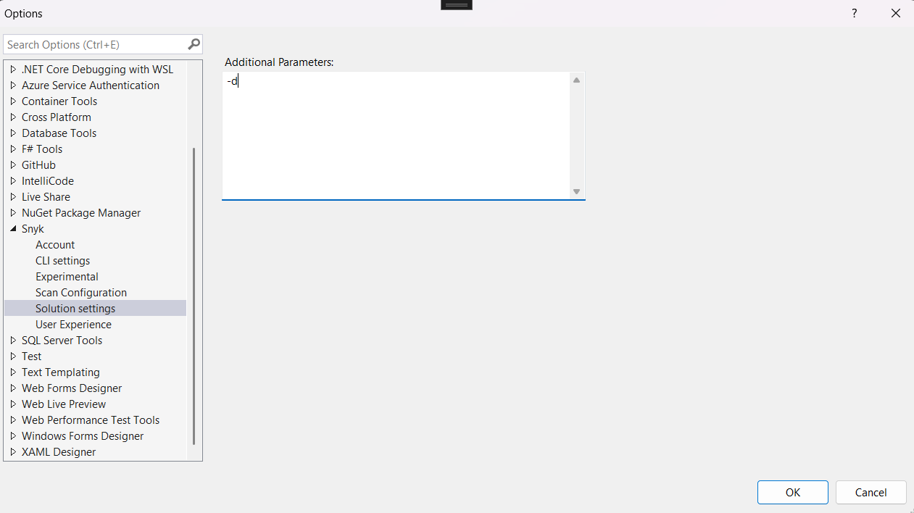

# Troubleshooting and known issues with Visual Studio extension


Snyk plugins are not supported on any operating system that has reached End Of Life (EOL) with the distributor.&#x20;


## Known issues

### The system cannot find the file specified

**Solution:** This issue is related to the CLI file. Close and open Snyk extension window to start the CLI download.

### The specified executable is not a valid application for this OS platform

**Solution:** This issue is related to the CLI file and its integrity. Remove the CLI from in\
`%HOMEPATH%\AppData\Local\Snyk\snyk-win.exe`. Close and open the Snyk extension window to start the CLI download.

### Snyk Code no supported code available

**Solution:** Check the `.gitignore` and `.dcignore` file rules. Check to see if there are any rules that exclude the source files of your Project.

## Troubleshooting Visual Studio Extension

### Logs


When you enable `debug`, your code may be logged in the IDE log files, for example, the `snyk-extension.log` file.


To enable Snyk Language Server debug logs in Visual Studio, add `-d` parameter through the **Snyk** **Extension Settings** > **Solution Settings** > **Additional Parameters**.

<figure><figcaption>
Adding the debug parameter
</figcaption></figure>

Press OK and restart the IDE after adding the parameter.

#### **View Log file**

You can find logs in the user's AppData directory:

<pre><code><strong>%HOMEPATH%\AppData\Local\Snyk\snyk-extension.log
</strong></code></pre>

#### **View Logs in the Output view**

* From the main menu, navigate to **View** > **Output**.
* In the Output panel, select the Snyk language server from the dropdown list to see its logs.

<figure><figcaption>
Visual Studio Output window with the Snyk Language Server debug logs
</figcaption></figure>

### Visual Studio versions

#### Where to find the current VS version 

Navigate to **Help** > **About Microsoft Visual Studio** to open the window with information about the IDE, including the version.

<figure><figcaption>
Visual Studio verson information
</figcaption></figure>

If you are communicating with Snyk Support, provide the version number highlighted at the top left in the screen image. This is the VS version.

#### Version numbers explained 

When customers mention that they are using a VS version, they usually say something like “we’re using VS 2022” or “VS 2019.” The year indicates the **major** part of the version. The “real” version is as follows:

| 2022 | 17.\* |
| ---- | ----- |
| 2019 | 16.\* |
| 2017 | 15.\* |
| 2015 | 14.\* |

The other two parts of the version are the `minor` and the `revision` parts.

For example, your current version may be VS 2022. The version is 17.2.6, so the `minor` is `2` and the `revision` is `6`.

#### How to update

Navigate to **Help** > **Check for Updates**. A window opens, stating whether VS is up to date or whether an update is needed.

#### What version does Snyk support? 

Snyk supports the latest version for VS 2015, 2017, 2019, and 2022, as long as the user is on the latest minor and revision version. An update can ensure that.

If a user has a bug with the Snyk plugin, especially bugs where the plugin fails to load, and there are errors about missing files, DLLs, or both, typically, the bug can be resolved by updating Visual Studio.

### Snyk Code ignores

Snyk Code allows developers to ignore files in their codebase. This is done through the use of Snyk Code Ignores. However, in Visual Studio, the `.snyk` file cannot be used to manage Snyk Code Ignores for C# Projects. Instead, developers must use `.dcignore` or `.gitignore` files to manage Code Ignores for C# Projects in Visual Studio.

### Settings storage

The Snyk Plugin for Visual Studio stores settings in two locations.

* `%HOME%/.config/configstore/snyk.json` contains the CLI settings. The Visual Studio plugin uses the following parameters from the CLI configuration
  * API Token
  * API endpoint
* Additional settings are stored in a config file located at `settings.json` in the extension directory. This is a path starting with `%LocalAppData%\\Microsoft\\VisualStudio\\`, for example, `C:\\Users\\user\\AppData\\Local\\Microsoft\\VisualStudio\\17.0_b97950dd\\Extensions\\dnzygpqo.juy`
