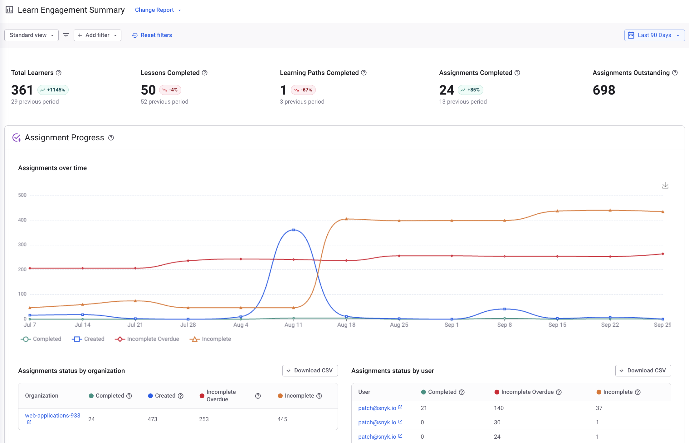
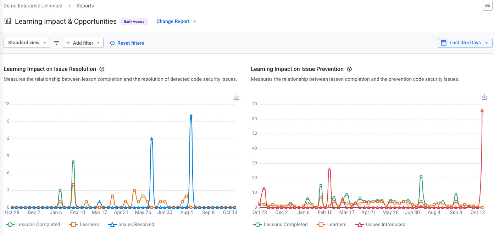
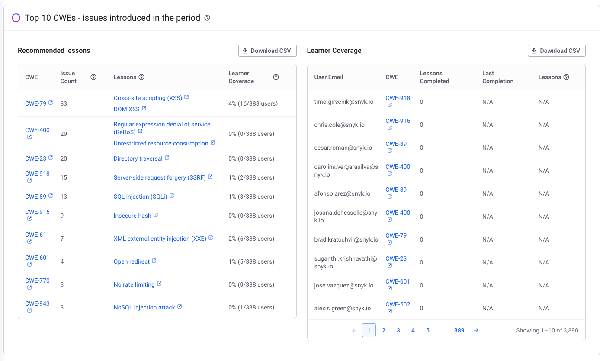
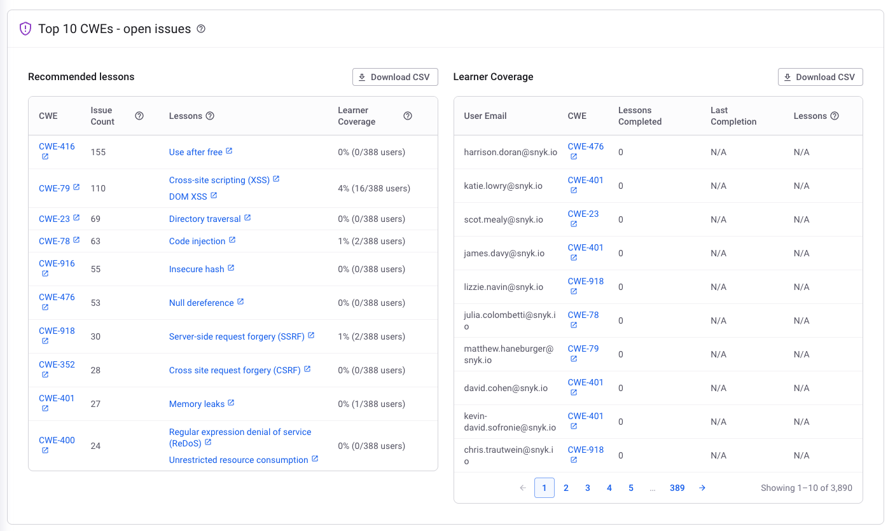

# Program reporting


Snyk Learn program reporting is available only in the Learning Management add-on offering. For more information, contact your Snyk account team.


Snyk Learn provides a Snyk in-app reporting powered report to give you insights into your security training and education program.

## Learn engagement report

The goal of the engagement report is to provide insights into the overall progress of your security education and training programs, and give you insights into which parts of your Organization are engaging with Snyk Learn content. You can use the data and insights to better optimize your program, find security champions, generate reports for compliance, and show progress to your executive sponsors. This report is available at the Group level.

Read more about this report [here](../../../manage-risk/analytics/reports-tab/education-reports.md#learn-engagement).


[Learning Programs](../snyk-learn-learning-programs.md) are not included in the Engagement Report


<figure><figcaption></figcaption></figure>

## Learning Impact & Opportunities Report


The Learning Impact & Opportunities report is available in Early Access.


The goal of the Impact and Opportunities Report is to provide insights into the impact your security education and training programs have on code issue remediation and prevention. In addition, the report gives recommendations for future training based on your code issue backlog and issues that were introduced during the selected time period of the report. This report is available at the Group level.

Read more about this report [here](../../../manage-risk/analytics/reports-tab/education-reports.md#learning-impact-and-opportunities).

<figure><figcaption></figcaption></figure>

<figure><figcaption></figcaption></figure> <figure><figcaption></figcaption></figure>

