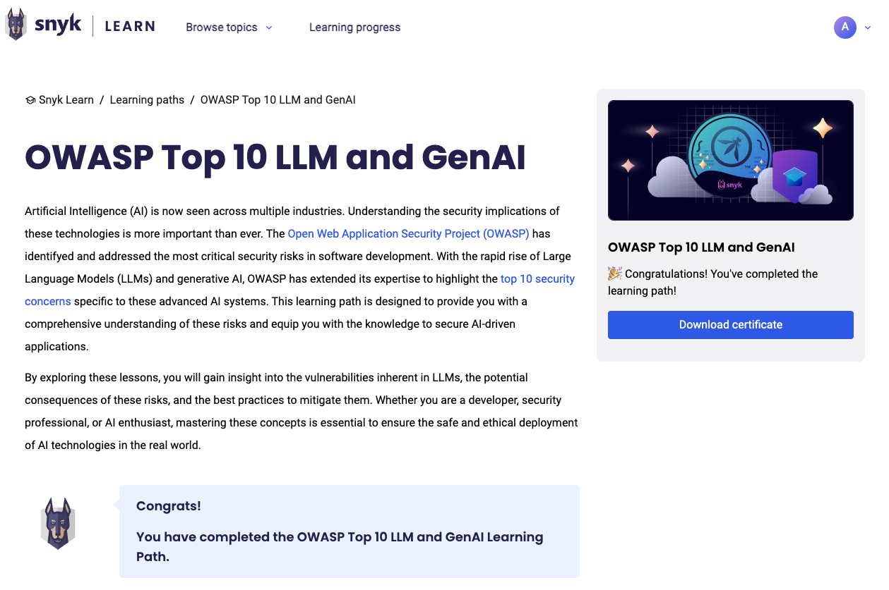

# Claiming CPE Credits with Snyk Learn

Snyk Learn offers a range of security education lessons and learning paths designed to enhance your application security skills. While these lessons provide valuable knowledge, they do not automatically grant Continuing Professional Education (CPE) credits. To claim CPE credits for your participation in Snyk Learn lessons and learning paths, follow these steps.&#x20;


The specific process for claiming CPE credits may vary depending on your certifying organization.


1. Complete a Snyk Learn module.
   1. Log in to your Snyk Learn account and finish a lesson or learning path.
   2. Ensure you meet all completion criteria, such as passing the quiz and engaging with interactive content.
2. Document your learning activity. Record essential details of the completed module, including:
   * Course title
   * Provider name: Snyk
   * Completion date
   * Duration: Time spent on the module
3. Submit to your certification body.
   1. Access the CPE submission portal of your certifying organization, such as ISC2 or ISACA.
   2. Enter the recorded details and provide any required documentation, such as completion certificates (available for Learning Paths) or screenshots of the completed lesson in your Learning Progress dashboard or the lesson page, see examples below.
4. Provide additional information if requested. You may be asked to supply further details or respond to inquiries from your certifying body to verify your CPE claim.

### Examples

#### Learning path certificate

Navigate to the page for the Learning Path that you completed and click the **Download certificate** button.

<figure><figcaption>
A completed Learning Path with certificate
</figcaption></figure>

#### Lesson completion example

<figure><figcaption></figcaption></figure>
