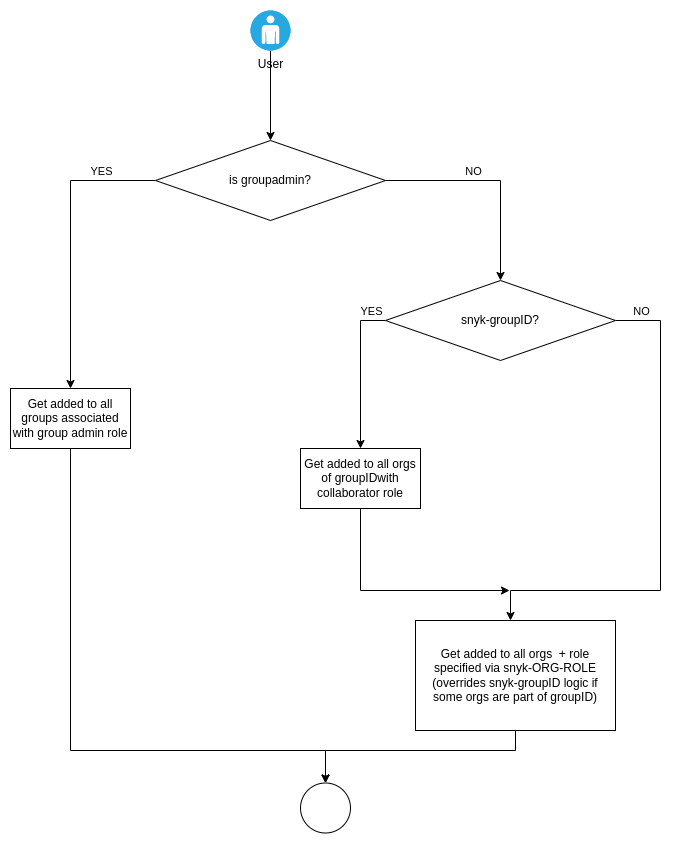

# SSO Custom Mapping Option

Custom mappings allows you to dynamically assign users to your Snyk Groups and Organizations based on data provided by your Identity Provider (IdP) to implement a scaled user provisioning and access model.


Work with your Snyk account team to implement this option.


To understand more about roles and permissions within Snyk, see [Managing permissions](broken-reference).

See also [User role management](../../../snyk-admin/user-roles/user-role-management.md) and [Roles in Custom SSO](../../../snyk-admin/user-roles/user-role-management.md#roles-in-custom-sso).

## Requirements for Custom Mapping

* Complete the SSO information worksheet for the appropriate IdP (identity provider) found in the Resources section of [Set up Snyk Single Sign-On (SSO)](../set-up-snyk-single-sign-on-sso.md)
* Properly configure the custom attributes in your IdP to populate the `roles` array mapping ([Example roles array mapping](./#example-roles-array-mapping))

## Roles array mapping with Snyk

In the IdP, you must first pass a custom mapping called `roles` as a string array. Refer to [Example: Example: setting up custom mapping for Okta](example-setting-up-custom-mapping-for-okta.md). Refer to your IdP documentation on how to configure custom mappings for additional IdP providers.

To configure this option, send the `roles` array within the SAML attributes or OIDC claims to adhere to **one** of the following patterns:

snyk-groupadmin

* This role mapping assigns users with the Group Admin and Org Admin roles.
* **groupadmin** configures all users with this role as a Group Admin and Org Admin for all Group(s) that the user is assigned to and all Orgs that fall under the Group(s).

snyk-groupviewer

* This role mapping assigns users with the Group Viewer role and grants read-only access to the Group, reports, and all Organizations associated with the Group.

snyk-{groupID}

* This role mapping assigns users with the Org Collaborator roles for all Organizations underneath the specified Group(s).
* **groupID** is the ID string for a group in Snyk. This can be found in the snyk URL at the Group level: `https://app.snyk.io/group/<Group ID>` or **Group dropdown -> Settings -> General -> Group ID**.

snyk-{orgslug}-{role}

* This role mapping assigns users with the specified role of Collaborator or Admin or Custom Role for the Snyk Organization specified in `orgslug`.
* `orgslug` is the unique identifier of the Organization name in Snyk.
  * How to find the `orgslug`: `https://app.snyk.io/org/{orgslug}` OR by using the Snyk [API List all organizations in a group endpoint.](https://snyk.docs.apiary.io/#reference/groups/list-all-organizations-in-a-group/list-all-organizations-in-a-group)
  * **Note**: The `orgslug` is the name of the Organization in most cases; however, there may be exceptions.
  * Note: `orgslug` can be a value of up to 60 characters.
* **role**:
  * If you are using standard roles, `{role}` should be either `collaborator` or `admin`**.**
  * Custom Role can also be used for `{role}` and should use the normalized name. See [Roles in custom SSO](../../../snyk-admin/user-roles/user-role-management.md#roles-in-custom-sso) for more details.


Users must only have one role mapped per Organization. Mapping multiple roles for an Organization is not supported and can lead to unexpected behavior.


## Roles array mapping format

To assign users with Group Admin role, use the following format:

```
{
    "roles": [
        "snyk-groupadmin"
    ]
}
```

To assign users with Group Viewer roles, use the following format:

```
{
    "roles": [
        "snyk-groupviewer"
    ]
}
```

To assign users with Org Collaborator roles, use the following format:

```
{
    "roles": [
        "snyk-{groupID}"
    ]
}
```

To assign users as Org Admin or Org Collaborator, use the following format for the roles array. **Note**: You can assign different roles on a per-org basis. The following example assigns a user as Org Admin in the `orgslug` Org but a Collaborator in the `orgslug2` Org.

```
{
    "roles": [
        "snyk-{orgslug}-admin",
        "snyk-{orgslug2}-collaborator"
    ]
}
```

To assign users a custom role, use the following format for the roles array. You can assign different roles on a per-Org basis and can use a combination of standard and custom roles for different Orgs.

```
{
    "roles": [
        "snyk-{orgslug}-admin",
        "snyk-{orgslug2}-collaborator",
        "snyk-{orgslug3}-developer_readonly"
    ]
}
```


The system also supports comma-separated lists of roles instead of an array.

```
{
  "roles": "snyk-{orgslug}-admin,snyk-{orgslug2}-collaborator"
}
```


## Example roles array mapping

The following example shows how to assign roles to Snyk users under the mapping convention.

* The customer is named ABC and has one Group called ABC.
* The customer has three Organizations within Snyk: Application-SecurityScanner1, Partner-Plugins, and Application-Payments.
* The customer has four teams: Business Development, Engineering, Security, and Product. Each has different needs:
  * The Business Development team needs access to the ABC group and only the Partner-Plugins Organization as Org Admin.
  * Engineering needs access to the ABC Group, the Application-SecurityScanner1 Organization as Org Admin, Partner-Plugins Organization as Org Admin, and Application-Payments as Org Collaborator.
  * Security needs access to the ABC group as Group Admin and all three organizations as Org Admin.
  * The Product team needs access to the ABC group and all three organizations as Org Collaborator,

For the Business Development Team, Snyk uses the snyk-{orgslug}-{role} mapping:

```
{
    "roles": [
        "snyk-partner-plugins-admin"
    ]
}
```

For the Engineering Team, Snyk uses the snyk-{orgslug}-{role} mapping:

```
{
    "roles": [
        "snyk-application-securityscanner1-admin",
        "snyk-partner-plugins-admin",
        "snyk-application-payments-collaborator"
    ]
}
```

For the Security Team, Snyk uses the snyk-groupadmin mapping:

```
{
    "roles": [
        "snyk-groupadmin"
    ]
}
```

For the Product Team, Snyk uses the snyk-{groupID} mapping, where the value of groupID must be inserted;

```
{
    "roles": [
        "snyk-{groupID}"
    ]
}
```

## Summary diagram of roles under custom mapping

<figure><figcaption><p>Summary diagram of role under custom mapping</p></figcaption></figure>
