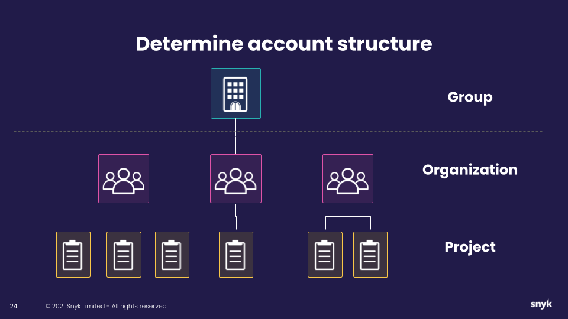

# Plan Organization structure

## Introduction to structure

<figure><figcaption>
Determine your account structure
</figcaption></figure>

Snyk uses a hierarchical approach to managing assets, access, and rollup reporting.

* **A Snyk Group**: the top level, typically representing the account/company name
  * The largest customers may have multiple groups representing each of their companies.
* **Snyk Organizations**: below the Group level, typically representing
  * Line of business,&#x20;
  * Git Organization or team structure
  * Types of application
  * Dev teams
* **Snyk Projects**
  * The targets you have tested/monitored with Snyk, such as a CLI scan, a container being monitored in registry/kubernetes, or open source files identified.

For more details, see [Manage Groups and Organizations](../../../snyk-admin/manage-groups-and-organizations/).

### Decide the structure

Deciding your structure is one of the earliest decisions you must make. When determining your account structure, structure Snyk Organizations to match your business needs.

Consider various factors when structuring Organizations, such as:

* Team-Based Structure:
  * Link Developer Team A with Organization Team A.
* Product-Based Structure:
  * Set up separate organizations for distinct parts of an application, like Payment Front-End and Payment Back-End.
  * Allow full-stack developers to join multiple organizations as needed.
* Git Organization based.&#x20;
  * Some companies will use a structure that mimics the organizations in git, typically seen if a customer has 10+ organizations in their git platform.


If you intend to use the [api-import-tool](../../../snyk-api-info/other-tools/tool-snyk-api-import/), the git organization based approach will be your path forward.


By exploring these options and grasping your company's requirements, you can establish an account structure that enhances collaboration and efficiency.

### Also see

See [Managing Organizations](../../../snyk-admin/manage-groups-and-organizations/manage-organizations.md) for more details.&#x20;
