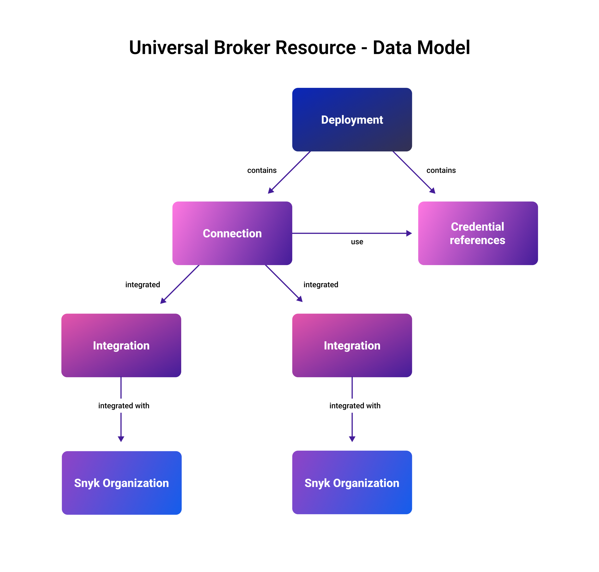

# Disconnect and clean up

The `snyk-broker-config workflows <RESOURCE> delete` command allows you to remove resources.&#x20;

Protections are in place to prevent invalid connection states, so you cannot delete connections that are integrated, and therefore relied upon, by Organizations. You must disconnect the integration before deleting the connection.

The `snyk-broker-config workflows connections disconnect` command walks you through the disconnection steps.

For all resources, you must delete the child items before you can delete a parent, as illustrated in the diagram that follows. A deployment contains connections and credentials references. Connections use credentials references. Each connection may have an integration with one or more Organizations.

The `snyk-broker-config introduction` command walks you through this flow and indicates what needs to be done to achieve successful deletion. These commands implement and enforce the following rules:

* Before you delete a connection, you must disconnect all integrations.
* Before you delete a credentials reference, you must delete the connection(s) using it.
* Before you delete a deployment, you must delete all connections and credentials references.

<figure><figcaption><p>Universal Broker resource data model illustrating child items to delete before parent items</p></figcaption></figure>

## Disconnect an integration

To remove an integration, run `snyk-broker-config workflows connections disconnect`.

Enter the Organization ID for the Organization from which to disconnect the connection.

## Delete  a connection

Run `snyk-broker-config workflows connections delete`.

Enter the number of the connection you want to delete.

In response to the prompt, type Y and press Enter if you want to disconnect all the Organizations reported as using the connection.

```
Universal Broker - Delete Connection Workflow
✓ Valid Snyk Token.
✓ Tenant Admin role confirms.
Now using Tenant ID of <returned number>.
Now using Deployment <returned number>.
   Which Connection do you want to use? <number entered>
   Connection <number entered> is used by 2 orgs integrations. 
Do you want to disconnect them all? (Y/N)
```

## Disconnect integrations

To delete multiple integrations, run `snyk-broker-config workflows connections disconnect`.

Enter the connection from which to disconnect.

Press Tab to select (check) an Organization. Press backspace to uncheck.

```
Universal Broker - Connections Disconnect Integration(s) Workflow
✓ Valid Snyk Token
✓ Tenant Admin role confirmed.
Now using Tenant ID <number returned> and Install ID <number returned>.
Now using Deployment <number returned>.
Which Connection do you want to use <number entered>
Selected Connection ID <number entered>. Ready to disconnect integrations using 
this connection.
Select (Press <backspace> to remove option) [Type: github] in <Organization ID returned>
[✓ ] Type github in <Organization ID returned> (integration <Integration ID returned>)
```

## Delete credentials references

Use `snyk-broker-config workflows credentials delete` to delete credentials references and follow the prompts to remove any other resources that must be removed first.
