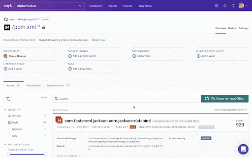

# Prioritize by Social Trends

**Overview of Snyk Social Trends prioritization**

Snyk shows a **Trending** banner on issues that are being actively discussed in Twitter.

Social Trends are calculated into the priority score by default. You can look at the top tweets mentioning this vulnerability by clicking on **View Tweets**.

How does Snyk determine if a vulnerability is trending?

* Snyk monitors mentions of known vulnerabilities in Twitter, calculating the trend of tweets and reactions.
* Bots and other noise gets canceled out to guarantee accuracy.
* Unexpected peaks in the trend will raise a “Trending” notification.
* The “Trending” notification is live until the trend dissipates plus several days.


See [Snyk Priority Score](https://docs.snyk.io/fixing-and-prioritizing-issues/starting-to-fix-vulnerabilities/snyk-priority-score) for more information on how vulnerabilities are prioritized by Snyk


