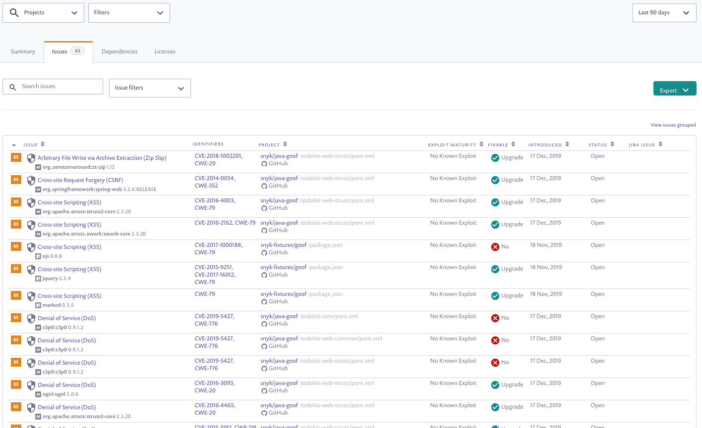

# Issues tab

The Issues tab displays all known vulnerability and license discrepancies across your projects, indicating details about each issue and which of your projects is affected. In addition, this area also displays information about which issues can be fixed, and how.

By default, issues are grouped together per issue, similar to the following example:

Get an overview of the general health of your organization on the whole by inspecting the number of projects affected per issue and the number and kinds of issues affecting your projects.

Alternatively, you can ungroup data, viewing a separate line for each project in which the issue occurs—meaning the same issue can appear multiple times if it affects multiple projects. Click the **View issues ungrouped** or **View issues grouped** link to toggle between views.

This view is beneficial in providing additional details about:

* Each affected project
* The recommended course of remediation

This view can be seen in the Elements column below, where all the elements of both views are described.


**Note**\
Data in each of the four tabs is displayed based on the filters you've applied from the top of the Reports area, as well as the group or organization that you're viewing from.


## Issues tab elements

Just under the **Export** button, click the **View issues ungrouped** or **View issues grouped** link to toggle between views.

The Issues area appears similar to this image when viewing issues ungrouped:

The following table describes the different parts of the Issues area as displayed when viewing issues either grouped or ungrouped:

| Element          | Description                                                                                                                                                                                                                                                                                                                                                                                                                                                                                                                                                                                                                                                                                                                                                                                                                                                                               | **Possible values**                                                                                                                                                                                                                                                                                                                                                                                      |
| ---------------- | ----------------------------------------------------------------------------------------------------------------------------------------------------------------------------------------------------------------------------------------------------------------------------------------------------------------------------------------------------------------------------------------------------------------------------------------------------------------------------------------------------------------------------------------------------------------------------------------------------------------------------------------------------------------------------------------------------------------------------------------------------------------------------------------------------------------------------------------------------------------------------------------- | -------------------------------------------------------------------------------------------------------------------------------------------------------------------------------------------------------------------------------------------------------------------------------------------------------------------------------------------------------------------------------------------------------- |
| Issue tab badge  | The number of issues that you’re currently viewing, based on the filters and searches you used, are displayed on the issues tab.                                                                                                                                                                                                                                                                                                                                                                                                                                                                                                                                                                                                                                                                                                                                                          |                                                                                                                                                                                                                                                                                                                                                                                                          |
| Severity         | The icon of the associated severity for this issue.                                                                                                                                                                                                                                                                                                                                                                                                                                                                                                                                                                                                                                                                                                                                                                                                                                       | 
 Critical

 High

 Medium

 Low
 |
| Priority Score   | 
Snyk processes a number of issue characteristics in a proprietary algorithm that weights each, producing a score that can be used to guide the order in which you fix issues.

<a href="https://support.snyk.io/hc/en-us/articles/360009884837">Find out more about Priority Score</a>
                                                                                                                                                                                                                                                                                                                                                                                                                                                                                                                                                                                        | 0-1000                                                                                                                                                                                                                                                                                                                                                                                                   |
| Issue            | The full officially recognized name of the issue and a list of all affected packages that are contained by your projects. The issue is linked to the **Package** page.                                                                                                                                                                                                                                                                                                                                                                                                                                                                                                                                                                                                                                                                                                                    |                                                                                                                                                                                                                                                                                                                                                                                                          |
| Identifiers      | All associated CVE identifiers. Each identifier is linked individually to the full official CVE or CWE vulnerability details as relevant.                                                                                                                                                                                                                                                                                                                                                                                                                                                                                                                                                                                                                                                                                                                                                 |                                                                                                                                                                                                                                                                                                                                                                                                          |
| Projects         | 
When viewing issues ungrouped, this is a complete list of all projects affected by the specific issue, and an indicator of the source of the projects.

If viewing the issues grouped, this column displays the number of projects affected by the issue.

Click on the total of projects to open a panel where a list of all affected projects in that grouping is displayed. Details in this view include:
<ul><li>Project</li><li>Status</li><li>Introduced-date the issue was detected in the project</li><li>Fixable—whether the issue can be eliminated with an upgrade or patch</li></ul>                                                                                                                                                                                                                                                                          |                                                                                                                                                                                                                                                                                                                                                                                                          |
| Exploit maturity | 
These values are available:
<ul><li><strong>Mature:</strong> a published code exploit that can easily be used for this vulnerability is available.</li><li><strong>Proof of concept:</strong> a published, theoretical proof-of-concept or detailed explanation that demonstrates how to exploit this vulnerability is available.</li><li><strong>No known exploit:</strong> neither a proof-of-concept code nor an exploit were found for this vulnerability, or are not publicly available.</li><li>
<strong>No data</strong>: this value indicates one of the following:
<ul><li>The issue is not a vulnerability (but rather, a license issue);</li><li>The ecosystem is not currently supported by Snyk (Linux); or</li><li>The project was imported prior to the release of this feature</li><li>Reimport the project in order to scan for this data</li></ul></li></ul> |                                                                                                                                                                                                                                                                                                                                                                                                          |

Following are the project level details that appear only when viewing issues ungrouped:

| **Element**  | **Description**                                                                                                                                                                                                                                                                   | **Possible values**                                                                                                                                                                                                                                                                                                                                                                                                                  |
| ------------ | --------------------------------------------------------------------------------------------------------------------------------------------------------------------------------------------------------------------------------------------------------------------------------- | ------------------------------------------------------------------------------------------------------------------------------------------------------------------------------------------------------------------------------------------------------------------------------------------------------------------------------------------------------------------------------------------------------------------------------------ |
| Fixable      | 
Indicates an upgrade or patch is available to fix the vulnerability. Also see <a href="https://support.snyk.io/hc/en-us/articles/4405034808209-Fixed-in-version-vs-fixable-attribute-in-vulnerabilities">Fixed in version vs. fixable attribute in vulnerabilities</a>.
 | 
<strong>Patch</strong>: Issues that can be fixed with a Snyk patch.

<strong>Upgrade</strong>: Issues that can be resolved by upgrading the affected package.

<strong>Pin</strong>: Issues that can be fixed by making a transitive dependency into a direct dependency. <strong>Note:</strong> this is currently Python-specific.

<strong>No</strong>: Issues for which there is currently no known fix.
 |
| Introduced   | The date the issue was introduced in the project                                                                                                                                                                                                                                  |                                                                                                                                                                                                                                                                                                                                                                                                                                      |
| Status       | The current status of a vulnerability                                                                                                                                                                                                                                             | 
Open: Issues that have not been handled

Fixed: Issues for which Fix PRs have been submitted (automatically by Snyk)

Patched: Issues that have been fixed with Snyk patches

Ignored: Issues to which the Ignore policy applies
                                                                                                                                                                               |
| Reachability | 
Indicates whether or not vulnerabilities have a path from the code to the vulnerable function

<a href="https://support.snyk.io/hc/en-us/articles/360010554837-Reachable-Vulnerabilities-">Find out more about Reachable Vulnerabilities</a>
                          | 
Reachable: There is a clear path from the app’s code down to the vulnerable function

Potentially reachable: There are indications that you might be exposed to the vulnerability

No path found: We don’t have enough information to decide whether the vulnerability is reachable or not
                                                                                                                          |
| Jira issue   |                                                                                                                                                                                                                                                                                   | When a Jira integration is configured for the project and a Jira issue has been filed against the issue in Snyk, this column displays the Jira key and links to that same issue within Jira.                                                                                                                                                                                                                                         |

## Issues tab actions

These controls appear above the table:

**Search issues**—this search capability allows users to search based on CVE, CWE or identifier name (i.e. DDoS). When searching by CVE or CWE, you must provide an exact value (for example CVE-1234) whereas, for identifier name, typing in a piece of the word will return results.

**Issue filters**—mark the issues to be displayed by selecting a range of priority scores, specific issue types, exploit maturity, status, fixable values and reachability.

**Export**—click the button to choose which format you’d like to export issue data in:

* CSV
* Print/generate a preview from the Print dialog box in your local environment. Once you click the initial **Print** button, in the backend we load all the issues into one page. This process can take a few seconds. Make sure you don’t close your tab/browser or refresh the page while we prepare the document. Once ready, you get a new dialog box informing you that the document is ready to print. Within the print dialog, you select to save as PDF or print directly.


**Note**\
Only 2000 issues can be generated at once. The number of issues you’re currently viewing is displayed on the Issues tab, as described in the Elements table.


**View issues ungrouped/View issues grouped**—toggle between views. When viewing “grouped”, each issue appears once only, grouping together all affected projects; when viewing “ungrouped”, each issue appears once per project that is affected by it.
