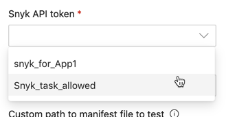

# Azure Pipelines integration

## Overview of Azure Pipelines integration

Snyk enables security across the Microsoft Azure ecosystem including for Azure Pipelines by automatically finding and fixing application and container vulnerabilities.

Ready-to-use tasks for Azure Pipelines can be inserted quickly and directly from the Azure interface, enabling you to customize and automate your pipelines with no extra coding. Among the tasks included is the Snyk task.

You can include the Snyk task in your pipeline to test for security vulnerabilities and licensing issues as part of your routine work. In this way you can test and monitor your application dependencies and container images for security vulnerabilities. When the testing is done you can review and work with results directly from the Azure Pipelines output, as well as from the Snyk interface.

The Snyk Security Scan task is available for all languages supported by Snyk and Azure DevOps.

## How the Snyk Security Scan task works

After the Snyk Security Scan task is added to a pipeline, each time the pipeline runs, the Snyk task performs the following actions:

### **Test**

1. Snyk tests the application dependencies or container images for vulnerabilities and licensing issues and lists the vulnerabilities and issues.
2. If Snyk finds vulnerabilities or license issues, it does one of the following (based on your configuration):
   * Fails the pipeline
   * Lets the pipeline continue

### **Monitor**

After the **snyk test** is complete, you have the option of doing **snyk monitor**. **snyk monitor** saves a snapshot of the project dependencies in your [snyk.io](https://snyk.io) account, where you can see the dependency tree with all of the issues and be alerted if and when new issues are found in the dependencies.

## Install the Snyk extension for your Azure pipelines

To start using the Snyk task as part of your pipeline build, first install the extension into your Azure DevOps instance per organization, from the [Visual Studio Marketplace](https://marketplace.visualstudio.com/items?itemName=Snyk.snyk-security-scan).

### **Prerequisites**

* Create a Snyk account at [https://snyk.io/](https://snyk.io)
* Ensure you are an owner of or an administrator for this account.

### **Steps**

1. Access your Snyk account.
2. For free plans, go to your **General Account Settings** and find, copy and save your personal API authentication token on the side.
3. For paid plans, navigate to the organization where you want to integrate; then go to **Settings** to create a new service account token. Copy and save it on the side.
4. Access your Azure DevOps account and navigate to **Extensions -> Browse marketplace.**
5. Search for the **Snyk Security Scan** extension, click **Get it free**.
6. Create a new **Service Connection** in your project via **Project Settings** —> **Pipelines** —> **Service Connections**
7. Select the **Snyk Authentication** service connection:
8. In the Snyk Authentication service connection form, enter the **Server URL** and the **Snyk API Token** along with a **Service connection name**.
9. Click **Save**, ensuring the new service connection appears in your list of service connections.


## Add the Snyk Security Task to your pipelines

### **Prerequisites**

* Ensure you have a pipeline within the repository for the code you’d like to test.
* If you created a pipeline with the Azure Repos wizard, this file is called `azure-pipelines.yml`.
* If this repository has multiple service connections, ask your Snyk admin which to use for your pipeline.
* If you want to add your Dockerfile for additional base image data to use when testing your container, ensure the image has been built.

### **Requirements**

This extension requires that Node.js and npm be installed on the build agent. These are available by default on all Microsoft-hosted build agents. However, if you are using a self-hosted build agent, you may need to explicitly activate Node.js and npm and ensure they are in your [PATH](https://en.wikipedia.org/wiki/PATH\_\(variable\)). This can be done using the [NodeTool task from Microsoft](https://docs.microsoft.com/en-us/azure/devops/pipelines/tasks/tool/node-js?view=azure-devops) prior to adding the SnykSecurityScan task to your pipeline.

### **Steps**

1. Add the Snyk Security Scan task when you create your pipeline or while editing an existing one. See the [Azure Pipelines documentation](https://docs.microsoft.com/en-us/azure/devops/pipelines/?view=azure-devops)
2. From Azure, access the pipeline that you want to scan for vulnerabilities. Open it for editing and check that the Build step is included just before the point at which you’d like to insert the Snyk task. Note that this is not required but is considered best practice for consistency across projects.
3. Open the **assistant**, search for the Snyk Security Scan task, and click it as shown in the screehsot that follows. The configuration panel opens on top of the assistant.\
   &#x20;
4. Complete the fields in the configuration. Find full details about the parameters in the [Snyk GitHub repo](https://github.com/snyk/snyk-azure-pipelines-task#task-parameters) or in the next section of this doc, [Snyk Security Scan task parameters and values](azure-pipelines-integration.md). **Note:** If you check the **Fail build if Snyk finds issue** option, then if the build fails, the pipeline job is failed by the Snyk task. If you uncheck the **Fail build if Snyk finds issue** option, the Snyk task tests for vulnerabilities, but does not cause the pipeline job to fail. When **testing a container image**, you can specify the path to the Dockerfile with the dockerfilePath property in order to receive additional information about issues in your base image. To add your Dockerfile for additional base image data when testing your container, ensure the image has been built.
5. Place your cursor inside the pipeline, ensuring you place it before a deployment step, such as **npm publish** or **docker push**. **Note:** You can have multiple instances of the Snyk Security Scan task within your pipeline. This might be useful, for example, if you have multiple project manifest files you want to test or if you want to test both the application and the container images.
6.  From the configuration panel, click **Add**. The task is inserted into your pipeline where your cursor was placed, similar to the following:

    ```
       - task: SnykSecurityScan@1
         inputs:
           testType: 'app'
           monitorWhen: 'always'
           failOnIssues: true
    ```
7. Once included in your pipeline, the task runs each time the pipeline runs, and the results appear in the Azure Pipelines output view:


> If the Snyk task fails the build, an error message appears in the results indicating that the build failed due to `snyk test`.

## Snyk Security Scan task parameters and values

This section describes the Snyk task parameters for Azure Pipelines integration, their parallel configuration fields from the configuration panel in Azure Pipelines, and their valid values.

| <p><strong>Configuration field</strong><br>(Parameter)</p>                                               | **Description**                                                                                                                                                                                                                                                                                                                                                                                                                                                                                                                                                                                                                                  | **Required** | **Default**   | **Type**                                                                          |
| -------------------------------------------------------------------------------------------------------- | ------------------------------------------------------------------------------------------------------------------------------------------------------------------------------------------------------------------------------------------------------------------------------------------------------------------------------------------------------------------------------------------------------------------------------------------------------------------------------------------------------------------------------------------------------------------------------------------------------------------------------------------------ | ------------ | ------------- | --------------------------------------------------------------------------------- |
| <p><strong>Snyk API token</strong><br><strong>service</strong><br>(ConnectionEndpoint)<br></p>           | <p>The Azure DevOps service connection endpoint where your Snyk API token is defined. Your admin defines this within your Azure DevOps project settings, assigning it with a unique string in order to differentiate between different connections.</p><p>The configuration panel displays all available Snyk service connections from a dropdown list like the following: </p><p>If multiple Snyk service connections are available from the dropdown list, ask your administrator which to use for the pipeline you’re working with.</p> | Yes          | none          | String / Azure Service Connection Endpoint of type SnykAuth / Snyk Authentication |
| <p><strong>What do you want to test</strong> (testType)<br></p>                                          | Determines which dynamic fields to display as described in the rest of this table.                                                                                                                                                                                                                                                                                                                                                                                                                                                                                                                                                               | Yes          | "application" | string: "app" or "container"                                                      |
| **Container Image Name** (dockerImageName)                                                               | <p>The name of the container image to test.</p><p>This dynamic field appears when <strong>What do you want to test</strong> is set to <strong>Container Imager</strong></p><p>Set to <strong>Yes</strong> if container image test.</p>                                                                                                                                                                                                                                                                                                                                                                                                           | Yes          | none          | string                                                                            |
| **Path to Dockerfile** (dockerfilePath)                                                                  | <p>The path to the Dockerfile corresponding to the <code>dockerImageName</code></p><p>This dynamic field appears when <strong>What do you want to test</strong> is set to <strong>Container Imager</strong><br></p><p>Set to <strong>Yes</strong> if container image test.</p>                                                                                                                                                                                                                                                                                                                                                                   | Yes          | none          | string                                                                            |
| **Custom path to manifest file to test** (targetFile)                                                    | <p>Applicable to application type tests only. The path to the manifest file to be used by Snyk. Should only be provided if non-standard.</p><p>This dynamic field appears when <strong>What do you want to test</strong> is set to <strong>Application</strong></p>                                                                                                                                                                                                                                                                                                                                                                              | No           | none          | string                                                                            |
| **Testing severity threshold** (severityThreshold)                                                       | <p>The severity-threshold to use when testing. By default, issues of all severity types are found.</p><p><strong>Note</strong>: if not configured, the default severity is set to <strong>Low</strong>.</p>                                                                                                                                                                                                                                                                                                                                                                                                                                      | No           | "Low"         | string: "low" or "medium" or "high"                                               |
| **When to run Snyk Monitor** (monitorWhen)                                                               | When to run **snyk monitor** to capture the dependency tree of the application or container image and monitor it within Snyk.                                                                                                                                                                                                                                                                                                                                                                                                                                                                                                                    | Yes          | "always"      | string: "always", "onIssuesFound", or "never"                                     |
| **Fail build if Snyk finds issues** (failOnIssues)                                                       | This specifies if pipeline jobs should be failed or continued based on issues found by Snyk.                                                                                                                                                                                                                                                                                                                                                                                                                                                                                                                                                     | Yes          | true          | boolean                                                                           |
| **Project name in Snyk** (projectName)                                                                   | A custom name for the Snyk project to be created on snyk.io                                                                                                                                                                                                                                                                                                                                                                                                                                                                                                                                                                                      | No           | none          | string                                                                            |
| **Organization name (or ID) in Snyk** (organization)                                                     | Name of the Snyk organization under which this project should be tested and monitored                                                                                                                                                                                                                                                                                                                                                                                                                                                                                                                                                            | No           | none          | string                                                                            |
| **Test (Working) Directory** (testDirectory)                                                             | Alternate working directory. For example, if you want to test a manifest file in a directory other than the root of your repo, you would put in a relative path to that directory.                                                                                                                                                                                                                                                                                                                                                                                                                                                               | No           | none          | string                                                                            |
| <p><strong>Additional command-line args for Snyk CLI (advanced)</strong></p><p>(additionalArguments)</p> | <p>Additional Snyk CLI arguments to be passed in. See <a href="https://docs.snyk.io/snyk-cli/guides-for-our-cli/cli-reference">CLI reference</a> for details.</p><p><strong>Tip</strong>: add <strong>--all-projects</strong> as good practice (for example, for .NET), if no project has been found.</p>                                                                                                                                                                                                                                                                                                                                        | No           | none          | string                                                                            |

### **Example of a Snyk task to test a node.js (npm) based application**

This section displays examples of Snyk Security Scan task configurations and parameters when testing a Node.js (npm) application.

The configuration panel appears as follows:


Click **add** and the task is added to your pipeline as follows:


### **Simple example of testing an application**

```
- task: SnykSecurityScan@0
  inputs:
    serviceConnectionEndpoint: 'snykToken'
    testType: 'app'
    monitorWhen: 'always'
    failOnIssues: true
```

### **Example of a Snyk task for a container image pipeline**

The following is an example of the Snyk Security Scan task within the script for a container image pipeline.

When populated with the most common settings, the configuration panel in Azure appears similar to the following:


Following is an example of the same configuration once you've added it to your pipeline.


### **Simple example of testing a container image**

```
- task: SnykSecurityScan@1
  inputs:
    serviceConnectionEndpoint: 'snykToken'
    testType: 'container'
    dockerImageName: 'goof'
    dockerfilePath: 'Dockerfile'
    monitorWhen: 'always'
    failOnIssues: true
```
