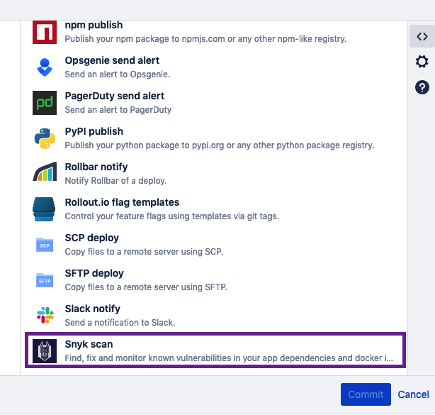
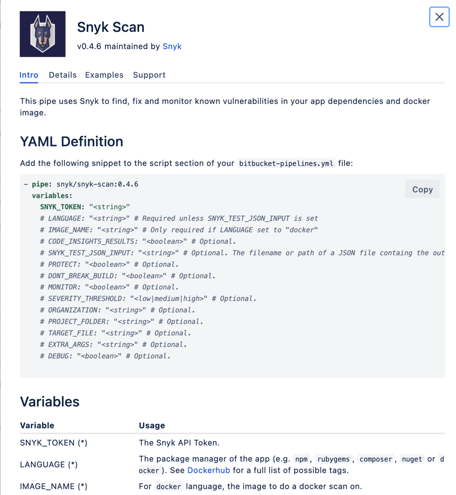
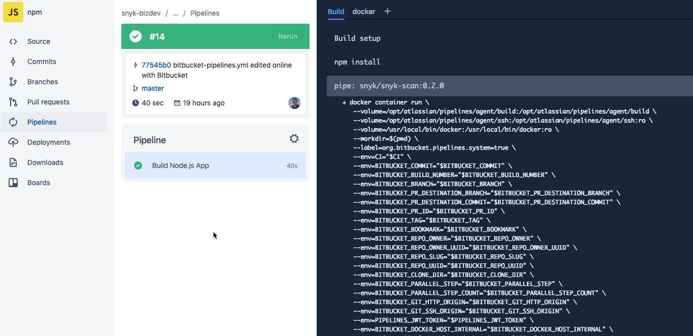

# Bitbucket Pipelines integration

Snyk integrates with Bitbucket Pipelines using a **Snyk pipe**, seamlessly scanning your application dependencies and Docker images for open source security vulnerabilities as part of the continuous integration/continuous delivery (CI/CD) workflow.

[Bitbucket Pipes](https://bitbucket.org/blog/meet-bitbucket-pipes-30-ways-to-automate-your-ci-cd-pipeline) enables users to customize and automate a Bitbucket Pipeline CI/CD workflow with a group of ready-to-use tasks that can be added inside of your pipelines by copying and pasting them from the Bitbucket interface.

With the Snyk pipe, you can quickly add Snyk scanning to your pipelines to test and monitor for vulnerabilities at different points of the CI/CD workflow, based on your configurations. Results are then displayed from the Bitbucket Pipelines output view and can also be monitored from [Snyk.io](http://app.snyk.io).

## Snyk pipe information in Bitbucket

From the build directory, Bitbucket Pipelines displays a list of available pipes customized for you directly, similar to the following image:

From this list, find and click **Snyk** to view the pipe, examples, parameters, and values:

## Language support

Snyk integration with Bitbucket pipes is supported for the following languages:

* JavaScript (npm)
* .NET (NuGet)
* PHP Composer
* Ruby
* Docker


Bitbucket pipeline implementation for Java (Maven and Gradle) requires the [Snyk CLI](https://docs.snyk.io/snyk-cli).


## Bitbucket Pipelines integration: how it works

Once the user has added the Snyk pipe to the pipeline, each time the pipeline executes (by any trigger type) the Snyk pipe does the following.

**Scan**

1. Scans app dependencies or container images for vulnerabilities or licensing issues, and lists them.
2. If Snyk finds vulnerabilities, it does one of the following (based on configuration):
   * Fails the build
   * Lets the build complete

**Monitor**

Optionally, if the build completes successfully and **MONITOR** is set to **True** in the Snyk step, then Snyk saves a snapshot of the project dependencies from the Snyk app, where you can view the dependency tree displaying all of the issues, and you can receive alerts for new issues found in the existing app version.

**Protect (optional)**

(For Node.js projects only) Optionally, set **PROTECT** to **True** and if a .snyk policy file exists, Snyk applies patches specified in the policy file.

## Configure your Bitbucket Pipelines integration

To enable Snyk to test and monitor your code as an integral part of your CI/CD workflow in Bitbucket, add the Snyk pipe into your `bitbucket-pipelines.yml` (YAML) file. The bitbucket-pipelines.yml file should be located in the root of your repository, and it is this file that defines all your build configurations (pipelines for your CI/CD workflow).

## Prerequisites

* For your Bitbucket Pipelines, ensure you have build minutes in your account, which are necessary to enable ongoing CI/CD workflows.
* Create a Snyk account and retrieve the Snyk API token from your **Account settings**.
* Create a Repository variable from Bitbucket for your Snyk API token. Call the variable SNYK\_TOKEN.

## How to add a Snyk pipe

1. Add the Snyk pipe while originally creating your pipeline, or while editing an existing pipeline. See the Bitbucket documentation for more information about [pipelines](https://confluence.atlassian.com/bitbucket/configure-bitbucket-pipelines-yml-792298910.html) and [pipes](https://support.atlassian.com/bitbucket-cloud/docs/pipes/). When adding the Snyk pipe, follow these guidelines:
2. Use the Bitbucket pipeline editor to update the .yml file configuration, select the correct language and use the Bitbucket Pipes build directory when adding the Snyk pipe.
3. Paste the Snyk pipe into the Bitbucket editor interface, after all, build steps. Build steps are commands such as these: `npm install / composer install / bundle install / dotnet restore / docker build`
4. Ensure you paste the pipe before a deployment step, such as **npm publish or docker push**.
5. Configure the **LANGUAGE**, choose whether to fail the pipeline on vulnerabilities found with **DONT\_BREAK\_BUILD** (you can also use **SEVERITY\_THRESHOLD**), and consider enabling **MONITOR and PROTECT** (Protect for Node.js projects only). See Snyk pipe parameters and values for more information.
6. Once included in your pipeline commands, Snyk looks for the manifest files in that repository (package.json, package-lock.json) and performs the scan.
7. Results appear in the Bitbucket Pipelines output interface, similar to the following:


**Note**\
If the build fails, even if **MONITOR** is set to **True**, Snyk does not continue to the Monitor stage (because no projects are deployed until the build succeeds). To enable monitoring on Snyk.io of projects with vulnerabilities, set **DONT\_BREAK\_BUILD** to **True**. You can use **SEVERITY\_THRESHOLD** to tell the pipe the severity threshold from which to fail the pipe at the scanning stage. See Snyk pipe parameters and values for more information.


## Snyk pipe parameters and values (Bitbucket Cloud)

Following is the Snyk pipe that should be configured as part of a pipeline YAML file in order to include vulnerability scanning as part of your CI/CD workflow:

`- pipe: snyk/snyk-scan:0.4.6`

variables:

`SNYK_TOKEN: '':` It's preferable to encrypt this value and enter the string $SNYK\_TOKEN only in the pipeline. See the table below for more information.

`LANGUAGE: '' # Required unless you use the snyk-cli image.`

`# IMAGE_NAME: '' # Only required if LANGUAGE set to 'docker'`

`# CODE_INSIGHTS_RESULTS: '' # Optional. Default: false.`

`# SNYK_TEST_JSON_INPUT: "" # Optional. Default: false.`

`# DONT_BREAK_BUILD: '' # Optional.`

`# MONITOR: '' # Optional.`

`# SEVERITY_THRESHOLD: '' # Optional`

`# ORGANIZATION: '' # Optional.`

`# PROJECT_FOLDER: '' # Optional.`

`# TARGET_FILE: '' # Optional.`

`# EXTRA_ARGS: '' # Optional.`

`# DEBUG: '' # Optional.`

The following table describes the Snyk pipe parameters.

| **Parameter**           | **Description**                                                                                                                                                                                                                                                                                                                                                                                                                                                                                                                                                                                                                                                                                                                                                                                                                                                                                          |
| ----------------------- | -------------------------------------------------------------------------------------------------------------------------------------------------------------------------------------------------------------------------------------------------------------------------------------------------------------------------------------------------------------------------------------------------------------------------------------------------------------------------------------------------------------------------------------------------------------------------------------------------------------------------------------------------------------------------------------------------------------------------------------------------------------------------------------------------------------------------------------------------------------------------------------------------------- |
| SNYK\_TOKEN (\*)        | 
Enter the Snyk API token, which you can retrieve from your Snyk Account settings.

We recommend you encrypt the token: you can add it as a predefined variable in a separate part of the Bitbucket pipes directory:
<ol><li>From the build directory, navigate to add a new Repository value, name the parameter “SNYK_TOKEN” and enter your API token from Snyk as the value.</li><li>
From the pipeline YAML file that you're building, enter $SNYK_TOKEN as the value for the SNYK_TOKEN parameter in the Snyk pipe.

</li></ol>
See <a href="https://confluence.atlassian.com/bitbucket/pipes-958765631.html">Bitbucket documentation</a> for more information about predefined variables.
 |
| LANGUAGE (\*)           | 
Configure the package manager of the app (for example, npm, maven, rubygems, composer, nuget or docker).

See <a href="https://hub.docker.com/r/snyk/snyk-cli/tags">Dockerhub</a> for a full list of possible tags.
                                                                                                                                                                                                                                                                                                                                                                                                                                                                                                                                                                                                                                                                          |
| IMAGE\_NAME (\*)        | For docker language only, configure the image name for which to perform a docker scan.                                                                                                                                                                                                                                                                                                                                                                                                                                                                                                                                                                                                                                                                                                                                                                                                                   |
| CODE\_INSIGHTS\_RESULTS | Create Code Insight report with Snyk test results. Default: \`false\`.                                                                                                                                                                                                                                                                                                                                                                                                                                                                                                                                                                                                                                                                                                                                                                                                                                   |
| SNYK\_TEST\_JSON\_INPUT | Use if you just want to create a Code Insights report from a previously generated \`snyk test --json\` output. See example below in the "Generating the Code Insights report from existing Snyk JSON output" section.                                                                                                                                                                                                                                                                                                                                                                                                                                                                                                                                                                                                                                                                                    |
| PROTECT                 | 
Supported only for JavaScript (npm) currently.

This parameter applies the patches specified in your .snyk file to the local file system when set to True.

Default: false. Automatic fixing is disabled.

To enable automatic fixing, first run the Snyk Wizard, which creates and adds the .snyk file to your project.
                                                                                                                                                                                                                                                                                                                                                                                                                                                                                                                                                           |
| DONT\_BREAK\_BUILD      | 
When set to true, continues the build even when vulnerabilities are discovered.

Default: false. The build fails.
                                                                                                                                                                                                                                                                                                                                                                                                                                                                                                                                                                                                                                                                                                                                                                            |
| MONITOR                 | 
Records a snapshot of the project for the Snyk UI and then continues monitoring the project after the build is run.

If the test succeeds, this records a snapshot of the app’s dependencies in the <a href="http://app.snyk.io">Snyk app</a> and allows you to see the state of your deployed code, have it monitored and receive alerts when new vulns are found in the code.

Default: false. The project is not monitored after the initial scan.
                                                                                                                                                                                                                                                                                                                                                                                                                                   |
| SEVERITY\_THRESHOLD     | 
Reports issues equal to or higher than the configured level. Possible values: low, med, high

Default: low. All vulnerabilities are reported.
                                                                                                                                                                                                                                                                                                                                                                                                                                                                                                                                                                                                                                                                                                                                                |
| ORGANIZATION            | 
Configures the organization from your Snyk account to which to associate the repository.

Default: none.
                                                                                                                                                                                                                                                                                                                                                                                                                                                                                                                                                                                                                                                                                                                                                                                     |
| PROJECT\_FOLDER         | 
The folder in which the project resides.

Default: ..
                                                                                                                                                                                                                                                                                                                                                                                                                                                                                                                                                                                                                                                                                                                                                                                                                                        |
| TARGET\_FILE            | 
The package file (for example package.json); equivalent to --file= in the CLI.

For Docker enter the Dockerfile as the value.

Default: none.
                                                                                                                                                                                                                                                                                                                                                                                                                                                                                                                                                                                                                                                                                                                                           |
| EXTRA\_ARGS             | 
Extra arguments to be passed to the Snyk CLI. Use the parameters and arguments as described here.

Default: none.
                                                                                                                                                                                                                                                                                                                                                                                                                                                                                                                                                                                                                                                                                                                                                                            |
| DEBUG                   | 
Turn on extra debug information.

Default: false
                                                                                                                                                                                                                                                                                                                                                                                                                                                                                                                                                                                                                                                                                                                                                                                                                                             |

**Example of a Snyk pipe for Docker**

Following is an example of the Snyk pipe set up for a Docker image:

**Example of a Snyk pipe for npm**

Following is an example of the Snyk pipe set up for npm:

