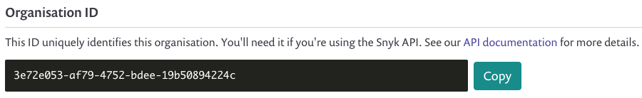
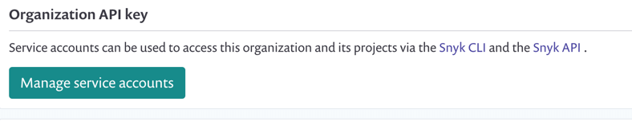
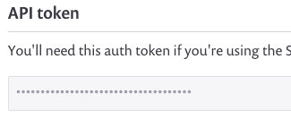

# TeamCity configuration parameters

| **Parameters**             | **Description and values**                                                                                                                                                                                                                                                                                                                                                                                                 |
| -------------------------- | -------------------------------------------------------------------------------------------------------------------------------------------------------------------------------------------------------------------------------------------------------------------------------------------------------------------------------------------------------------------------------------------------------------------------- |
| **Snyk settings**          |                                                                                                                                                                                                                                                                                                                                                                                                                            |
| Severity threshold         | 
Default: low

Specify a threshold: <code>low</code>
                                                                                                                                                                                                                                                                                                                                                            |
| Monitor project on build   | 
Default: ON

Snyk runs the <code>snyk monitor</code> command during the build, sending a project snapshot to the Snyk Web UI, and continuing to monitor the project for vulnerabilities even after this build.
                                                                                                                                                                                                 |
| File                       | 
Optional

If the manifest file is not on the root level, enter the relative path to that file.
                                                                                                                                                                                                                                                                                                                 |
| Organization               | 
Optional

The ID of the Snyk organization to which this project should be associated when imported to the UI.

Copy the Organization ID from the Snyk UI in the Settings area.

                                                                                                            |
| Project name               | 
Optional

Enter any unique name for this project to recognize it when viewing from the Snyk UI.
                                                                                                                                                                                                                                                                                                                |
| Additional parameters      | 
Optional

Enter additional CLI arguments as necessary. See the <a href="../../../../snyk-cli/">CLI documentation</a> and <a href="https://snyk.io/wp-content/uploads/Cheat-Sheet-CLI-1.pdf">cheat sheet </a>for additional information.
                                                                                                                                                                        |
| **Snyk tool settings**     |                                                                                                                                                                                                                                                                                                                                                                                                                            |
| Snyk API token             | 
From the Settings area in the Snyk UI, copy the Org or Personal API token or create a service account. Use the token to authenticate your Snyk account when connecting to TeamCity.

 |
| Snyk version               | 
Default: the most recent version

Select the plugin version to be used in your build if you would like an older Snyk CLI version to support the plugin.

Snyk recommends configuring automatic upgrades and using the most recent version.
                                                                                                                                                                |
| Use custom build tool path | 
Specify which tool instance in your local environment Snyk is to use for this build.

Otherwise Snyk auto-detects the tool and locates it in your environment based on project type.
                                                                                                                                                                                                                           |
