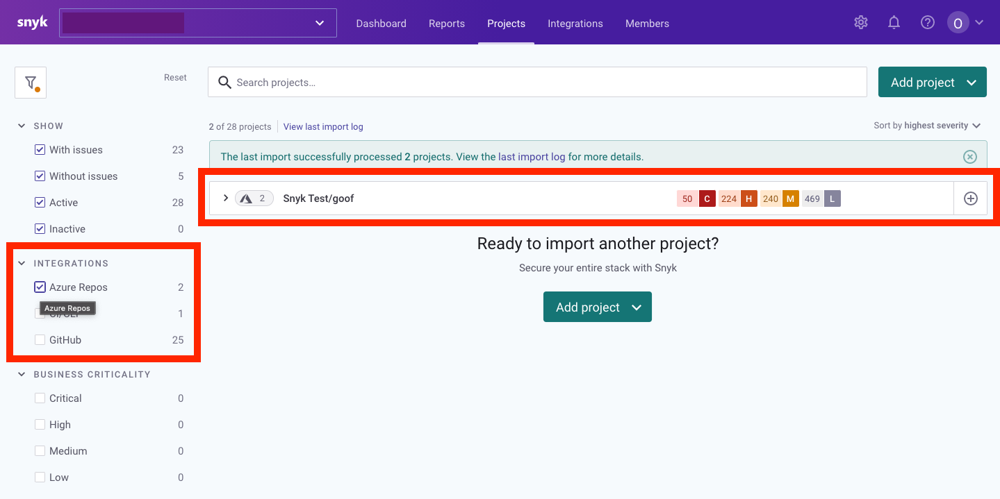

# Azure Repos integration

The user generates a unique Azure DevOps personal access token (PAT) generated for Snyk specifically. Together the username and password constitute a token that Snyk uses. The token authorizes Snyk to access the user’s repos for only the specific permissions that the user indicates to Azure Repos when generating it.

1. The user selects projects and repositories for import to Snyk (for testing and monitoring). The user can also enter custom file locations for any manifest files that are not located in the root folders of their repositories.
2. Snyk evaluates the items that the user selected and imports any that have relevant manifest files in their root folder and all the subfolders at any level.
3. Snyk communicates directly with your repository for each test it runs to determine exactly what code is currently pushed and what dependencies are being used. Each dependency is tested against Snyk’s vulnerability database to see if it contains any known vulnerabilities.
4. Based on your configurations, if vulnerabilities are found, Snyk notifies you via email or Slack so that you can take immediate action to fix.

## Add projects to Snyk for Azure Repos

Snyk tests and monitors Azure Repos that are in any of our supported languages by evaluating root folders and custom file locations.

**Adding projects to Snyk**

1. Go to **Projects** and click **Add projects**. Choose the tool from which to import your projects:
2. A popup screen opens with all the available repositories under the selected integration:
3. Select the repos that you would like to import to Snyk to monitor them for security/license issues. To import all repos for a specific organization, checkmark the organization.
4. Click **Add selected repositories**. Snyk will now scan the entire file tree for dependency files and import them to Snyk as Projects.

.png>)

## Adding custom file location

1. From the Add custom file location dropdown list, select the relevant repo for which you would like to configure a custom path. The repo must first be selected from the Add Projects view, as described in the previous step.
2. In the text field, enter the relative path in which the manifest file is located, as demonstrated in the image above.


**Note**\
This field is case-sensitive.


## Excluding folders from import

This integration works similar to our other integrations. To continue to monitor, fix and manage your projects, see the relevant pages in our Docs.


**Note**\
This field is case-sensitive and the pattern applies for all repos.


**Next steps**

Once repositories are imported, a confirmation appears in green at the top of the screen. The selected files are indicated with a unique icon, they are named by organization/repo, and you can now also filter to view only those projects, as seen in the example below:

This integration works similar to our other integrations. To continue to monitor, fix and manage your projects, see the relevant pages in our Docs.

## Configure your integration for Azure Repos


**Feature availability**\
Integration with Azure Repos Cloud is available for all of our pricing plans. Integration with Azure DevOps Server 2020 and above (also known as TFS) is available with Enterprise and Business plans. See [pricing plans](https://snyk.io/plans/) for more details.


Snyk integrates with Microsoft Azure Repos to enable you to import your projects and monitor the source code for your repositories. Snyk tests the projects you’ve imported for any known security vulnerabilities found in the application’s dependencies, testing at a frequency you control.

## How to configure your integration

Enable integration between Azure Repos and Snyk, and start managing your vulnerabilities.

**Prerequisites**

Ensure you have set up your Azure Repos account and your Snyk account.


**Note**: it is important that a Snyk admin user configure the integration within the UI. Collaborator users cannot complete this task.


**Steps**

1. The account creating the Personal Access Token must be a member of the Project Administrators group to allow Git repositories to see the [Azure DevOps documentation](https://docs.microsoft.com/en-us/azure/devops/repos/git/set-git-repository-permissions).
2. Access your Azure Repos account and retrieve a unique Personal Access Token for use by Snyk. For help doing this, see the [Azure DevOps documentation](https://docs.microsoft.com/en-us/azure/devops/organizations/accounts/use-personal-access-tokens-to-authenticate?view=azure-devops).
3. When prompted in Azure, enable the following permissions for Snyk access as follows:
   * Expiry—We recommend choosing an expiration date for this token that is far in the future to avoid breaking integration.
   * Scopes—Custom defined
   * Code—Read and write (enable Project Administrators group permissions if user creating the Personal Access Token is not an admin of the Repositories)
4. [Log in](https://app.snyk.io) to your Snyk account.
5. Navigate to **Integrations** from the menu bar at the top.
6. From the **Integrations** page under the Azure Repos logo, click the **Connect to Azure Repos button.**
7. From the **Settings** page in the **Integrations** area, enter the Azure DevOps organization that you want to integrate with (i.e. [https://dev.azure.com/{org-name}\\](https://dev.azure.com/%7Borg-name%7D\)/) and the personal access token that you just generated. \* Enterprise customers can also provide a custom URL for Azure Repos Server private instance which is publicly reachable.
8. Click **Save**.
9. Snyk tests the connection values and the page reloads, now displaying Azure Repos integration information. A confirmation message that the details were saved also appears in green at the top of the screen. In addition, if the connection to Azure failed, a notification appears under the Connected to Azure Repos section.

