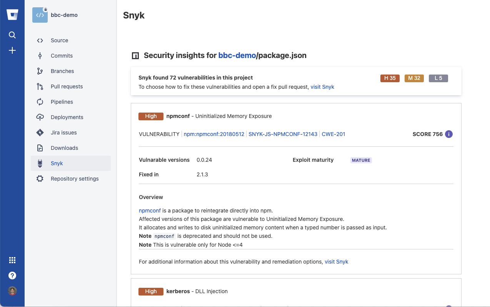
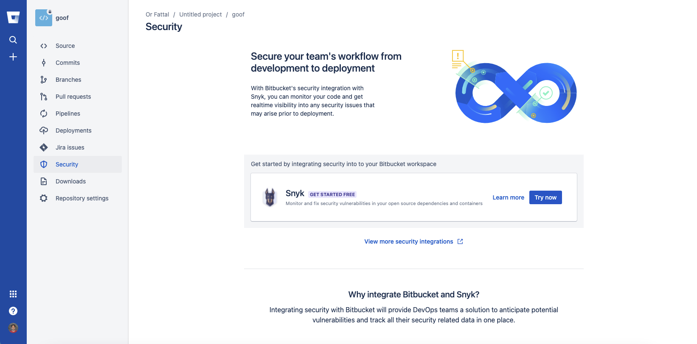
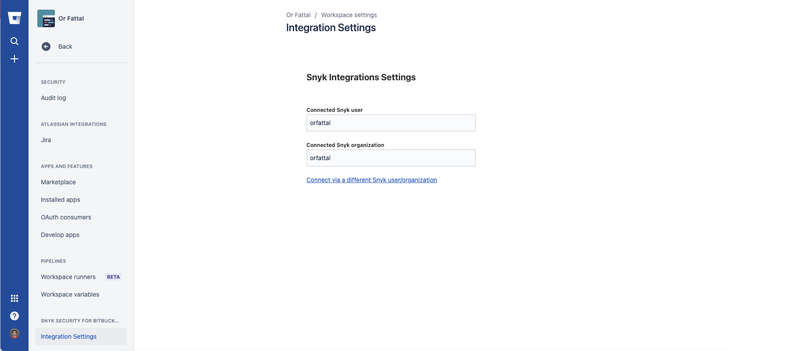

# Bitbucket Cloud integration

Snyk's Bitbucket Cloud integration allows you to continuously perform security scanning across all the integrated repositories, detect vulnerabilities in your open source components, and use automated fixes.

> **Feature availability**\
> This feature is available for all plans. See [pricing plans](https://snyk.io/plans/) for more details.

### Setting up a Bitbucket Cloud Integration

> The newly created user must have **Admin** permissions to all the repositories you need to monitor with Snyk.
>
> Admin permissions are required; however, Snyk's access is ultimately limited by the [permissions assigned to the App Password](https://support.atlassian.com/bitbucket-cloud/docs/app-passwords/).

1. To give Snyk access to your Bitbucket account
   1. Set up a dedicated service account in Bitbucket, with admin permissions.
   2. Visit [Bitbucket documentation ](https://support.atlassian.com/bitbucket-cloud/docs/grant-access-to-a-workspace/)to learn more about creating users.
2. In Snyk, go to the **Integrations** page and click on **Bitbucket Cloud** card.
3. Access your Bitbucket Cloud account and create a unique App Password for Snyk with the following permissions:
   1. **Account: Email & Read**
   2. **Workspace membership: Read**
   3. **Projects: Read**
   4. **Repositories: Read & Write**
   5. **Pull requests: Read & Write**
   6. **Webhooks: Read & Write**
      1. Follow [Bitbucket documentation](https://confluence.atlassian.com/bitbucket/app-passwords-828781300.html) to see how to do this in detail.
4. Enter the username, which can be found under BitBucket's Personal settings, and the [App Password for the service account](https://support.atlassian.com/bitbucket-cloud/docs/app-passwords/) you created:
5.  Click **Save**.\
    Snyk connects to your Bitbucket Cloud account. When the connection succeeds, the following indications appear:

    .png>)\
    You can now select the repositories for Snyk to monitor.
6. Click **Add your Bitbucket Cloud repositories to Snyk** to start importing repositories to Snyk.
7. Select the repositories to import to Snyk when prompted, then click **Add selected repositories**.
8. Snyk scans the selected repositories for dependency files (such as package.json and pom.xml) in the entire directory tree, and import them to Snyk as projects:
9. The imported projects appear in your **Projects** page and are continuously checked for vulnerabilities.

 (4) (4) (4) (5) (4) (1) (1) (1) (1) (1) (1) (1) (1) (1) (1) (1) (1) (1) (1) (1) (1) (1) (15).png>)

After the integration is done, you can use capabilities as described below.

### Project level security reports

Snyk produces advanced security reports, allowing you to explore the vulnerabilities found in your repositories, and fix them immediately by opening a fix pull request directly to your repository, with the required upgrades or patches.

This is an example of a project level security report:

 (5) (6) (1) (1) (1) (1) (1) (1) (1) (1) (1) (1) (1) (1) (1) (1) (1) (1) (1) (1) (33).png>)

### Projects monitoring and automatic fix pull requests

Snyk frequently scans your projects on either a daily or a weekly basis. When new vulnerabilities are found, it notifies you by email and by opening an automated pull requests with fixes to repositories.

Here is an example of a fix pull request opened by Snyk:

To review and adjust the automatic fix pull request settings:

1. Click on settings > **Integrations**.
2. Select **Edit Settings** for Bitbucket Cloud.
3. Navigate to **Automatic fix pull requests**:

 (2) (6) (7) (3) (1) (1) (1) (1) (1) (1) (1) (1) (1) (1) (1) (1) (1) (1) (1) (1) (1) (31).png>)

### Pull request tests

Snyk tests any newly created pull request in your repositories for security vulnerabilities, and sends a build check to Bitbucket Cloud. You can to see whether the pull request introduces new security issues, directly from Bitbucket Cloud.

This is how Snyk pull request build check appears in the **Pull Request** page in Bitbucket Cloud:

To review and adjust the pull request tests settings,

1. Click on settings  > **Integrations**.
2. Select **Edit Settings** for Bitbucket Cloud.
3. Navigate to **Default Snyk test for pull requests > Open Source Security & Licenses**, and edit settings: \*\*\*\*

### Required permissions scope for the Bitbucket Cloud integration

All the operations, triggered manually or automatically, are performed for a Bitbucket Cloud service account that has its token (App Password) configured in the integrations settings.

This shows the required access scopes for the configured token:

| **Action**                                          | **Why?**                                                                                                                                               | **Required permissions in Bitbucket**                            |
| --------------------------------------------------- | ------------------------------------------------------------------------------------------------------------------------------------------------------ | ---------------------------------------------------------------- |
| Daily / weekly tests                                | For reading manifest files in private repos                                                                                                            | _Repositories read_                                              |
| Manual fix pull requests (triggered by the user)    | For creating fix PRs in the monitored repos                                                                                                            | _Repositories (read & write)_ _pull requests (read & write)_     |
| Automatic fix and upgrade pull requests             | For creating fix / upgrade PRs in the monitored repos                                                                                                  | _Repositories (read & write)_ _pull requests (read & write)_     |
| Snyk tests on pull requests                         | For sending pull request status checks whenever a new PR is created / an existing PR is updated                                                        | _Repositories (read & write)_ _pull requests (read & write)_     |
| Importing new projects to Snyk                      | For presenting a list of all the available repos in the Bitbucket in the "Add Projects" screen (import popup)                                          | _Account (read)_ _Workspace membership (read)_ _Projects (read)_ |
| Snyk tests on pull requests - initial configuration | For adding Snyk's webhooks to the imported repos, so Snyk will be informed whenever pull requests are created or updated and be able to trigger scans. | _webhooks (read & write)_                                        |

### Required permissions scope for repositories 

For Snyk to perform the required operations on monitored repositories (such as reading manifest files on a frequent basis and opening fix or upgrade PRs), the integrated Bitbucket Cloud service account needs **Admin** permissions on the imported repositories:

| **Action**                                          | **Why?**                                                                                                                            | **Required permissions on the repository** |
| --------------------------------------------------- | ----------------------------------------------------------------------------------------------------------------------------------- | ------------------------------------------ |
| Daily / weekly tests                                | To read manifest files in private repositories.                                                                                     | **Write** or above                         |
| Snyk tests on pull requests                         | To send pull request status checks when a new PR is created, or an existing PR is updated.                                          |                                            |
| Opening fix and upgrade pull requests               | To create fix PRs in monitored repositories.                                                                                        |                                            |
| Snyk tests on pull requests - initial configuration | To add Snyk's webhooks to the imported repos, so Snyk is informed when pull requests are created or updated, and can trigger scans. | **Admin**                                  |

## 1st Party Integration (Connect App)

The Connect App integration is a layer on top of the regular App Password integration, which allows your developers to consume Snyk from the Bitbucket interface.

> The Connect App currently supports [Snyk Open Source](../../../products/snyk-open-source/) and [Snyk Container](../../../products/snyk-container/) products only.

By adding the Connect App to your Bitbucket workspaces, your workspaces members can import repos and see the security data in a dedicated Snyk tab in Bitbucket Cloud:

### Installing the Connect App

To install the app, navigate to the **Security** tab in one of your workspace's repos in Bitbucket Cloud, then click **Try now**:

### Uninstalling the Connect App

To remove the Connect App from your workspace in Bitbucket Cloud:

1. Navigate to the **workspace settings** page > **Installed apps**.
2. Find **Snyk Security for Bitbucket Cloud** in the installed applications list.
3. Click **remove**.

### Associating the Connect App to a different Snyk account / organization

The Connect App is associated to a specific Snyk account and organization, as defined during the app onboarding process.

To change these settings later, navigate to the workspace settings and select **Security for Bitbucket Cloud Integration Settings**:

### Disabling the Bitbucket Cloud integration

To disable this integration:

1. Click on settings > **Integrations** in Snyk.
2. Find the specific integration to deactivate in your list of integrations, and click Edit settings.
3. A page appears showing the current status of your integration and a place to update your credentials, specific to each integration (credentials, API key, Service Principal, or connection details):
4. Click **Disconnect**.

> Your credentials are removed from Snyk and any integration-specific projects Snyk is monitoring are deactivated on Snyk.\
> If you then choose to re-enable this integration at any time, you will need to re-enter your credentials and activate your projects.
