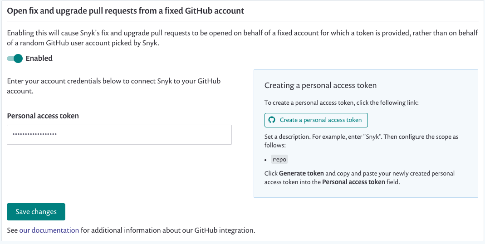
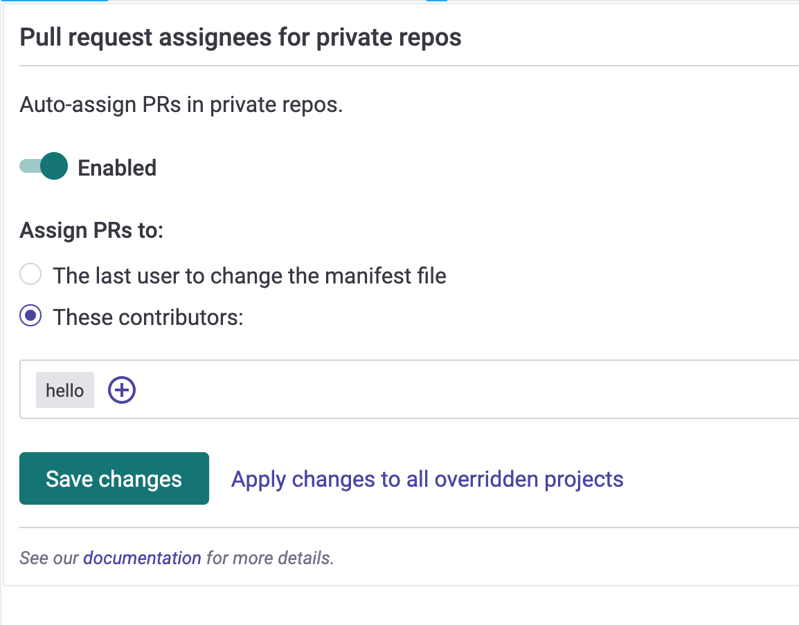
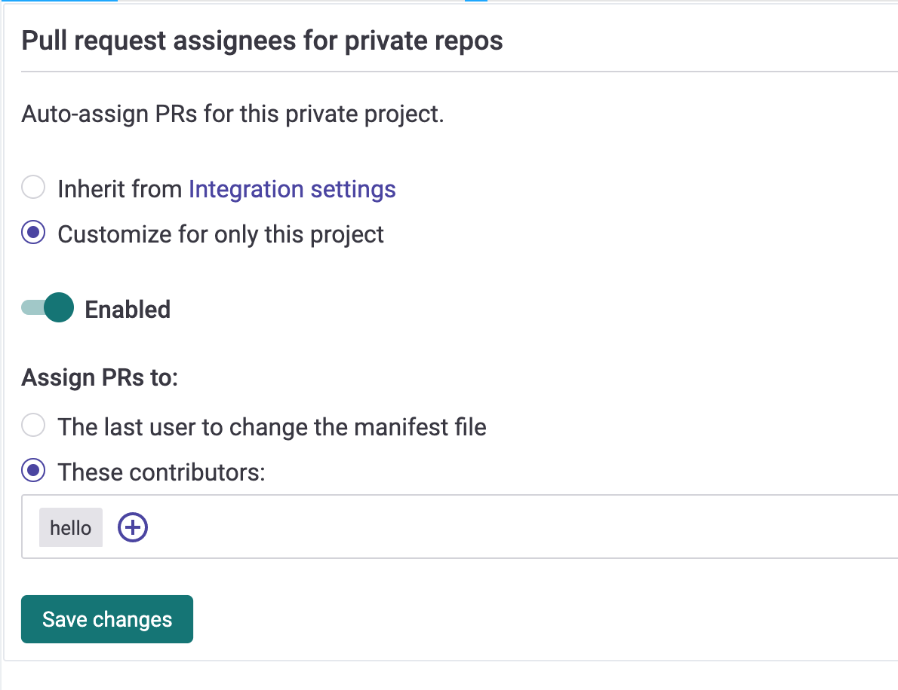
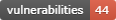
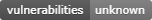

# GitHub integration

Snyk's GitHub integration allows you to continuously perform security scanning across all the integrated repositories, detect vulnerabilities in your open source components, and provide automated fixes.

Please note, **GitHub integrates per user and not per org**. Setting up this integration means it will be used for all organizations associated with your account.


Using a **Personal Access Token** in a GitHub integration allows opening of PRs, but not importing projects. In order to setup import of projects using a [Personal Access Token](https://docs.github.com/en/authentication/keeping-your-account-and-data-secure/creating-a-personal-access-token), use [GitHub Enterprise integration](github-enterprise-integration.md).


## Setting up a GitHub Integration

1. Go to the Integrations page and click on “GitHub”.
2. Choose whether you'd like to give Snyk access to both public and private repositories or only to public repositories.
3. When the GitHub authorization screen opens, click on "Authorize snyk" to provide it with an access to your repositories.
4. Select the repos you'd like to import to Snyk. When done, click on the **Add selected repositories** button, at the top of the page. Once clicked, Snyk will start scanning the selected repos for dependency files (meaning package.json, pom.xml, etc.) in the entire directory tree and import them to Snyk as projects:
5. The imported projects now appear in your Projects page and are continuously checked for vulnerabilities.

 (5) (9) (7) (18) (1) (1) (1) (1) (1) (1) (1) (1) (1) (1) (1) (1) (27) (1) (1) (1) (1) (1) (26).jpg>)

## GitHub Integration Features

Once the integration is in place, you'll be able to enjoy the following capabilities:

### **1. Project level security reports**

Snyk will produce advanced security reports, allowing you to explore the vulnerabilities found in your repositories and fix them right away by opening a fix pull request directly to your repository, with the required upgrades or patches.

This is an example of a project-level security report:

 (5) (6) (1) (1) (1) (1) (1) (1) (1) (1) (1) (1) (1) (1) (1) (1) (1) (1) (1) (1) (28).png>)

### **2. Project monitoring and automatic fix pull requests**

Snyk will frequently scan your projects on either a daily or a weekly basis. When new vulnerabilities are found, it will notify you by email and by opening automated pull requests with fixes to repositories. Here is an example of a fix pull request opened by Snyk:

You can review and adjust the automatic fix pull request settings by navigating to the GitHub Integration Settings page in Snyk (Settings --> Integration --> GitHub):

 (2) (6) (7) (3) (1) (1) (1) (1) (1) (1) (1) (1) (1) (1) (1) (1) (1) (1) (1) (1) (1) (40).png>)

#### Commit Signing

All the commits in Snyk's PRs are done by [snyk-bot@snyk.io](mailto:snyk-bot@snyk.io) - a verified user on GitHub, and signed with a PGP key. Therefore, all Snyk PRs will appear as verified on GitHub, providing your developers confidence that the fix / upgrade PRs are generated by a trusted source.


This feature is _not_ supported for brokered GitHub integrations.


### **3. Pull request testing**

Snyk will test any newly created pull request in your repositories for security vulnerabilities and send a status check to GitHub so you can see whether the pull request introduces new security issues, directly from GitHub.

This is how Snyk pull request checks appear on the Pull Request page on GitHub:

 (2) (6) (5) (1) (1) (1) (1) (1) (1) (1) (1) (1) (1) (1) (1) (1) (1) (1) (1) (1) (22).png>)

You can review and adjust the pull request tests settings by navigating to the GitHub Integration **Settings** page in Snyk (Settings --> Integration --> GitHub):

 (1).png>)

## Required permissions scope for the GitHub integration

### Non-Brokered GitHub Integrations

1. Operations that are triggered via the Snyk UI, for example, opening a Fix PR or retesting a project, are performed on behalf of the acting user. Therefore, a user that wants to perform this operation on GitHub via the Snyk UI, must connect their GitHub account to Snyk and have the required permissions scope for the repositories they would like to perform these operations for. See the **Required permissions scope for repositories** section for more details.
2. Operations which are not triggered via the UI, such as daily / weekly tests and automatic PRs (fix and upgrade) are performed on behalf of a random Snyk organization members who have connected their GitHub accounts to Snyk and have the required permissions scope for the repository.
3. Some operations (such as creating the PR) may occasionally be performed by [snyk-bot@snyk.io](mailto:snyk-bot@snyk.io) for public repositories that are non-brokered.


**Note**\
A Snyk organization admin can configure a [specific GitHub account on whose behalf the PRs will be opened](opening-fix-and-upgrade-pull-requests-from-a-fixed-github-account.md). In this case, Snyk will continue using a random Snyk organization member’s GitHub account to perform all the other operations. Therefore, using this feature does not eliminate the need for connecting users’ GitHub accounts to Snyk.


## Brokered GitHub Integrations

All the operations, both the ones that are triggered via the UI and the automatic ones, are performed on behalf of a GitHub service account that its token is configured with the Broker. This is the breakdown of the required access scopes for the configured token:

| **Action**                                          | **Why?**                                                                                                                                              | **Required permissions in GitHub** |
| --------------------------------------------------- | ----------------------------------------------------------------------------------------------------------------------------------------------------- | ---------------------------------- |
| Daily / weekly tests                                | For reading manifest files in private repos                                                                                                           | _repo (all)_                       |
| Manual fix pull requests (triggered by the user)    | For creating fix PRs in the monitored repos                                                                                                           | _repo (all)_                       |
| Automatic fix and upgrade pull requests             | For creating fix / upgrade PRs in the monitored repos                                                                                                 | _repo (all)_                       |
| Snyk tests on pull requests                         | For sending pull request status checks whenever a new PR is created / an existing PR is updated                                                       | _repo (all)_                       |
| Importing new projects to Snyk                      | For presenting a list of all the available repos in the GitHub org in the "Add Projects" screen (import popup)                                        | _admin:read:org, repo (all)_       |
| Snyk tests on pull requests - initial configuration | For adding Snyk's webhooks to the imported repos, so Snyk will be informed whenever pull requests are created or updated and be able to trigger scans | _admin:repo\_hooks (read & write)_ |

## Required permissions scope for repositories 

In order for Snyk to be able to perform the required operation on monitor repositories, meaning reading manifest files on a frequent basis and opening fix or upgrade PRs. The accounts that are connected to Snyk (either directly or via Broker) need to have the following access to the repositories:

| **Action**                                          | **Why?**                                                                                                                                              | **Required permissions on the repository** |
| --------------------------------------------------- | ----------------------------------------------------------------------------------------------------------------------------------------------------- | ------------------------------------------ |
| Daily / weekly tests                                | For reading manifest files in private repos                                                                                                           | _Write_ or above                           |
| Snyk tests on pull requests                         | For sending pull request status checks whenever a new PR is created / an existing PR is updated                                                       | _Write_ or above                           |
| Opening fix and upgrade pull requests               | For creating fix / upgrade PRs in the monitored repos                                                                                                 | _Write_ or above                           |
| Snyk tests on pull requests - initial configuration | For adding Snyk's webhooks to the imported repos, so Snyk will be informed whenever pull requests are created or updated and be able to trigger scans | _Admin_                                    |

### **1. Opening fix and upgrade pull requests from a fixed GitHub account**

Snyk allows you to configure a specific GitHub account on whose behalf the fix and upgrade PRs will be opened. Please note that the configured account is only used for opening PRs. All the other operations will still be performed on behalf of a random Snyk organization member who has connected their GitHub accounts to Snyk.

In order to use this feature, you'll need to do the following:

1. Open GitHub's Integrations Settings page in the Snyk Web UI, by clicking on _Settings_ → _Integrations_ → _GitHub_
2. Enable the toggle button under the _Open fix and upgrade pull requests from a fixed GitHub_ _account_ setting:
3. Follow the instructions for creating a personal access token in GitHub 2. Provide the newly generated token to Snyk so it can be used to perform operations on GitHub (meaning opening Fix PRs and etc)

**Important note:**

Make sure that the GitHub account for which the token is provided, has _**write**_ level permissions or above, to the repos you'd like to monitor with Snyk.

Read more about [repository permission levels on GitHub](github-integration.md#required-permissions-scope-for-the-github-integration).

### **2. Pull request assignees** 

Snyk can automatically assign pull requests it creates to help ensure that they are actioned by the right people.

This can be enabled for the GitHub integration (and all projects imported via GitHub), or on a per-project basis. This feature is supported only for private repositories.

Users can either be manually specified (and all will be assigned) or automatically selected based on the last commit user account.

**Enabling for all projects within the Github integration**

Go to GitHub's Integration _**Settings**_ page in Snyk (Settings --> Integration --> GitHub):

**Enable for one project**

Go to the project's settings, and from the **Integration settings** tab within the project settings:

## Disconnecting the GitHub integration

Snyk’s GitHub SCM integration leverages the oAuth app integration. In case you integrated to GitHub without using the Broker, you can simply disconnect it by following these steps:

1. Log into the GitHub account that initially created the integration.
2. Navigate to the account settings and select the **Applications** tab in the right sidebar.
3. Select the **Authorized OAuth Apps** tab You can also reach the [Authorized OAuth Apps tab directly](https://github.com/settings/applications).
4. Find the **Snyk** entry, click on the 3 dots on the right, and select **Revoke**.

Revoking this access effectively disconnects Snyk’s access to that GitHub account. Existing imported snapshots will persist in Snyk and continue to rescan based on the existing snapshots until deleted. Snyk will no longer be able to import new projects from the GitHub integration and will no longer re-scan on new code merges.

Additionally, it is required to confirm that Snyk is not enabled on any existing "Branch protection rules": GitHub - Repository -> Settings -> Branches -> Branch protection rules -> Status checks found in the last week for this repository.

## GitHub badges

Once you’re vulnerability free, you can put a badge on your README showing your package has no known security holes. This will show your users you care about security, and tell them that they should care too.

If there are no vulnerabilities, this is indicated by a green badge.

If vulnerabilities have been found, the red badge will show the number of vulnerabilities.

To show a badge for a given Node.js, Ruby or Java GitHub repository, copy the relevant snippet below and replace “{username}/{repo}” with the GitHub username and repo you want to test.

**HTML:**

`<*a href="https://snyk.io/test/github/{username}/{repo}">`

**Markdown:**

``

The badge will reflect the vulnerability state of the latest commit on the master branch. To show the vulnerability state of a specific branch, release or tag, simply add its name after the repo name in the URL.

For example, to show a badge for the 4.x branch of the express repo, use the URL [https://snyk.io/test/github/expressjs/express/4.x/badge.svg](https://snyk.io/test/github/expressjs/express/4.x/badge.svg).

**Styles**

To change the style of the badge, you can add the following query parameters after badge.svg:

`?style=flat-square`

`style=plastic`

**npm badges**

To show a badge for a given npm package, copy the relevant snippet below, and replace “{name}” with the name of your package.

**HTML**

`<*img src="https://snyk.io/test/npm/{name}/badge.svg" alt="Known Vulnerabilities" data-canonical-src="https://snyk.io/test/npm/{name}" style="max-width:100%;"/>`

**Markdown**

``

The badge will reflect the vulnerability state of the latest version of this package. To show the vulnerability state of a specific package, you can specify the specific version in the URL.

For example, to test version 1.2.3 of package name, use the URL [https://snyk.io/test/npm/name/1.2.3/badge.svg](https://snyk.io/test/npm/name/1.2.3/badge.svg).

**Private packages and repos**

Badges currently only work for public npm packages and GitHub repositories, and will fail if pointed at a private repository. To continuously watch for vulnerabilities in your GitHub repositories, both public and private, consider integrating them with Snyk.

**Custom manifest file locations**

By default, the badge will test against the first [valid manifest file](../../../products/snyk-open-source/language-and-package-manager-support/) it detects in the root of your project.

If your manifest file is in another location other than the root of the repository, or if you have multiple manifest files that you would like to show a badge for, you can pass a targetFile query string parameter to direct the badge to test against another supported manifest file.

**HTML:**

`<*a href="https://snyk.io/test/github/{username}/{repo}">`

**Markdown:**

``
